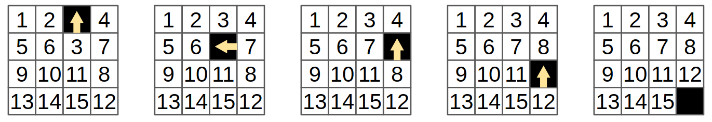

The 15-puzzle
=============

The `15-puzzle <https://en.wikipedia.org/wiki/15_puzzle>`_ is a well-known game
in which you are given a frame of 4x4 tiles where one of the tiles is missing, and the other
are numbered 1-15. You have to slide tiles into the "hole" until you reach the "solved"
configuration, in which the numbers are ordered.

Below you can see an example of solving a very simple initial scenario.
The first step is to slide 3 up into the hole, then 7, 8 and 12, which brings
us to the "solved" configuration in which the empty tile is on the bottom-right corner
and the numbers are sorted.

We will use the 15-puzzle as an example -- we will show how to write a Cairo program
verifying a solution to the 15-puzzle (the initial state will be an input)
thus allowing you to prove that you know the solution to that initial state (without necessarily
revealing the solution to the person verifying the proof!).

What we need to check
---------------------

We will represent the solution as two lists:
The first will contain the positions of the empty tile (row and column, where both are indexed
starting from zero), so in the example above we have:
``[(0, 2), (1, 2), (1, 3), (2, 3), (3, 3)]``.
The second list will contain the numbers of the tiles being moved, so we have:
``[3, 7, 8, 12]``.
Note that the first list is always longer by one element.
We will call the length of the second list ``n_steps`` (this is indeed the number of steps),
and the length of the first list will be ``n_steps + 1``.

We will verify that the following properties hold:

1.  The locations in the first list make sense -- all the numbers are between 0 and 3, and each
    consecutive pair represent adjacent locations.
2.  The numbers in the second list correspond to the values of the tiles according
    to the locations in the first list.
    For example, ``3`` is the tile at location ``(1, 2)`` in the
    initial state, and at location ``(0, 2)`` in the next state.
    Similarly ``7`` is the tile at location ``(1, 3)`` in the second state,
    and at location ``(1, 2)`` in the following state.
3.  The final state is the "solved" configuration.

We will output the initial state, so that the verifiers of the proof will know
what state we started from.

The Location struct
-------------------

Let's start by defining a struct that represents a tile location:

.. tested-code:: cairo location

    struct Location {
        row: felt,
        col: felt,
    }

The first line ``struct Location {`` starts the definition of a struct.
Next we define two members ``row`` and ``col``, both of type ``felt``.
Finally we close the struct with the ``}`` character.
For more information about structs, see :ref:`typed_references`.

Verifying the validity of a single location
-------------------------------------------

We can now write a function that verifies that a location is valid:

.. tested-code:: cairo verify_valid_location

    func verify_valid_location(loc: Location*) {
        // Check that row is in the range 0-3.
        tempvar row = loc.row;
        assert row * (row - 1) * (row - 2) * (row - 3) = 0;

        // Check that col is in the range 0-3.
        tempvar col = loc.col;
        assert col * (col - 1) * (col - 2) * (col - 3) = 0;

        return ();
    }

The expression ``loc: Location*`` instructs Cairo to interpret ``loc`` as the address
of a ``Location`` instance.
This means that it will expect that the value of the memory at address
``loc`` is the row of the location,
and the value at address ``loc + 1`` is the column.
Cairo lets us address the two values using ``loc.row`` and ``loc.col``.

Next we see a definition of a temporary variable.
We have mentioned above that Cairo memory is immutable, so the name
"variable" may be misleading (as its value cannot change).
A statement of the form ``tempvar a = <expr>;``
allocates one memory cell, names it ``a``, and assigns it the value of ``<expr>``.

The scope of a temporary variable is restricted.
For example, a temporary variable
may be revoked due to jumps (e.g., if statements) or function calls.
You can read more in :ref:`revoked_references`.
As you may recall, in the first section we mentioned that Cairo has
some delicate points, this is one of them.
As this function is very simple with no jumps and no calls to other functions
using ``tempvar`` is fine here.

For more information on temporary variables see :ref:`tempvars`.

Cairo does not have a ``<`` operator.
The reason is that in the Cairo machine the is-less-than operation is a complicated operation,
so Cairo has a *builtin* called range-check that allows comparing values.
(You can learn more about builtins and the range-check builtin :ref:`here <builtins>`.
There are also library functions to invoke it such as ``assert_nn_le()``, which
gets two arguments x and y and verifies
that :math:`0 \leq x \leq y`).
Instead, we chose to use a simple mathematical trick that says that if we multiply
numbers and get zero, one of them must be zero. This means that if
``row * (row - 1) * (row - 2) * (row - 3) = 0``
then either ``row = 0`` or ``row - 1 = 0`` (so ``row = 1``),
etc. This is exactly what we need.

The last line in the function is ``return();``, unlike high-level languages
in which the return statement is implicit, you **must** explicitly
use ``return()`` at the end of the function even if there are no return
values.

Verifying two consecutive locations
-----------------------------------

Let's continue with verifying that two consecutive locations are adjacent:
If we look at the difference between the two location we expect to see
one of ``(0, 1), (0, -1), (1, 0), (-1, 0)``. For example,
the first two locations in the example above are ``(0, 2)`` and ``(1, 2)``
and indeed ``(0, 2) - (1, 2) = (-1, 0)``.

.. tested-code:: cairo verify_adjacent_locations

    func verify_adjacent_locations(
        loc0: Location*, loc1: Location*
    ) {
        alloc_locals;
        local row_diff = loc0.row - loc1.row;
        local col_diff = loc0.col - loc1.col;

        if (row_diff == 0) {
            // The row coordinate is the same. Make sure the
            // difference in col is 1 or -1.
            assert col_diff * col_diff = 1;
            return ();
        } else {
            // Verify the difference in row is 1 or -1.
            assert row_diff * row_diff = 1;
            // Verify that the col coordinate is the same.
            assert col_diff = 0;
            return ();
        }
    }

This function uses local variables.
These are similar to temporary variables,
except that the scope in which they can be accessed is much less restricted --
you can access them starting from their definition up to the end of the function.

The line ``alloc_locals;`` is part of Cairo's ``local`` mechanism. It allocates
the memory required for the local variables of the function.
Usually, this should be the first statement in a function which uses local variables.
If you try to use local variables without that line,
the compilation will fail.

So if the compiler knows when I'm using local variables, why can't it add that line for me?
For two reasons:

1.  Cairo is an explicit language -- in most cases it doesn't automatically add instructions
    unless the code explicitly says so.

2.  In some cases it is possible to avoid this statement, and allocate the required memory manually
    by increasing the ``ap`` register
    (you can read about Cairo's registers :ref:`here <registers>`) as part of
    other instructions. In other cases it makes sense to place it in a different part of
    the code. You can read more about it :ref:`here <local_vars>`.

Let's go over the flow of the function:
First, we compute the row and column differences (recall that we expect them to be -1, 0 or 1).

Then, if the row is the same, the column difference must be either -1 or 1 (which is equivalent
to ``col_diff * col_diff = 1``). And if it's not zero, then the column must be the same
and the row difference must be -1 or 1.

References, temporary variables and local variables
***************************************************

A :ref:`reference <references>` is defined using a ``let`` statement,
such as ``let x = y * y * y;``.
You should think of ``x`` as an alias to the expression ``y * y * y``, which means that
the instruction ``let x = y * y * y;`` by itself will not cause any computation to be performed.
On the other hand, a later instruction such as ``assert x * x = 1;`` will turn into
``assert (y * y * y) * (y * y * y) = 1;``.
The scope in which a reference is defined is derived from the scope in which the aliased expression
is defined.

Note: the syntax ``let x = foo(...)`` is an exception to the above --
it calls ``foo()`` immediately
(unlike other ``let`` statements, which do not result in actual computation),
and creates a reference ``x`` to the return value of foo().
In general, references cannot contain function calls.

Temporary and local variables are special cases of a reference.
They point to a specific memory cell, which stores the result of a computation.
Thus the statement ``tempvar x = y * y * y;`` **will** invoke the computation, and ``x``
will be an alias to the memory cell containing the result, rather than the
*expression* ``y * y * y``.

Temporary variables do not require prior allocation of memory, but their scope is restricted.
Local variables are placed at the beginning of the function stack, so they require prior allocation
using the instruction ``alloc_locals``, but they can be accessed throughout the entire
execution of the function.

The scope of the result of a function call is similar to that of a temporary variable.
If you need to access the returned value later, you should copy the result to a local variable.

If you get an error that your temporary variable was revoked, you can try to make it a local
variable instead.

Verifying the list of locations
-------------------------------

Let's wrap it in a loop (recursion, to be precise) that calls those two functions
on the entire location list.

.. tested-code:: cairo verify_location_list

    func verify_location_list(loc_list: Location*, n_steps) {
        // Always verify that the location is valid, even if
        // n_steps = 0 (remember that there is always one more
        // location than steps).
        verify_valid_location(loc=loc_list);

        if (n_steps == 0) {
            return ();
        }

        verify_adjacent_locations(
            loc0=loc_list, loc1=loc_list + Location.SIZE
        );

        // Call verify_location_list recursively.
        verify_location_list(
            loc_list=loc_list + Location.SIZE, n_steps=n_steps - 1
        );
        return ();
    }

Adding a dummy main function
----------------------------

Before we continue, let's write a dummy main function that will allow us to run
``verify_location_list`` (we will remove it later, and replace it with the real
main function):

.. tested-code:: cairo dummy_main

    from starkware.cairo.common.registers import get_fp_and_pc

    func main() {
        alloc_locals;

        local loc_tuple: (
            Location, Location, Location, Location, Location
        ) = (
            Location(row=0, col=2),
            Location(row=1, col=2),
            Location(row=1, col=3),
            Location(row=2, col=3),
            Location(row=3, col=3),
        );

        // Get the value of the frame pointer register (fp) so that
        // we can use the address of loc_tuple.
        let (__fp__, _) = get_fp_and_pc();
        // Since the tuple elements are next to each other, we can
        // use the address of loc_tuple as a pointer to the 5
        // locations.
        verify_location_list(
            loc_list=cast(&loc_tuple, Location*), n_steps=4
        );
        return ();
    }

This function uses a tuple to define and store the list of ``Location`` elements. Tuples are
ordered, finite lists that can contain any combination of valid types, for example, five
``Location`` structs. Each element may be accessed with a zero-based index (e.g., ``loc_tuple[2]``
is the third element. See :ref:`tuples`).

At the beginning of the function we allocate 5 locations, using a typed local variable.
Cairo looks for the constant ``Location.SIZE`` to find how many cells are
required for each of the variables, and then allocates them in the order of definition.
Since ``loc_tuple`` is a tuple of 5 locations, Cairo allocates ``5 * Location.SIZE`` memory
cells. Each ``Location`` instance is assigned some coordinates (according to the example above).

Since ``verify_location_list`` requires a pointer to a list of locations,
we pass ``&loc_tuple``, which represents the address in memory of ``loc_tuple``. Since the type
of ``&loc_tuple`` is a pointer to a tuple rather than ``Location*``, we need the cast operation
to instruct the compiler to treat this address as ``Location*``. See :ref:`casting` for
more information.

For technical reasons, when Cairo needs to retrieve the address of a local variable
(``&loc_tuple``), it needs to be told the value of the frame pointer register, ``fp``
(see :ref:`fp_register`).
This can be done by the statement ``let (__fp__, _) = get_fp_and_pc()``
which calls the library function ``get_fp_and_pc()`` to retrieve ``fp``.
The result is named ``__fp__`` which is the name Cairo looks for
when it has to know ``fp``.
If you forget to write this line, you may get an error of the form:
``Using the value of fp directly, requires defining a variable named __fp__.``

The syntax ``let (...) = foo(...)`` calls a function ``foo`` which returns a tuple of values
and stores each entry of that tuple into a separate variable.
The symbol ``_`` can be used to skip an entry.

Again, don't forget to return at the end!

Exercise
********

Play with the values of the location coordinates and make sure the program fails
if they represent illegal values.

For example, try to change ``loc_tuple[0].row`` from 0 to 10.
You should see that the assert in ``verify_valid_location`` fails.
Or you can change this value to 1, which will make the first transition
illegal (the empty tile cannot stay in the same place).

Exercise
********

Modify ``verify_location_list`` so that it checks that the last location is
indeed ``(3, 3)``.

.. test::

    from starkware.cairo.lang.compiler.cairo_compile import compile_cairo
    from starkware.cairo.lang.vm.cairo_runner import CairoRunner

    PRIME = 2**64 + 13
    code = '\n'.join([
        codes['location'],
        codes['verify_valid_location'],
        codes['verify_adjacent_locations'],
        codes['verify_location_list'],
        codes['dummy_main']])
    program = compile_cairo(code, PRIME, debug_info=True)

    runner = CairoRunner(program, layout='small')

    runner.initialize_segments()
    end = runner.initialize_main_entrypoint()
    runner.initialize_vm(hint_locals={})
    runner.run_until_pc(end)
