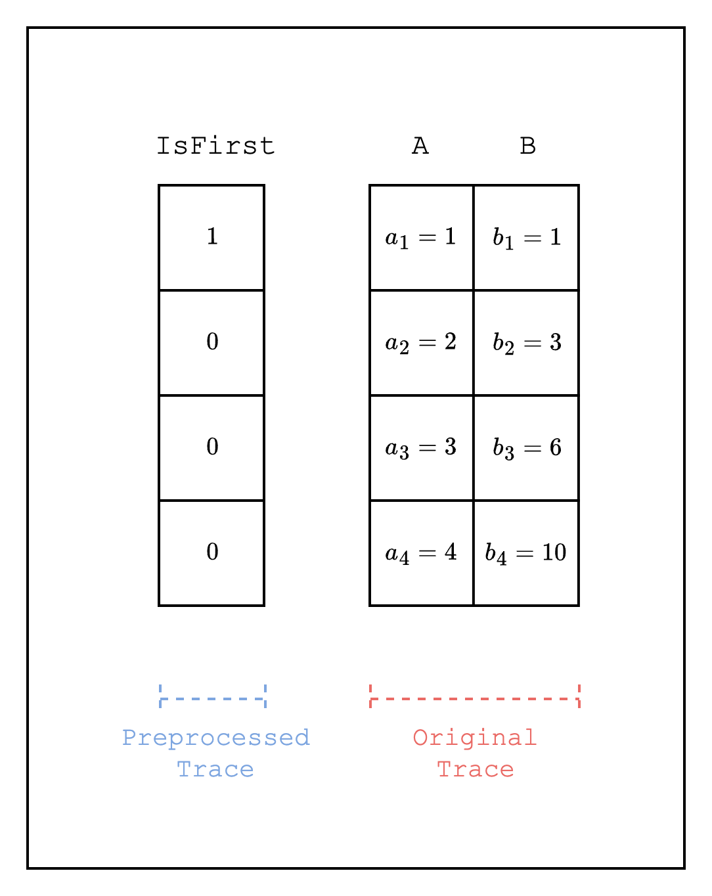
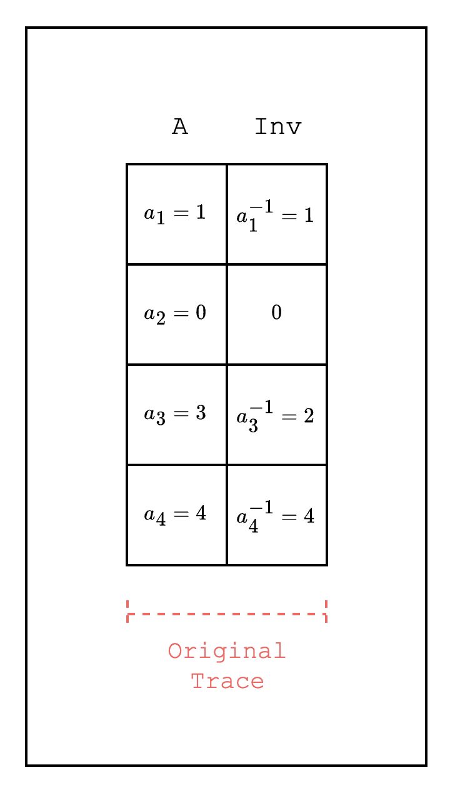
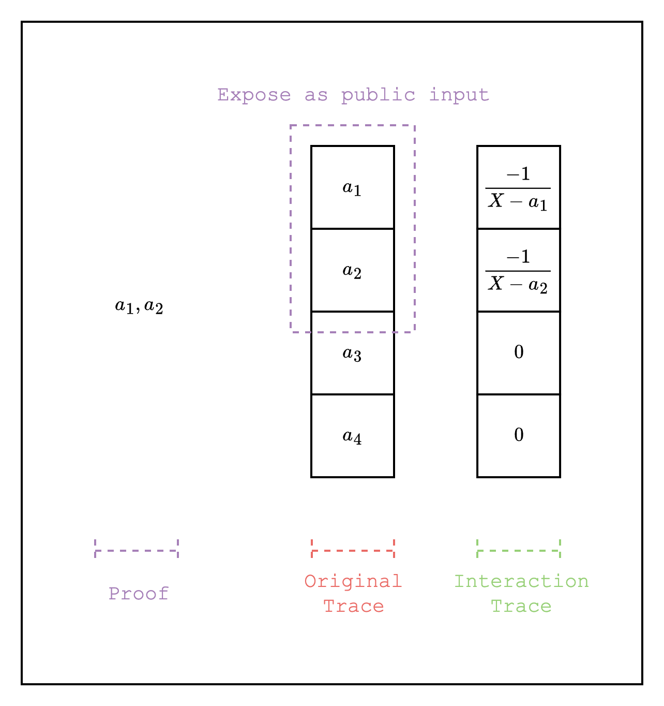
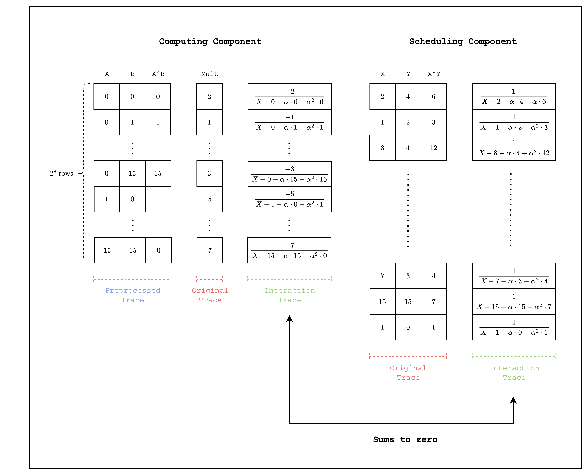

Here, we introduce some additional AIRs that may help in designing more complex AIRs.

## Selectors

A selector is a column of 0s and 1s that selectively enables or disables a constraint. One example of a selector is the `IsFirst` column which has a value of 1 only on the first row. This can be used when constraints are defined over both the current and previous rows but we need to make an exception for the first row.

For example, as seen in [Figure 1](#figure-1), when we want to track the cumulative sum of a column, i.e. $b_2 = a_1 + a_2$, the previous row of the first row points to the last row, creating an incorrect constraint $a_1 = b_4 + b_1$. Thus, we need to disable the constraint for the first row and enable a separate constraint $a_1 = b_1$. This can be achieved by using a selector column that has a value of 1 on the first row and 0 on the other rows and multiplying the constraint by the selector column:

$$
(1 - \text{IsFirst(X)}) \cdot (A(\omega \cdot X) - B(X) - B(\omega \cdot X)) + \text{IsFirst(X)} \cdot (A(X) - B(X)) = 0
$$

where $X$ refers to the previous value of $\omega\cdot X$ in the multiplicative subgroup of the finite field.

*Figure 1: IsFirst selector*

## IsZero

Checking that a certain field element is zero is a common use case when writing AIRs. To do this efficiently, we can use the property of finite fields that a non-zero field element always has a multiplicative inverse.

For example, in [Figure 2](#figure-2), we want to check whether a field element in $\mathbb{F}_5$ is zero. We create a new column that contains the multiplicative inverse of each field element $a_i$. We then use the multiplication of the two columns and check whether the result is 0 or 1. Note that if the existing column has a zero element, we can insert any value in the new column since the multiplication will always be zero.

This way, we can create a constraint that uses the `IsZero` condition as part of the constraint, e.g. $(1 - (A(X) \cdot Inv(X))) \cdot (\text{constraint\_1}) + (A(X) \cdot Inv(X)) \cdot (\text{constraint\_2}) = 0$, which checks $\text{constraint\_1}$ if $A(X)$ is 0 and $\text{constraint\_2}$ if $A(X)$ is not 0.

*Figure 2: IsZero over a prime field 5*

## Public Inputs

When writing AIRs, we may want to expose some values in the trace to the verifier to check in the open. For example, when running an AIR for a Cairo program, we may want to check that the program that was executed is the correct one.

In S-two, we can achieve this by adding the public input portion of the trace as a LogUp column as negative multiplicity. As shown in [Figure 3](#figure-3), the public inputs $a_1, a_2$ are added as LogUp values with negative multiplicity $\frac{-1}{X - a_1}$ and $\frac{-1}{X - a_2}$. The public inputs are given to the verifier as part of the proof and the verifier can directly compute the LogUp values with positive multiplicity $\frac{1}{X - a_1}$ and $\frac{1}{X - a_2}$ and add it to the LogUp sum and check that the total sum is 0.

*Figure 3: Public inputs*

One important thing to note is that the public inputs must be added to the Fiat-Shamir channel before drawing random elements for the interaction trace. We refer the reader to this [example implementation](https://github.com/starknet-io/starknet-docs/blob/main/learn/S-two-book/stwo-examples/examples/public_input.rs) for reference.

## XOR

We can also handle XOR operations as part of the AIR. First, as we did in the [Components](../components/index) section, we create a computing component and a scheduling component. Then, we connect the two components using lookups: the computing component sets the LogUp value as a negative multiplicity and the scheduling component sets the same value as a positive multiplicity.

For example, [Figure 4](#figure-4) shows the XOR operation for 4-bit integers. To accommodate the entire combination of inputs, the size of the trace for the computing component is $2^8=256$ rows. Note that the size of the trace for the scheduling component does not have to be the same as the computing component.

*Figure 4: XOR operations for 4-bit integers*

Note that for larger integers, we may need to decompose into smaller limbs to avoid creating large tables. Also note that the M31 field does not fully support XOR operations for 31-bit integers since we cannot use $2^{31} -1$, although this is not feasible as it would require a table of size of around $2^{31} \times 2^{31}$.
