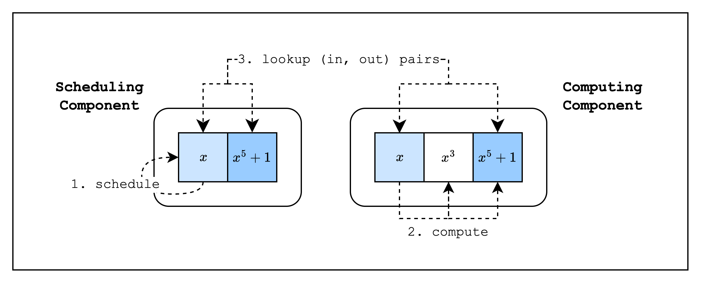
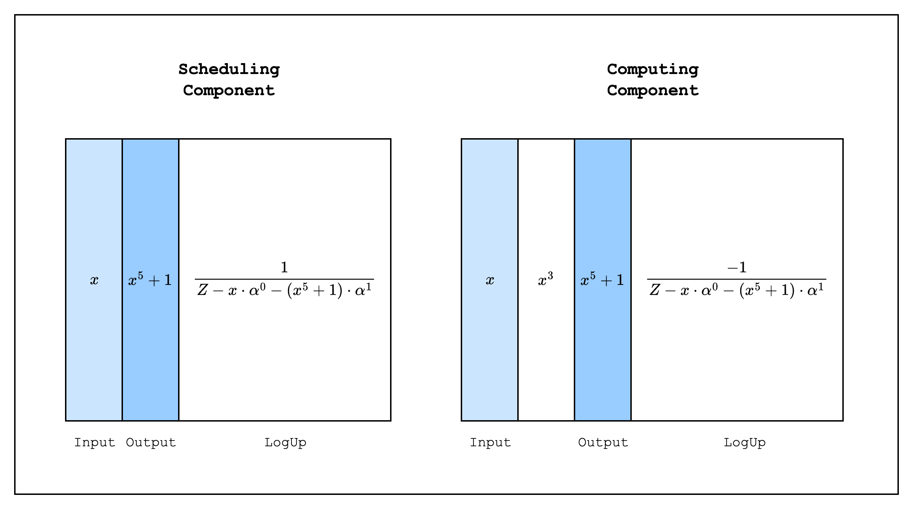

So now that we know how to create a self-contained AIR, the inevitable question arises: How do we make this modular?

Fortunately, S-two provides an abstraction called **components** that allows us to create independent AIRs and compose them together. In other proving frontends, this is also commonly referred to as a _chip_, but the idea is the same.

One of the most common use cases of components is to separate frequently used functions (e.g. a hash function) from the main component into a separate component and reuse it, avoiding trace column bloat. Even if the function is not frequently used, it can be useful to separate it into a component to avoid the degree of the constraints becoming too high. This second point is possible because when we create a new component and connect it to the old component, we do it by using lookups, which means that the constraints of the new component are not added to the degree of the old component.

## Hash Function Example

To illustrate how to use components, we will create two components where the main component calls a hash function component. For simplicity, instead of an actual hash function, the second component will compute $x^5 + 1$ from an input $x$. This component will have, in total, three columns: [input, intermediate, output], which will correspond to the values $[x, x^3, x^5 + 1]$. Our main component, on the other hand, will have two columns, [input, output], which corresponds to the values $[x, x^5 + 1]$.

We'll refer to the main component as the **scheduling component** and the hash function component as the **computing component**, since the main component is essentially _scheduling_ the hash function component to run its function with a given input and the hash function component _computes_ on the provided input. As can be seen in [Figure 1](#fig-component-example), the input and output of each component are connected by lookups.



*Figure 1: Scheduling and Computing components*

### Design



*Figure 2: Traces of each component*

When we implement this in S-two, the traces of each component will look like [Figure 2](#fig-component-trace) above. Each component has its own original and LogUp traces, and the inputs and outputs of each component are connected by lookups. Since the scheduling component sets the LogUp value as a positive multiplicity and the computing component sets the same value as a negative multiplicity, the verifier can simply check that the sum of the two LogUp columns is zero. Note that we combine the input and output randomly as

$$
\frac{1}{Z - x \cdot \alpha^0 - (x^5+1) \cdot \alpha^1}
$$

to form a single lookup. This is because we want to ensure that each input is paired with the correct output. If we add the input and output as separate lookups as

$$
\frac{1}{Z - x} + \frac{1}{Z - (x^5+1)}
$$

A malicious prover can switch the output with a different row and still come up with a valid proof. For example, the following scheduling component

| Input | Output  |
| ----- | ------- |
| x     | y^5 + 1 |
| y     | x^5 + 1 |

And the following computing component

| Input | Intermediate | Output  |
| ----- | ------------ | ------- |
| x     | x^3 + 1      | x^5 + 1 |
| y     | y^3 + 1      | y^5 + 1 |

would be valid.

## Implementation

Let's move on to the implementation.

```rust,ignore
fn main() {
    // --snip--

    // Create trace columns
    let scheduling_trace = gen_scheduling_trace(log_size);
    let computing_trace = gen_computing_trace(log_size, &scheduling_trace[0], &scheduling_trace[1]);

    // Statement 0
    let statement0 = ComponentsStatement0 { log_size };
    statement0.mix_into(channel);

    // Commit to the trace columns
    let mut tree_builder = commitment_scheme.tree_builder();
    tree_builder.extend_evals([scheduling_trace.clone(), computing_trace.clone()].concat());
    tree_builder.commit(channel);

    // Draw random elements to use when creating the random linear combination of lookup values in the LogUp columns
    let lookup_elements = ComputationLookupElements::draw(channel);

    // Create LogUp columns
    let (scheduling_logup_cols, scheduling_claimed_sum) = gen_scheduling_logup_trace(
        log_size,
        &scheduling_trace[0],
        &scheduling_trace[1],
        &lookup_elements,
    );
    let (computing_logup_cols, computing_claimed_sum) = gen_computing_logup_trace(
        log_size,
        &computing_trace[0],
        &computing_trace[2],
        &lookup_elements,
    );

    // Statement 1
    let statement1 = ComponentsStatement1 {
        scheduling_claimed_sum,
        computing_claimed_sum,
    };
    statement1.mix_into(channel);

    // Commit to the LogUp columns
    let mut tree_builder = commitment_scheme.tree_builder();
    tree_builder.extend_evals([scheduling_logup_cols, computing_logup_cols].concat());
    tree_builder.commit(channel);

    let components = Components::new(&statement0, &lookup_elements, &statement1);

    let stark_proof = prove(&components.component_provers(), channel, commitment_scheme).unwrap();

    let proof = ComponentsProof {
        statement0,
        statement1,
        stark_proof,
    };

    // --snip--
}
```

The code above for proving the components should look pretty familiar by now. Since we need to do everything twice as many times, we create structs like `ComponentsStatement0`, `ComponentsStatement1`, `Components`, and `ComponentsProof`, but the main logic is the same.

Let's take a closer look at how the LogUp columns are generated.

```rust,ignore
fn gen_scheduling_logup_trace(
    log_size: u32,
    scheduling_col_1: &CircleEvaluation<SimdBackend, M31, BitReversedOrder>,
    scheduling_col_2: &CircleEvaluation<SimdBackend, M31, BitReversedOrder>,
    lookup_elements: &ComputationLookupElements,
) -> (
    Vec<CircleEvaluation<SimdBackend, M31, BitReversedOrder>>,
    SecureField,
) {
        // --snip--

        let scheduling_input_output: PackedSecureField =
            lookup_elements.combine(&[scheduling_col_1.data[row], scheduling_col_2.data[row]]);
        col_gen.write_frac(row, PackedSecureField::one(), scheduling_input_output);

        // --snip--


fn gen_computing_logup_trace(
    log_size: u32,
    computing_col_1: &CircleEvaluation<SimdBackend, M31, BitReversedOrder>,
    computing_col_3: &CircleEvaluation<SimdBackend, M31, BitReversedOrder>,
    lookup_elements: &ComputationLookupElements,
) -> (
    Vec<CircleEvaluation<SimdBackend, M31, BitReversedOrder>>,
    SecureField,
) {
        // --snip--

        let computing_input_output: PackedSecureField =
            lookup_elements.combine(&[computing_col_1.data[row], computing_col_3.data[row]]);
        col_gen.write_frac(row, -PackedSecureField::one(), computing_input_output);

        // --snip--
}
```

As you can see, the LogUp values of the input and output columns of both the scheduling and computing components are batched together, but in the scheduling component, the output LogUp value is subtracted from the input LogUp value, while in the computing component, the input LogUp value is subtracted from the output LogUp value. This means that when the LogUp sums from both components are added together, they should cancel out to zero.

Next, let's check how the constraints are created.

```rust,ignore
impl FrameworkEval for SchedulingEval {
    // --snip--

    fn evaluate<E: EvalAtRow>(&self, mut eval: E) -> E {
        let input_col = eval.next_trace_mask();
        let output_col = eval.next_trace_mask();

        eval.add_to_relation(RelationEntry::new(
            &self.lookup_elements,
            E::EF::one(),
            &[input_col, output_col],
        ));

        eval.finalize_logup();

        eval
    }
}

impl FrameworkEval for ComputingEval {
    // --snip--

    fn evaluate<E: EvalAtRow>(&self, mut eval: E) -> E {
        let input_col = eval.next_trace_mask();
        let intermediate_col = eval.next_trace_mask();
        let output_col = eval.next_trace_mask();

        eval.add_constraint(
            intermediate_col.clone() - input_col.clone() * input_col.clone() * input_col.clone(),
        );
        eval.add_constraint(
            output_col.clone()
                - intermediate_col.clone() * input_col.clone() * input_col.clone()
                - E::F::one(),
        );

        eval.add_to_relation(RelationEntry::new(
            &self.lookup_elements,
            -E::EF::one(),
            &[input_col, output_col],
        ));

        eval.finalize_logup();

        eval
    }
}
```

As you can see, we define the LogUp constraints for each component, and we also add two constraints that make sure the computations $x^3$ and $x^5 + 1$ are correct.

```rust,ignore
fn main() {
    // --snip--

    // Verify claimed sums
    assert_eq!(
        scheduling_claimed_sum + computing_claimed_sum,
        SecureField::zero()
    );

    // Unpack proof
    let statement0 = proof.statement0;
    let statement1 = proof.statement1;
    let stark_proof = proof.stark_proof;

    // Create channel and commitment scheme
    let channel = &mut Blake2sChannel::default();
    let commitment_scheme = &mut CommitmentSchemeVerifier::<Blake2sMerkleChannel>::new(config);
    let log_sizes = statement0.log_sizes();

    // Preprocessed columns.
    commitment_scheme.commit(stark_proof.commitments[0], &log_sizes[0], channel);

    // Commit to statement 0
    statement0.mix_into(channel);

    // Trace columns.
    commitment_scheme.commit(stark_proof.commitments[1], &log_sizes[1], channel);

    // Draw lookup element.
    let lookup_elements = ComputationLookupElements::draw(channel);

    // Commit to statement 1
    statement1.mix_into(channel);

    // Interaction columns.
    commitment_scheme.commit(stark_proof.commitments[2], &log_sizes[2], channel);

    // Create components
    let components = Components::new(&statement0, &lookup_elements, &statement1);

    verify(
        &components.components(),
        channel,
        commitment_scheme,
        stark_proof,
    )
    .unwrap();
```

Finally, we verify the components!
