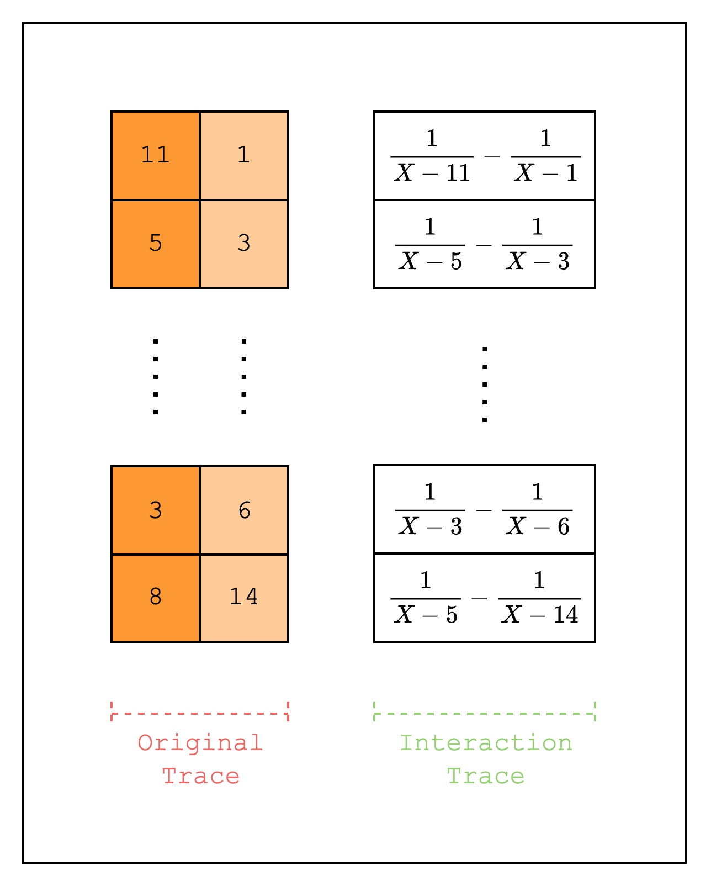

In the last section, we implemented a static lookup. A dynamic lookup is the same as a static lookup except that the values that are being looked up are not known before the proving process (i.e. they are not preprocessed columns but trace columns).

In this section, we will implement one of the simplest dynamic lookups: a permutation check.

A permutation check simply checks that two sets of values have the same elements, but not necessarily in the same order. For example, the values $[1, 2, 3]$ and $[3, 1, 2]$ are a permutation of each other, but $[1, 2, 3]$ and $[1, 2]$ are not.

If you went through the previous section, you should have a good intuition for how to implement this. First, create two original trace columns that each contain a random permutation of the same set of values. Then, create a LogUp column where the first original trace column is added as a fraction with multiplicity $1$ and the second original trace column is added as a fraction with multiplicity $-1$. Then, check that the `claimed_sum`, or the sum of the fractions in the two LogUp columns, is $0$.

<div id="figure-1" style={{ textAlign: 'center', maxWidth: '60%', height: 'auto', margin: '0 auto',  }}>

*Figure 1: Permutation check*
</div>

Let's move on to the implementation.

```rust
fn gen_trace(log_size: u32) -> Vec<CircleEvaluation<SimdBackend, M31, BitReversedOrder>> {
    let mut rng = rand::thread_rng();
    let values = (0..(1 << log_size)).map(|i| i).collect::<Vec<_>>();

    // Create a random permutation of the values
    let mut random_values = values.clone();
    random_values.shuffle(&mut rng);
    let random_col_1 = BaseColumn::from_iter(random_values.iter().map(|v| M31::from(*v)));

    // Create another random permutation of the values
    let mut random_values = random_values.clone();
    random_values.shuffle(&mut rng);
    let random_col_2 = BaseColumn::from_iter(random_values.iter().map(|v| M31::from(*v)));

    // Convert table to trace polynomials
    let domain = CanonicCoset::new(log_size).circle_domain();
    vec![random_col_1, random_col_2]
        .into_iter()
        .map(|col| CircleEvaluation::new(domain, col))
        .collect()
}

fn gen_logup_trace(
    log_size: u32,
    random_col_1: &BaseColumn,
    random_col_2: &BaseColumn,
    lookup_elements: &LookupElements,
) -> (
    Vec<CircleEvaluation<SimdBackend, M31, BitReversedOrder>>,
    SecureField,
) {
    let mut logup_gen = LogupTraceGenerator::new(log_size);

    let mut col_gen = logup_gen.new_col();
    for row in 0..(1 << (log_size - LOG_N_LANES)) {
        // 1 / random - 1 / ordered = (ordered - random) / (random * ordered)
        let random_val: PackedSecureField = lookup_elements.combine(&[random_col_1.data[row]]);
        let ordered_val: PackedSecureField = lookup_elements.combine(&[random_col_2.data[row]]);
        col_gen.write_frac(row, ordered_val - random_val, random_val * ordered_val);
    }
    col_gen.finalize_col();

    logup_gen.finalize_last()
}

fn main() {
    ...
    // Create and commit to the trace columns
    let trace = gen_trace(log_size);
    let mut tree_builder = commitment_scheme.tree_builder();
    tree_builder.extend_evals(trace.clone());
    tree_builder.commit(channel);

    // Draw random elements to use when creating the random linear combination of lookup values in the LogUp columns
    let lookup_elements = LookupElements::draw(channel);

    // Create and commit to the LogUp columns
    let (logup_cols, claimed_sum) =
        gen_logup_trace(log_size, &trace[0], &trace[1], &lookup_elements);
    let mut tree_builder = commitment_scheme.tree_builder();
    tree_builder.extend_evals(logup_cols);
    tree_builder.commit(channel);
    ...
}
```

Looking at the code above, we can see that it looks very similar to the implementation in the previous section. Instead of creating a preprocessed column, we create two columns where the first column is a random permutation of values `[0, 1 << log_size)` and the second column contains the values in order. Note that this is equivalent to "looking up" all values in the first trace column once. And since all the values are looked up exactly once, we do not need a separate multiplicity column.

Then, we create a LogUp column that contains the values $\frac{1}{original} - \frac{1}{permuted}$.

```rust
struct TestEval {
    log_size: u32,
    lookup_elements: LookupElements,
}

impl FrameworkEval for TestEval {
    fn log_size(&self) -> u32 {
        self.log_size
    }

    fn max_constraint_log_degree_bound(&self) -> u32 {
        self.log_size + LOG_CONSTRAINT_EVAL_BLOWUP_FACTOR
    }

    fn evaluate<E: EvalAtRow>(&self, mut eval: E) -> E {
        let random_col = eval.next_trace_mask();
        let ordered_col = eval.next_trace_mask();

        eval.add_to_relation(RelationEntry::new(
            &self.lookup_elements,
            E::EF::one(),
            &[random_col],
        ));

        eval.add_to_relation(RelationEntry::new(
            &self.lookup_elements,
            -E::EF::one(),
            &[ordered_col],
        ));

        eval.finalize_logup_in_pairs();

        eval
    }
}
```

The `TestEval` struct is also very similar to the one in the previous section. The only difference is that we call `add_to_relation` twice and add them together by calling `finalize_logup_in_pairs()` on the `TestEval` instance. This is equivalent to calling the `finalize_logup_batched` function with `&vec![0, 0]`.
