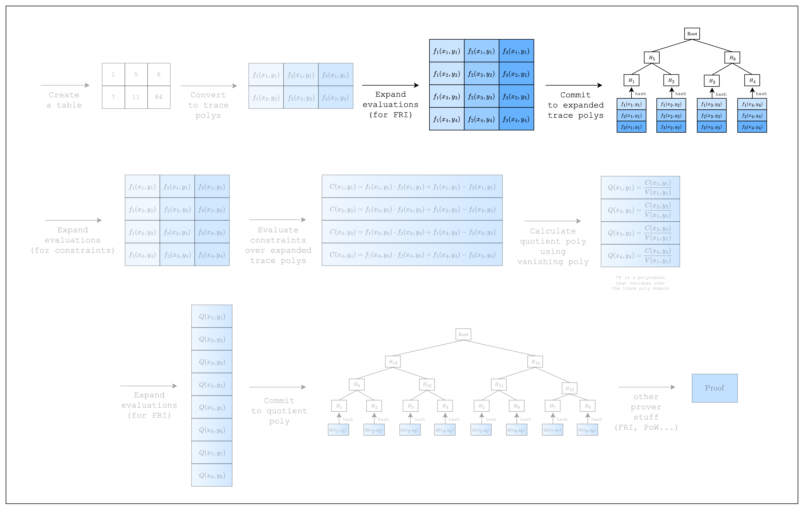

*Figure 1: Prover workflow: Commitment*

Now that we have created the trace polynomials, we need to commit to them.

As we can see in [Figure 1](#fig-committing-to-the-trace-polynomials-1), S-two commits to the trace polynomials by first expanding the trace polynomials (i.e. adding more evaluations) and then committing to the expanded evaluations using a Merkle tree. The rate of expansion (commonly referred to as the _blowup factor_) is a parameter of the FRI protocol and for the purposes of this tutorial, we will use the default value.

```rust,ignore
const LOG_CONSTRAINT_EVAL_BLOWUP_FACTOR: u32 = 1;

fn main() {
    // --snip--
    // Config for FRI and PoW
    let config = PcsConfig::default();

    // Precompute twiddles for evaluating and interpolating the trace
    let twiddles = SimdBackend::precompute_twiddles(
        CanonicCoset::new(
            log_num_rows + LOG_CONSTRAINT_EVAL_BLOWUP_FACTOR + config.fri_config.log_blowup_factor,
        )
        .circle_domain()
        .half_coset,
    );

    // Create the channel and commitment scheme
    let channel = &mut Blake2sChannel::default();
    let mut commitment_scheme =
        CommitmentSchemeProver::<SimdBackend, Blake2sMerkleChannel>::new(config, &twiddles);

    // Commit to the preprocessed trace
    let mut tree_builder = commitment_scheme.tree_builder();
    tree_builder.extend_evals(vec![]);
    tree_builder.commit(channel);

    // Commit to the size of the trace
    channel.mix_u64(log_num_rows as u64);

    // Commit to the original trace
    let mut tree_builder = commitment_scheme.tree_builder();
    tree_builder.extend_evals(trace);
    tree_builder.commit(channel);
}
```

We begin with some setup. First, we create a default `PcsConfig` instance, which sets the values for the FRI and PoW operations. Setting non-default values is related to the security of the proof, which is outside the scope of this tutorial.

Next, we precompute twiddles, which are factors multiplied during FFT for a particular domain. Notice that the log size of the domain is set to `log_num_rows + LOG_CONSTRAINT_EVAL_BLOWUP_FACTOR + config.fri_config.log_blowup_factor`, which is the max log size of the domain that is needed throughout the proving process. For committing to the trace polynomial, we only need to add `config.fri_config.log_blowup_factor` but as we will see in the next section, we also need to commit to a polynomial of a higher degree, which is the reason we also add `LOG_CONSTRAINT_EVAL_BLOWUP_FACTOR`.

The final setup is creating a commitment scheme and a channel. The commitment scheme will be used to commit to the trace polynomials as Merkle trees, while the channel will be used to keep a running hash of all data in the proving process (i.e. transcript of the proof). This is part of the Fiat-Shamir transformation, which derives randomness safely in a non-interactive setting. Here, we use the `Blake2sChannel` and `Blake2sMerkleChannel` for the channel and commitment scheme, respectively, but we can also use the `Poseidon252Channel` and `Poseidon252MerkleChannel` pair.

Now that we have our setup, we can commit to the trace polynomials. But before we do so, we need to first commit to an empty vector called a _preprocessed trace_, which doesn't do anything but is required by S-two. Then, we need to commit to the size of the trace, which is another vital part that the prover should not be able to cheat on. After doing so, we can finally commit to the original trace polynomials.

Now that we have committed to the trace polynomials, we can move on to how we can create constraints over the trace polynomials!
