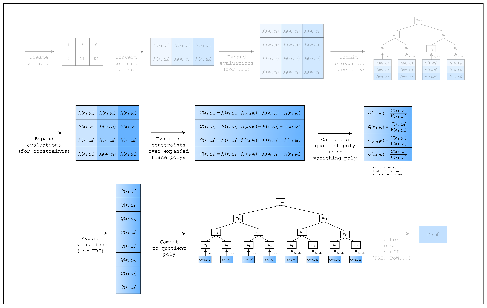
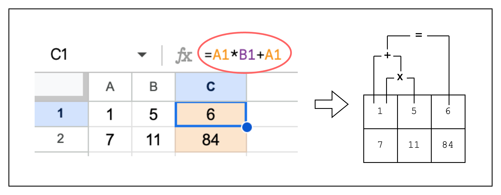
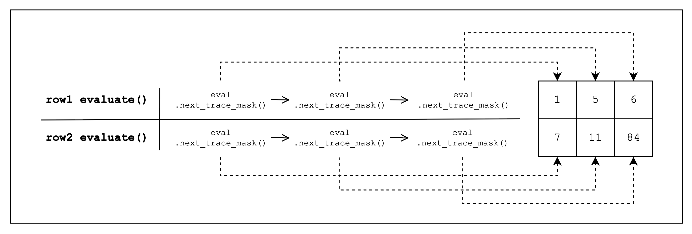

<div id="figure-1" style={{ textAlign: 'center' }}>

*Figure 1: Prover workflow: Constraints*
</div>

## Proving Spreadsheet Functions

When we want to perform computations over the cells in a spreadsheet, we don't want to manually fill in the computed values. Instead, we leverage spreadsheet functions to autofill cells based on a given computation.

We can do the same thing with our table, except in addition to autofilling cells, we can also create a constraint that the result was computed correctly. Remember that the purpose of using a proof system is that the verifier can verify a computation was executed correctly without having to execute it themselves? Well, that's exactly why we need to create a constraint.

Now let's say we want to add a new column `C` to our spreadsheet that computes the product of the previous columns plus the first column. We can set `C1` as `A1 * B1 + A1` as in [Figure 2](#figure-2). The corresponding constraint is expressed as `C1 = A1 * B1 + A1`. However, we use an alternate representation `A1 * B1 + A1 - C1 = 0` because we can only enforce constraints stating that an expression should equal zero. Generalizing this constraint to the whole column, we get `col1_row1 * col2_row1 + col1_row1 - col3_row1 = 0`.

<div id="figure-2" style={{ textAlign: 'center' }}>

*Figure 2: Proving spreadsheet functions as constraints*
</div>

## Identical Constraints Every Row

Obviously, as can be seen in [Figure 2](#figure-2), our new constraint is satisfied for every row in the table. This means that we can substitute creating a constraint for each row with a single constraint over the columns, i.e. the trace polynomials.

Thus, `col1_row1 * col2_row1 + col1_row1 - col3_row1 = 0` becomes:

$$
f_1(x,y) \cdot f_2(x,y) + f_1(x,y) - f_3(x,y) = 0
$$

<Info>
The idea that all rows must have the same constraint may seem restrictive, compared to say a spreadsheet where we can define different functions for different rows. However, we will show in later sections how to handle such use-cases.

(Spoiler alert: it involves selectors and components)
</Info>

## Composition Polynomial

We will now give a name to the polynomial that expresses the constraint: a **composition polynomial**.

$$
C(x,y) = f_1(x,y) \cdot f_2(x,y) + f_1(x,y) - f_3(x,y)
$$

Basically, in order to prove that the constraints are satisfied, we need to show that the composition polynomial evaluates to 0 over the original domain (i.e. the domain of size the number of rows in the table).

But first, as can be seen in the upper part of [Figure 1](#figure-1), we need to expand the evaluations of the trace polynomials by a factor of 2. This is because when you multiply two trace polynomials of degree `n-1` (where `n` is the number of rows) to compute the constraint polynomial, the degree of the constraint polynomial will be the sum of the degrees of the trace polynomials, which is `2n-2`. To adjust for this increase in degree, we double the number of evaluations.

Once we have the expanded evaluations, we can evaluate the composition polynomial $C(x,y)$. Since we need to do a FRI operation on the composition polynomial as well, we expand the evaluations again by a factor of 2 and commit to them as a merkle tree. This part corresponds to the bottom part of [Figure 1](#figure-1).

## Implementation

Let's see how this is implemented in the code.

```rust
struct TestEval {
    log_size: u32,
}

impl FrameworkEval for TestEval {
    fn log_size(&self) -> u32 {
        self.log_size
    }

    fn max_constraint_log_degree_bound(&self) -> u32 {
        self.log_size + LOG_CONSTRAINT_EVAL_BLOWUP_FACTOR
    }

    fn evaluate<E: EvalAtRow>(&self, mut eval: E) -> E {
        let col_1 = eval.next_trace_mask();
        let col_2 = eval.next_trace_mask();
        let col_3 = eval.next_trace_mask();
        eval.add_constraint(col_1.clone() * col_2.clone() + col_1.clone() - col_3.clone());
        eval
    }
}

fn main() {
    // --snip--

    let mut col_3 = BaseColumn::zeros(num_rows);
    col_3.set(0, col_1.at(0) * col_2.at(0) + col_1.at(0));
    col_3.set(1, col_1.at(1) * col_2.at(1) + col_1.at(1));

    // Convert table to trace polynomials
    let domain = CanonicCoset::new(log_num_rows).circle_domain();
    let trace: ColumnVec<CircleEvaluation<SimdBackend, M31, BitReversedOrder>> =
        vec![col_1, col_2, col_3]
            .into_iter()
            .map(|col| CircleEvaluation::new(domain, col))
            .collect();

    // --snip--

    // Create a component
    let _component = FrameworkComponent::<TestEval>::new(
        &mut TraceLocationAllocator::default(),
        TestEval {
            log_size: log_num_rows,
        },
        QM31::zero(),
    );
}
```

First, we add a new column `col_3` that contains the result of the computation: `col_1 * col_2 + col_1`. Note that all the columns are padded with 0 to a length of 16 via `BaseColumn::zeros(num_rows)` and we got lucky because this satisfies our constraint (i.e. `0 * 0 + 0 - 0 = 0`), so we don't need to modify the constraint.

Then, to create a constraint over the trace polynomials, we first create a `TestEval` struct that implements the `FrameworkEval` trait. Then, we add our constraint logic in the `FrameworkEval::evaluate` function. Note that this function is called for every row in the table, so we only need to define the constraint once.

Inside `FrameworkEval::evaluate`, we call `eval.next_trace_mask()` consecutively three times, retrieving the cell values of all three columns (see [Figure 3](#figure-3) below for a visual representation). Once we retrieve all three column values, we add a constraint of the form `col_1 * col_2 + col_1 - col_3`, which should equal 0. Note that `FrameworkEval::evaluate` will be called for every row in the table.

<div id="figure-3" style={{ textAlign: 'center' }}>

*Figure 3: Evaluate function*
</div>

We also need to implement `FrameworkEval::max_constraint_log_degree_bound(&self)` for `FrameworkEval`. As mentioned in the [Composition Polynomial section](#composition-polynomial), we need to expand the trace polynomial evaluations because the degree of our composition polynomial is higher than that of the trace polynomial. Expanding it by `LOG_CONSTRAINT_EVAL_BLOWUP_FACTOR=1` is sufficient for our example as the total degree of the highest degree term $f_1(x,y) \cdot f_2(x,y)$ is 2, so we return `self.log_size + LOG_CONSTRAINT_EVAL_BLOWUP_FACTOR`. For those who are interested in how to set this value in general, we leave a detailed note below.

<Tip>
**What value to set for `max_constraint_log_degree_bound(&self)`?**

`self.log_size + max(1, ceil(log2(max_degree - 1)))`, where `max_degree` is the maximum total degree of all defined constraint polynomials. For example, the `max_degree` of constraint $f_1(x,y) \cdot f_2(x,y) = 0$ is 2, while that of $f_1(x,y) \cdot f_1(x,y) \cdot f_2(x,y) \cdot f_3(x,y) = 0$ is 4.

e.g.
- degree 1 - 3: `self.log_size + 1`
- degree 4 - 5: `self.log_size + 2`
- degree 6 - 9: `self.log_size + 3`
- degree 10 - 17: `self.log_size + 4`
- ...
</Tip>

<Note>
Now that we know the degree of the composition polynomial, we can now why we need to set the `log_size` of the domain to `log_num_rows + LOG_CONSTRAINT_EVAL_BLOWUP_FACTOR + config.fri_config.log_blowup_factor` when precomputing twiddles in the following code:
</Note>

```rust
// Precompute twiddles for evaluating and interpolating the trace
let twiddles = SimdBackend::precompute_twiddles(
    CanonicCoset::new(
        log_num_rows + LOG_CONSTRAINT_EVAL_BLOWUP_FACTOR + config.fri_config.log_blowup_factor,
    )
    .circle_domain()
    .half_coset,
);
```

To prove that the composition polynomial evaluates to 0 over the trace domain (since the composition polynomial is composed of constraints that evaluates to 0 over the trace domain), we first divide the composition polynomial by the **vanishing polynomial**, which is a polynomial that evaluates to 0 over the trace domain. If the composition polynomial is created correctly, this will result in a polynomial instead of a rational function, and we can perform FRI over this polynomial to prove this.

Thus, we need to commit to this new polynomial, which is called the **quotient polynomial**. We can calculate its degree by subtracting the degree of the vanishing polynomial from the degree of the composition polynomial. Since the trace is of size `1 << log_num_rows`, the degree of the vanishing polynomial will be `1 << log_num_rows - 1`, so the resulting degree will be `1 << (log_num_rows + LOG_CONSTRAINT_EVAL_BLOWUP_FACTOR) - (1 << log_num_rows - 1)`. However, since we can only commit to a power of two degree, we can just use the `1 << (log_num_rows + LOG_CONSTRAINT_EVAL_BLOWUP_FACTOR)` value.

If we apply the FRI blowup as well, we finally end up with the following log domain size: `log_num_rows + LOG_CONSTRAINT_EVAL_BLOWUP_FACTOR + config.fri_config.log_blowup_factor`.


Using the new `TestEval` struct, we can create a new `FrameworkComponent::<TestEval>` component, which the prover will use to evaluate the constraint. For now, we can ignore the other parameters of the `FrameworkComponent::<TestEval>` constructor.

We now move on to the final section where we finally create and verify a proof.

<Info>
Finally, we can break down what an Algebraic Intermediate Representation (AIR) means.

*Algebraic* means that we are using polynomials to represent the constraints.

*Intermediate Representation* means that this is a modified representation of our statement so that it can be proven.

So AIR is just another way of saying that we are representing statements to be proven as constraints over polynomials.
</Info>
