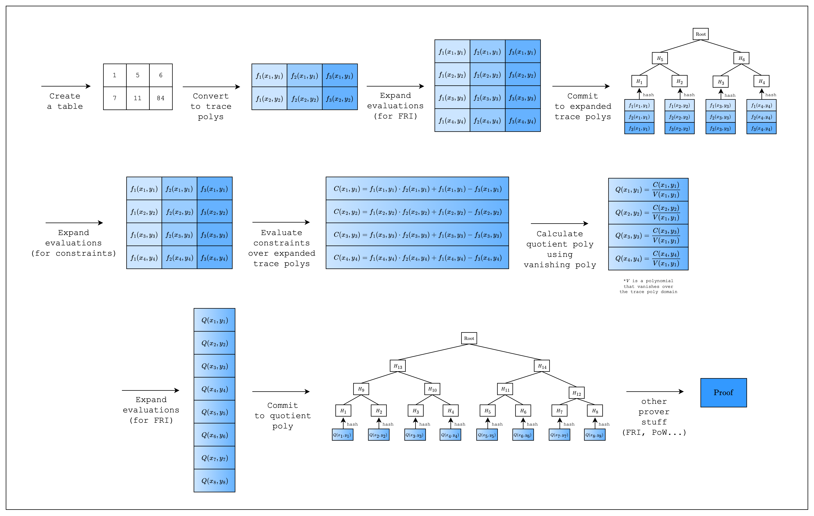

# First Breath of AIR

*Figure 1: Proving lifecycle in Stwo*

Welcome to the guide for writing AIRs in Stwo!

In this section, we will go through the process of writing a simple AIR from scratch. This requires some understanding of the proving lifecycle in Stwo, so we added a diagram showing a high-level overview of the whole process. As we go through each step, please note that the diagram may contain more steps than the code. This is because there are steps that are abstracted away by the Stwo implementation, but are necessary to understand the code that we write when creating an AIR.
