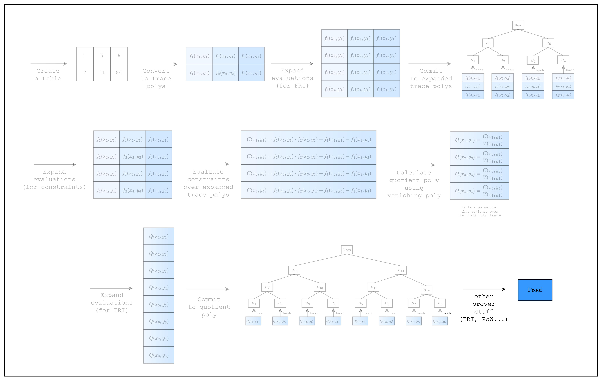

# Proving and Verifying an AIR



*Figure 1: Prover workflow: perform FRI and PoW*

We're finally ready for the last step: prove and verify an AIR!

Since the code is relatively short, let us present it first and then go over the details.

```rust,ignore
fn main() {
    // --snip--

    // Prove
    let proof = prove(&[&component], channel, commitment_scheme).unwrap();

    // Verify
    let channel = &mut Blake2sChannel::default();
    let commitment_scheme = &mut CommitmentSchemeVerifier::<Blake2sMerkleChannel>::new(config);
    let sizes = component.trace_log_degree_bounds();

    commitment_scheme.commit(proof.commitments[0], &sizes[0], channel);
    channel.mix_u64(log_num_rows as u64);
    commitment_scheme.commit(proof.commitments[1], &sizes[1], channel);

    verify(&[&component], channel, commitment_scheme, proof).unwrap();
}
```

## Prove

As you can see, there is only a single line of code added to create the proof. The `prove` function performs the FRI and PoW operations under the hood, although, technically, the constraint-related steps in [Figure 1](#fig-proving-an-air-1) were not performed in the previous section and are only performed once `prove` is called.

## Verify

In order to verify our proof, we need to check that the constraints are satisfied using the commitments from the proof. In order to do that, we need to set up a `Blake2sChannel` and `CommitmentSchemeVerifier<Blake2sMerkleChannel>`, along with the same `PcsConfig` that we used when creating the proof. Then, we need to recreate the Fiat-Shamir channel by passing the Merkle tree commitments and the `log_num_rows` to the `CommitmentSchemeVerifier` instance by calling `commit` (remember: the order is important!). Then, we can verify the proof using the `verify` function.

<Callout type="info">
Try setting the dummy values in the table to 1 instead of 0. Does it fail? If so, can you see why?
</Callout>

Congratulations! We have come full circle. We now know how to create a table, convert it to trace polynomials, commit to them, create constraints over the trace polynomials, and prove and verify the constraints (i.e. an AIR). In the following sections, we will go over some more complicated AIRs to explain S-two's other features.
