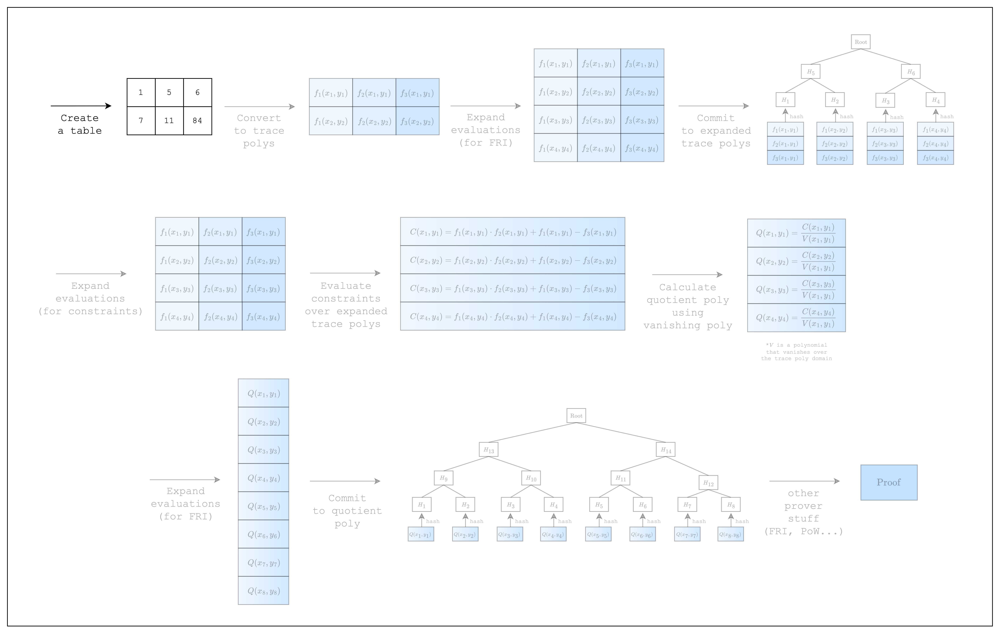
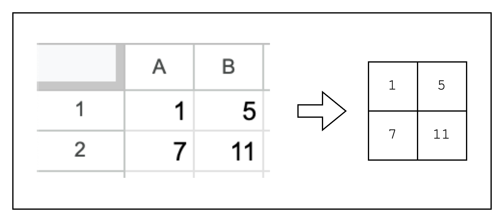

# Writing a Spreadsheet



*Figure 1: Prover workflow: Create a table*

In order to write a proof, we first need to create a table of rows and columns. This is no different from writing integers to an Excel spreadsheet as we can see in [Figure 2](#fig-writing-a-spreadsheet-2).



*Figure 2: From spreadsheet to table*

But there is a slight caveat to consider when creating the table. S-two implements [SIMD operations](https://en.wikipedia.org/wiki/Single_instruction,_multiple_data) to speed up the prover in the CPU, but this requires providing the table cells in chunks of 16 rows. Simply put, this is because S-two supports 16 lanes of 32-bit integers, which means that the same instruction can be run simultaneously for 16 different data.

Alas, for our table, we will need to create 14 dummy rows to make the total number of rows equal to 16, as shown in [Figure 3](#fig-writing-a-spreadsheet-3). For the sake of simplicity, however, we will omit the dummy rows in the diagrams of the following sections.


*Figure 3: Creating a table with 16 rows*

Given all that, let's create this table using S-two.

```rust,ignore
use stwo::prover::{
    backend::{
        simd::{column::BaseColumn, m31::N_LANES},
        Column,
    },
};
use stwo::core::fields::m31::M31;

fn main() {
    let num_rows = N_LANES;

    let mut col_1 = BaseColumn::zeros(num_rows as usize);
    col_1.set(0, M31::from(1));
    col_1.set(1, M31::from(7));

    let mut col_2 = BaseColumn::zeros(num_rows as usize);
    col_2.set(0, M31::from(5));
    col_2.set(1, M31::from(11));
}
```

As mentioned above, we instantiate the `num_rows` of our table as `N_LANES=16` to accommodate SIMD operations. Then we create a `BaseColumn` of `N_LANES=16` rows for each column and populate the first two rows with our values and the rest with dummy values.

Note that the values in the `BaseColumn` need to be of type `M31`, which refers to the Mersenne-31 prime field that S-two uses. This means that the integers in the table must lie in the range $[0, 2^{31}-1)$.

Now that we have our table, let's move on!
