# Benchmarks Report

- Overview of zkVM and Proof Systems

| zkVM / Proof System   | Architecture   | Frontend   | Backend       | Security Bits |
|:----------------------|:---------------|:-----------|:--------------|:--------------|
| [RISC Zero](https://github.com/risc0/risc0)             | RISC-V         | Rust       | STARK-based   | 96 bits       |
| [SP1](https://github.com/succinctlabs/sp1)       | RISC-V         | Rust       | STARK-based   | 100 bits      |
| [OpenVM](https://github.com/openvm-org/openvm)       | RISC-V         | Rust       | STARK-based   | 100 bits      |
| [Jolt](https://github.com/a16z/jolt)                  | RISC-V         | Rust       | Lookup-based  | -             |
| [Stone](https://github.com/starkware-libs/stone-prover)                 | Cairo VM       | Cairo      | STARK-based   | 100 bits      |
| [S-two](https://github.com/starkware-libs/stwo)                  | Cairo VM       | Cairo      | STARK-based   | 96 bits       |

- All benchmarks presented here are **CPU-only** and do not utilize any GPU acceleration.
- Stone benchmarks were generated using the `dynamic` layout with these [configurations](https://github.com/zksecurity/zkvm-benchmarks/tree/master/stone/configs).
- The benchmarks for SP1, R0 and OpenVM use compressed or succinct prover type, which aggregates all the STARK proofs into a single STARK proof.
- Benchmarks which run out of memory have been indicated by `💾` and benchmarks which generate errors in proof generation have been indicated by `❌` in the tables.

## Time and Commit Hash
- **Commit Hash**: f27856ec17fbd9e85ec31cba9c2cb9e96d8dd08f
- **Timestamp**: Thursday, July 03, 2025 20:52:50 UTC

## System Information

### OS Version
Ubuntu 24.04.2 LTS

### CPU Info

- **Architecture**: x86_64

- **CPU(s)**: 48

- **Model name**: AMD EPYC-Rome Processor

- **Thread(s) per core**: 2

- **Core(s) per socket**: 24

- **Socket(s)**: 1

- **L3 cache**: 16 MiB (1 instance)

### Memory Info

- **MemTotal**: 184.25 GB

- **MemFree**: 166.19 GB

- **MemAvailable**: 178.69 GB

## Fibonacci
Benchmark `n` Fibonacci iterations.

### Prover Time (s)
|       n |   jolt |     sp1 |   openvm |      r0 |   stone |   stwo |
|----:|----:|----:|----:|----:|----:|----:|
|   32768 |  3.208 |  15.003 |   34.291 |  17.128 |  56.325 | 13.198 |
|   65536 |  5.183 |  18.252 |   42.403 |  29.241 |  95.468 | 11.372 |
|  131072 |   9.17 |  24.982 |   57.978 |  52.298 |      💾 | 12.886 |
|  262144 | 15.771 |  39.327 |   92.229 |  86.743 |      💾 | 12.587 |
|  524288 |  28.16 |  54.812 |  158.128 | 167.607 |      💾 | 16.166 |
| 1048576 |  54.42 |  72.028 |  320.082 | 306.386 |      💾 | 18.612 |
| 2097152 | 107.89 | 128.215 |  515.567 |  605.92 |      💾 | 31.047 |
| 4194304 |     ❌ | 222.332 |  1042.58 | 1206.76 |      💾 | 60.939 |

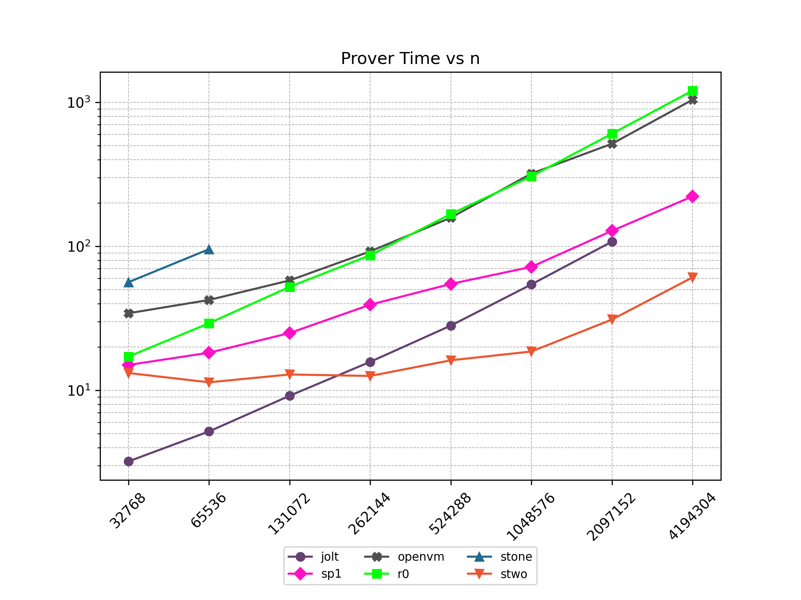

### Verifier Time (ms) 
|       n |   jolt |   sp1 |   openvm |   r0 |   stone |   stwo |
|----:|----:|----:|----:|----:|----:|----:|
|   32768 |   53.0 |   108 |      142 |   23 |    92.0 |     41 |
|   65536 |   77.0 |   107 |      139 |   10 |   113.0 |     16 |
|  131072 |   58.0 |   101 |      140 |   23 |      💾 |     18 |
|  262144 |  103.0 |   100 |      141 |   22 |      💾 |     89 |
|  524288 |   56.0 |    83 |      140 |   24 |      💾 |     14 |
| 1048576 |  104.0 |    83 |       57 |   23 |      💾 |    414 |
| 2097152 |   98.0 |    84 |       57 |   10 |      💾 |    367 |
| 4194304 |     ❌ |    83 |       57 |   23 |      💾 |     10 |

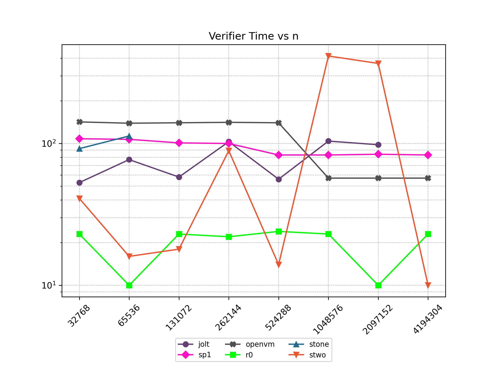

### Proof Size (KB)
|       n |    jolt |     sp1 |   openvm |      r0 |   stone |    stwo |
|----:|----:|----:|----:|----:|----:|----:|
|   32768 | 187.615 | 1315.53 |  1708.31 | 223.234 | 125.608 | 789.578 |
|   65536 | 197.799 | 1315.53 |  1708.31 | 223.234 |   129.8 |  783.63 |
|  131072 | 208.399 | 1315.53 |  1708.31 | 223.234 |      💾 | 783.834 |
|  262144 | 219.415 | 1315.53 |  1708.31 | 223.234 |      💾 | 802.678 |
|  524288 | 230.847 | 1315.53 |  1708.31 | 223.234 |      💾 | 801.194 |
| 1048576 | 242.695 | 1315.53 |  852.937 | 223.234 |      💾 | 808.038 |
| 2097152 | 254.959 | 1315.53 |  852.937 | 223.234 |      💾 | 819.122 |
| 4194304 |      ❌ | 1315.53 |  816.649 | 223.234 |      💾 | 866.882 |

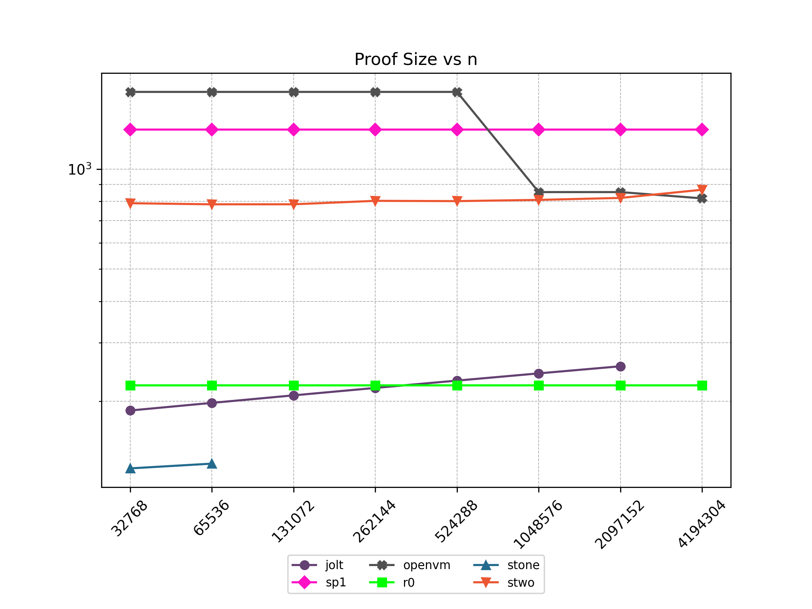

### Cycle Count
|       n |     jolt |      sp1 |       r0 |   stone |     stwo |
|----:|----:|----:|----:|----:|----:|
|   32768 |   196974 |   168808 |   166215 |  229390 |   262143 |
|   65536 |   393582 |   332648 |   330055 |  458766 |   524287 |
|  131072 |   786798 |   660328 |   657735 |      💾 |  1048575 |
|  262144 |  1573230 |  1315688 |  1313095 |      💾 |  2097151 |
|  524288 |  3146041 |  2626408 |  2623815 |      💾 |  4194303 |
| 1048576 |  6291822 |  5247848 |  5245255 |      💾 |  8388607 |
| 2097152 | 12583293 | 10490728 | 10488135 |      💾 | 16777215 |
| 4194304 |       ❌ | 20976488 | 20973895 |      💾 | 33554431 |

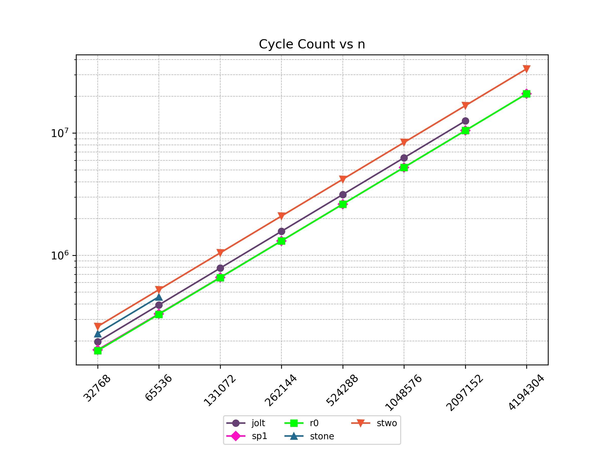

### Peak Memory (GB)
|       n |   jolt |   sp1 |   openvm |   r0 |   stone |   stwo |
|----:|----:|----:|----:|----:|----:|----:|
|   32768 |   6.44 |  5.12 |        7 |  2.3 |   59.44 |  11.08 |
|   65536 |   5.83 |  6.42 |     5.43 | 4.58 |  118.54 |  11.46 |
|  131072 |   8.79 |  9.18 |     5.43 | 9.15 |      💾 |   12.2 |
|  262144 |  14.73 |  14.3 |     6.57 | 9.17 |      💾 |  14.01 |
|  524288 |  26.95 | 15.12 |    12.22 | 9.17 |      💾 |  17.57 |
| 1048576 |  50.85 | 25.94 |    12.22 | 9.17 |      💾 |  24.57 |
| 2097152 |  98.93 | 35.61 |    12.42 | 9.18 |      💾 |  38.62 |
| 4194304 |     ❌ | 51.25 |    12.43 | 9.18 |      💾 |  72.26 |

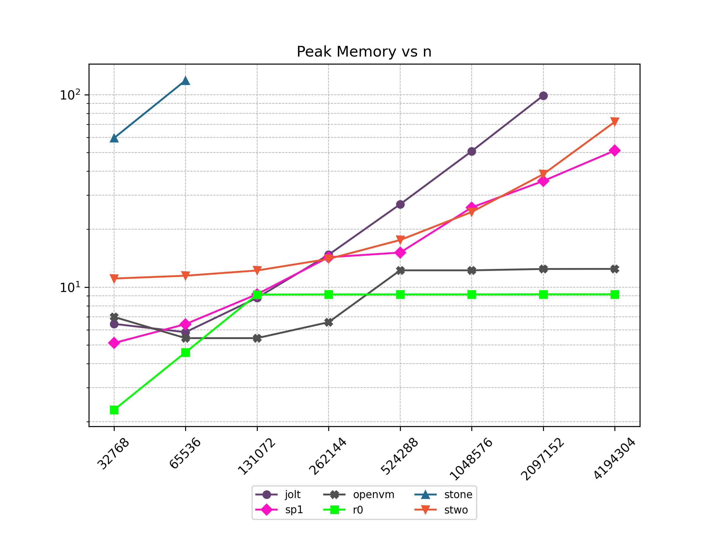

## Sha2
Benchmark Sha256 hash of `n` bytes. For Stone, the [cairo implementation of sha256](https://github.com/cartridge-gg/cairo-sha256) by cartridge was used for benchmarking and for other zkvms [sha2 Rust crate](https://crates.io/crates/sha2) was used for benchmarking.

### Prover Time (s)
|      n |   jolt |     sp1 |   openvm |      r0 |   stone |   stwo |   sp1-precompile |   r0-precompile |   openvm-precompile |
|----:|----:|----:|----:|----:|----:|----:|----:|----:|----:|
|    256 |  1.657 |   12.71 |   28.943 |  11.196 |  10.835 | 17.978 |           34.019 |           8.316 |              44.301 |
|    512 |  1.711 |  13.184 |   29.561 |  11.306 |   19.88 | 15.051 |           33.991 |           11.33 |              43.728 |
|   1024 |  2.173 |  13.863 |   30.609 |  17.136 |  31.021 | 16.833 |            33.83 |          11.201 |              44.897 |
|   2048 |  3.324 |  15.021 |   34.184 |  28.934 |  31.294 | 17.726 |           34.531 |          17.174 |              44.683 |
|   4096 |     ❌ |   16.88 |    39.38 |  52.487 |  66.539 | 14.084 |           34.418 |          28.982 |              47.701 |
|   8192 |     ❌ |  24.037 |   50.539 |  86.688 | 116.467 | 14.979 |           35.564 |           52.48 |              48.995 |
|  16384 |     ❌ |  37.958 |   78.057 | 167.856 |      💾 | 21.402 |           38.267 |         110.887 |              52.865 |
|  32768 |     ❌ |  52.566 |  129.842 | 300.572 |      💾 | 16.555 |           46.209 |         184.873 |              60.148 |
|  65536 |     ❌ |  72.136 |  249.403 |  589.84 |      💾 | 18.384 |           60.138 |         357.716 |              79.957 |
| 131072 |     ❌ | 136.592 |  532.796 | 1172.21 |      💾 | 27.871 |            87.29 |         709.726 |             124.996 |
| 262144 |     ❌ |  257.02 |  916.603 | 2338.03 |      💾 | 27.362 |          121.022 |         1415.34 |             219.654 |
| 524288 |     ❌ | 513.726 |  1790.29 | 4673.32 |      💾 | 43.242 |          233.959 |         2825.46 |             393.678 |

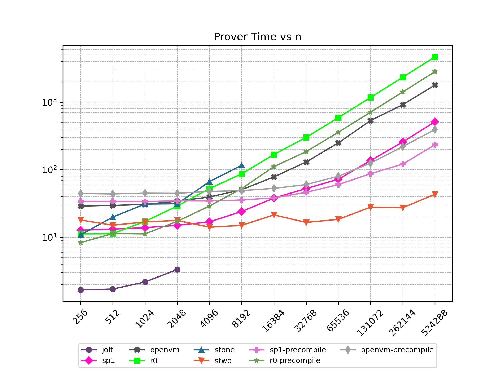

### Verifier Time (ms)
|      n |   jolt |   sp1 |   openvm |   r0 |   stone |   stwo |   sp1-precompile |   r0-precompile |   openvm-precompile |
|----:|----:|----:|----:|----:|----:|----:|----:|----:|----:|
|    256 |   50.0 |   108 |      141 |   10 |   428.0 |     10 |               83 |              22 |                 142 |
|    512 |   49.0 |   113 |      144 |   20 |   418.0 |     11 |              106 |              23 |                 141 |
|   1024 |   49.0 |   102 |      140 |   23 |   426.0 |     11 |               90 |              15 |                 141 |
|   2048 |   75.0 |    97 |      140 |   22 |   440.0 |     11 |              109 |              22 |                 142 |
|   4096 |     ❌ |   106 |      139 |   22 |   454.0 |     11 |               99 |              23 |                 141 |
|   8192 |     ❌ |   109 |      141 |   22 |   525.0 |     11 |               87 |              22 |                 142 |
|  16384 |     ❌ |    82 |      144 |   22 |      💾 |     42 |               92 |              23 |                 142 |
|  32768 |     ❌ |    94 |      140 |   23 |      💾 |     49 |              102 |              15 |                 142 |
|  65536 |     ❌ |    83 |      141 |   23 |      💾 |    143 |               95 |              23 |                 141 |
| 131072 |     ❌ |    83 |       57 |   24 |      💾 |    441 |               83 |              24 |                 141 |
| 262144 |     ❌ |    83 |       56 |   24 |      💾 |    236 |               83 |              23 |                 142 |
| 524288 |     ❌ |    83 |       56 |   23 |      💾 |     12 |               82 |              24 |                 141 |

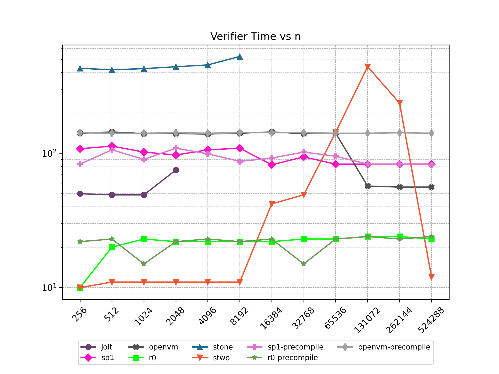

### Proof Size (KB)
|      n |    jolt |     sp1 |   openvm |      r0 |   stone |    stwo |   sp1-precompile |   r0-precompile |   openvm-precompile |
|----:|----:|----:|----:|----:|----:|----:|----:|----:|----:|
|    256 | 172.143 | 1315.56 |  1708.31 | 223.482 | 104.104 | 986.394 |          1315.56 |         223.482 |             1784.35 |
|    512 | 172.143 | 1315.56 |  1708.31 | 223.482 | 114.152 | 1000.61 |          1315.56 |         223.482 |             1784.35 |
|   1024 | 181.495 | 1315.56 |  1708.31 | 223.482 | 117.224 | 1011.16 |          1315.56 |         223.482 |             1784.35 |
|   2048 | 191.263 | 1315.56 |  1708.31 | 223.482 |  120.04 | 1011.71 |          1315.56 |         223.482 |             1784.35 |
|   4096 |      ❌ | 1315.56 |  1708.31 | 223.482 | 126.632 | 1007.77 |          1315.56 |         223.482 |             1784.35 |
|   8192 |      ❌ | 1315.56 |  1708.31 | 223.482 | 130.824 | 1013.42 |          1315.56 |         223.482 |             1784.35 |
|  16384 |      ❌ | 1315.56 |  1708.31 | 223.482 |      💾 | 1005.31 |          1315.56 |         223.482 |             1784.35 |
|  32768 |      ❌ | 1315.56 |  1708.31 | 223.482 |      💾 | 1018.49 |          1315.56 |         223.482 |             1784.35 |
|  65536 |      ❌ | 1315.56 |  1708.31 | 223.482 |      💾 | 1017.72 |          1315.56 |         223.482 |             1784.35 |
| 131072 |      ❌ | 1315.56 |  852.937 | 223.482 |      💾 | 1037.15 |          1315.56 |         223.482 |             1784.35 |
| 262144 |      ❌ | 1315.56 |  852.937 | 223.482 |      💾 | 1045.93 |          1315.56 |         223.482 |             1784.35 |
| 524288 |      ❌ | 1315.56 |  816.649 | 223.482 |      💾 | 1092.14 |          1315.56 |         223.482 |             1784.35 |

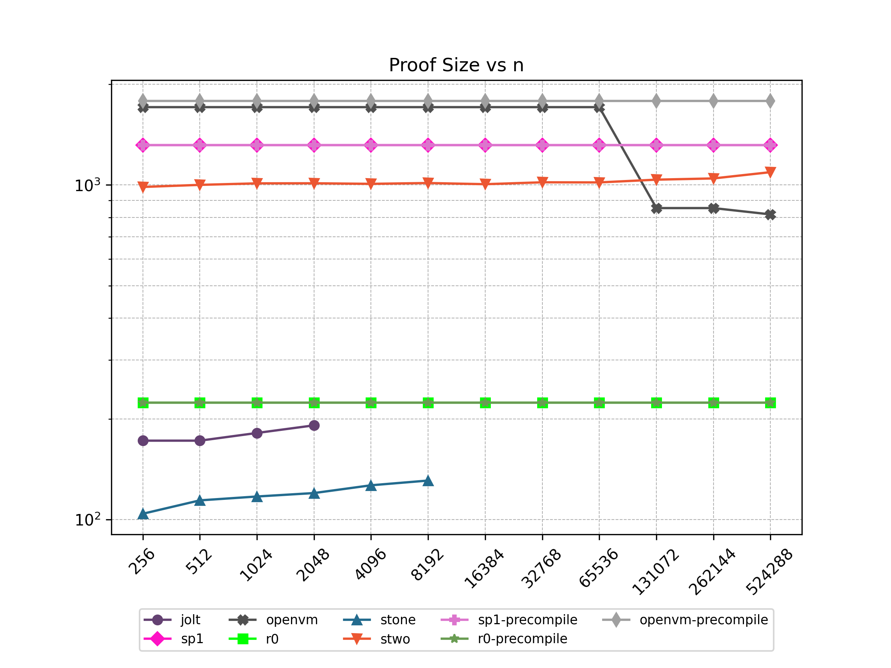

### Cycle Count
|      n |    jolt |      sp1 |       r0 |   stone |     stwo |   sp1-precompile |   r0-precompile |
|----:|----:|----:|----:|----:|----:|----:|----:|
|    256 | 35325.0 |    33911 |    51280 | 14791.0 |   131071 |            11492 |           31643 |
|    512 | 60893.0 |    52743 |    90848 | 29233.0 |   131071 |            15820 |           55467 |
|   1024 |  112029 |    90407 |   169984 | 46295.0 |   131071 |            24476 |          103133 |
|   2048 |  214301 |   165735 |   328256 | 80419.0 |   131071 |            41788 |          198463 |
|   4096 |      ❌ |   316391 |   644800 |  160489 |   262143 |            76412 |          389106 |
|   8192 |      ❌ |   617703 |  1277888 |  308807 |   524287 |           145660 |          770392 |
|  16384 |      ❌ |  1220327 |  2544064 |      💾 |  1048575 |           284156 |         1532981 |
|  32768 |      ❌ |  2425575 |  5076416 |      💾 |  2097151 |           561148 |         3058159 |
|  65536 |      ❌ |  4836071 | 10141120 |      💾 |  4194303 |          1115132 |         6108532 |
| 131072 |      ❌ |  9657063 | 20270528 |      💾 |  8388607 |          2223100 |        12209241 |
| 262144 |      ❌ | 19299047 | 40529344 |      💾 | 16777215 |          4439036 |        24410676 |
| 524288 |      ❌ | 38583015 | 81046976 |      💾 | 33554431 |          8870908 |        48813546 |

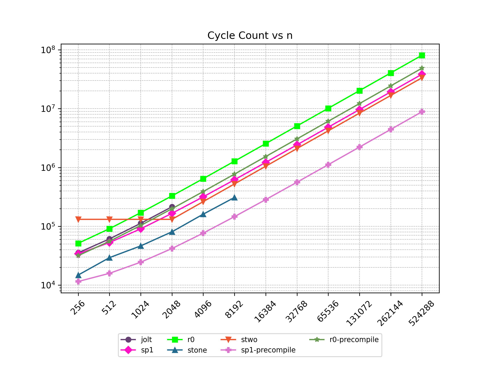

### Peak Memory (GB)
|      n |   jolt |   sp1 |   openvm |   r0 |   stone |   stwo |   sp1-precompile |   r0-precompile |   openvm-precompile |
|----:|----:|----:|----:|----:|----:|----:|----:|----:|----:|
|    256 |   5.09 |  4.29 |     5.45 | 1.43 |    9.63 |  10.79 |             7.84 |            1.43 |                5.44 |
|    512 |    4.9 |  4.42 |     5.44 | 1.42 |    18.9 |  10.82 |             8.18 |            1.42 |                5.45 |
|   1024 |    4.9 |  4.54 |     5.44 |  2.3 |   35.74 |  10.86 |             8.01 |            1.42 |                5.44 |
|   2048 |   4.91 |  5.02 |     5.44 | 4.58 |   35.73 |  10.87 |              8.1 |             2.3 |                5.44 |
|   4096 |     ❌ |  6.28 |     5.44 | 9.15 |   71.46 |  11.03 |             8.29 |            4.59 |                5.44 |
|   8192 |     ❌ |   8.6 |     5.44 | 9.17 |  142.68 |  11.34 |             8.53 |            9.16 |                5.44 |
|  16384 |     ❌ | 13.32 |     5.44 | 9.18 |      💾 |  11.94 |             8.79 |            9.17 |                5.44 |
|  32768 |     ❌ | 15.31 |     8.78 | 9.18 |      💾 |  13.48 |             8.63 |            9.18 |                5.44 |
|  65536 |     ❌ | 29.19 |    16.64 | 9.18 |      💾 |  16.52 |             12.9 |            9.18 |                5.44 |
| 131072 |     ❌ |  35.4 |     21.6 |  9.2 |      💾 |   22.5 |            21.26 |            9.19 |                6.89 |
| 262144 |     ❌ | 45.34 |    22.77 | 9.21 |      💾 |  34.52 |            34.15 |            9.21 |               12.86 |
| 524288 |     ❌ | 54.88 |    25.59 | 9.25 |      💾 |  63.89 |            49.57 |            9.23 |               24.78 |

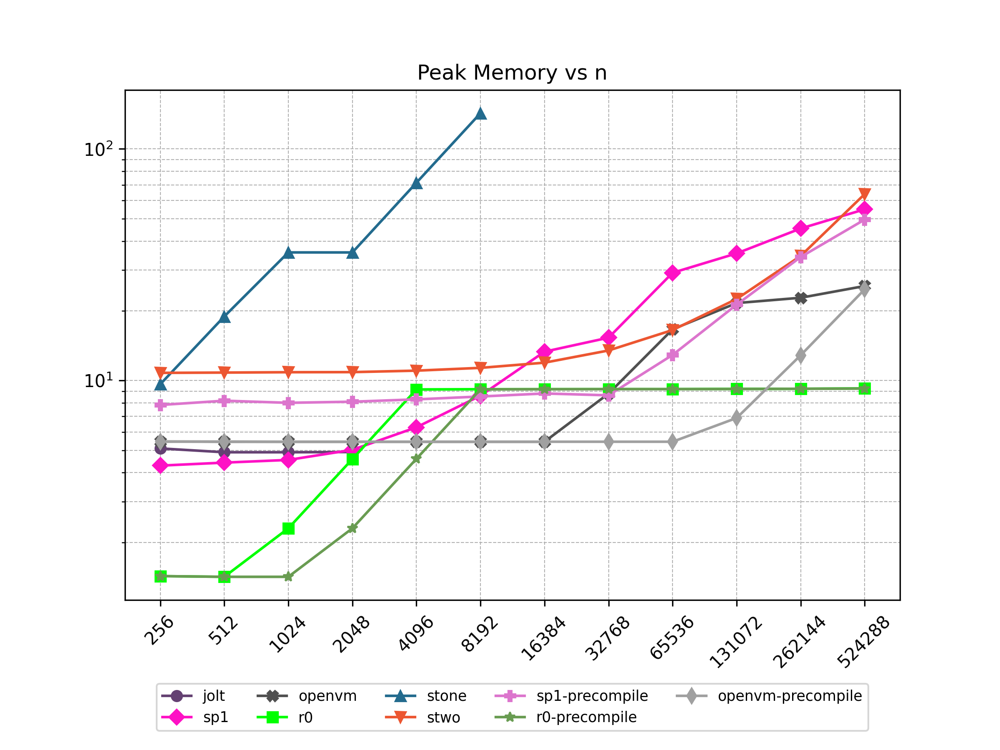

## Sha2-Chain
Benchmark Sha256 hash of 32 bytes for `n` iteration.

### Prover Time (s)
|     n |   jolt |     sp1 |   openvm |      r0 |   stone |   stwo |   sp1-precompile |   r0-precompile |   openvm-precompile |
|----:|----:|----:|----:|----:|----:|----:|----:|----:|----:|
|     8 |  2.164 |  12.798 |   29.444 |  11.303 |  11.083 | 11.488 |           34.606 |           6.862 |              43.511 |
|    16 |  2.973 |  13.875 |   30.349 |  11.252 |  11.115 | 18.583 |           34.339 |           8.352 |              44.295 |
|    32 |  4.912 |   14.62 |   33.814 |  17.156 |  11.991 | 11.938 |           34.203 |           8.305 |              43.893 |
|    64 |  8.285 |  17.617 |   38.294 |  28.948 |  10.631 | 14.158 |           33.862 |          11.289 |              44.197 |
|   128 | 14.469 |  24.728 |   49.582 |  52.457 |  19.206 | 10.335 |           35.134 |          11.315 |              45.006 |
|   256 | 25.909 |  37.471 |   73.574 |  74.818 |  26.184 | 14.057 |           36.234 |          17.422 |              42.793 |
|   512 | 50.064 |  52.895 |  126.086 | 144.234 |  56.529 | 22.012 |           40.643 |          29.057 |              46.573 |
|  1024 | 96.901 |  71.752 |  231.888 | 285.012 |  95.878 | 20.846 |            50.02 |          52.522 |              52.862 |
|  2048 |     ❌ | 132.275 |  516.789 | 574.819 |      💾 | 14.061 |           77.808 |         110.071 |              61.761 |
|  4096 |     ❌ | 227.325 |  905.706 | 1110.77 |      💾 | 17.799 |          103.011 |         191.208 |              81.617 |
|  8192 |     ❌ | 444.028 |  1814.44 | 2210.89 |      💾 | 18.607 |          193.572 |         365.446 |              122.31 |
| 16384 |     ❌ | 872.638 |  3596.93 | 4404.24 |      💾 | 20.569 |           319.33 |         723.963 |              212.16 |
| 32768 |     ❌ | 1698.85 |  7067.26 | 8791.74 |      💾 | 25.041 |          628.712 |         1443.04 |              388.56 |

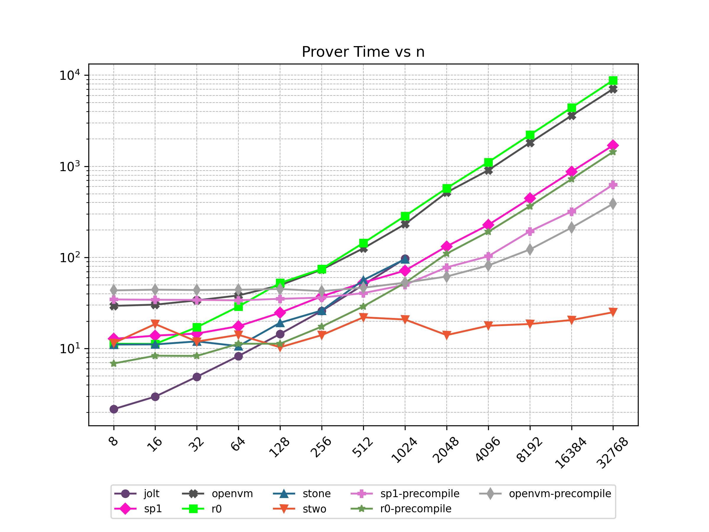

### Verifier Time (ms)
|     n |   jolt |   sp1 |   openvm |   r0 |   stone |   stwo |   sp1-precompile |   r0-precompile |   openvm-precompile |
|----:|----:|----:|----:|----:|----:|----:|----:|----:|----:|
|     8 |   49.0 |    82 |      140 |   22 |   432.0 |     10 |               83 |              23 |                 141 |
|    16 |   55.0 |   101 |      140 |   23 |   398.0 |     10 |               93 |              20 |                 142 |
|    32 |   86.0 |   108 |      140 |   22 |   402.0 |     10 |               94 |              21 |                 141 |
|    64 |  102.0 |    88 |      140 |   23 |   375.0 |     10 |               87 |              22 |                 141 |
|   128 |   78.0 |   108 |      141 |   23 |   413.0 |     10 |               84 |              21 |                 141 |
|   256 |   60.0 |    83 |      139 |   22 |   422.0 |     11 |               83 |              23 |                 141 |
|   512 |   60.0 |    84 |      140 |   22 |   420.0 |     37 |               83 |              22 |                 142 |
|  1024 |  103.0 |    83 |      139 |   23 |   456.0 |     41 |               83 |              22 |                 141 |
|  2048 |     ❌ |    83 |       57 |   23 |      💾 |     40 |               83 |              10 |                 141 |
|  4096 |     ❌ |    86 |       56 |   22 |      💾 |    119 |               83 |              23 |                 141 |
|  8192 |     ❌ |    83 |       56 |   22 |      💾 |    116 |               83 |              10 |                 142 |
| 16384 |     ❌ |    84 |       56 |   24 |      💾 |    182 |               86 |              23 |                 141 |
| 32768 |     ❌ |    83 |       56 |   24 |      💾 |    262 |               83 |              23 |                 141 |

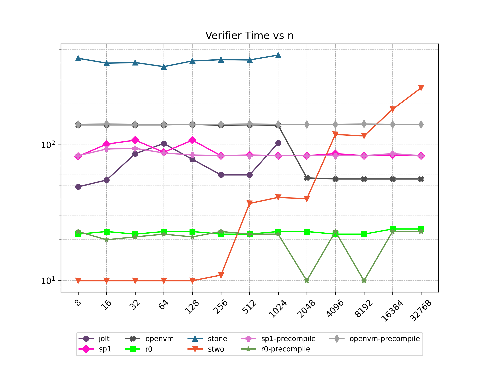

### Proof Size (KB)
|     n |    jolt |     sp1 |   openvm |      r0 |   stone |    stwo |   sp1-precompile |   r0-precompile |   openvm-precompile |
|----:|----:|----:|----:|----:|----:|----:|----:|----:|----:|
|     8 | 181.495 | 1315.56 |  1708.31 | 223.482 | 109.544 | 952.094 |          1315.56 |         223.482 |             1784.35 |
|    16 | 191.263 | 1315.56 |  1708.31 | 223.482 | 106.728 | 971.154 |          1315.56 |         223.482 |             1784.35 |
|    32 | 201.447 | 1315.56 |  1708.31 | 223.482 | 108.776 | 955.554 |          1315.56 |         223.482 |             1784.35 |
|    64 | 212.047 | 1315.56 |  1708.31 | 223.482 | 106.568 | 962.798 |          1315.56 |         223.482 |             1784.35 |
|   128 | 223.063 | 1315.56 |  1708.31 | 223.482 |  112.36 | 946.158 |          1315.56 |         223.482 |             1784.35 |
|   256 | 234.495 | 1315.56 |  1708.31 | 223.482 | 117.992 | 969.698 |          1315.56 |         223.482 |             1784.35 |
|   512 | 246.343 | 1315.56 |  1708.31 | 223.482 | 124.168 | 947.738 |          1315.56 |         223.482 |             1784.35 |
|  1024 | 258.607 | 1315.56 |  1708.31 | 223.482 | 129.512 | 948.874 |          1315.56 |         223.482 |             1784.35 |
|  2048 |      ❌ | 1315.56 |  852.937 | 223.482 |      💾 | 959.414 |          1315.56 |         223.482 |             1784.35 |
|  4096 |      ❌ | 1315.56 |  852.937 | 223.482 |      💾 | 966.074 |          1315.56 |         223.482 |             1784.35 |
|  8192 |      ❌ | 1315.56 |  816.649 | 223.482 |      💾 | 976.142 |          1315.56 |         223.482 |             1784.35 |
| 16384 |      ❌ | 1315.56 |  816.649 | 223.482 |      💾 | 986.186 |          1315.56 |         223.482 |             1784.35 |
| 32768 |      ❌ | 1315.56 |  852.937 | 223.482 |      💾 | 1001.51 |          1315.56 |         223.482 |             1784.35 |

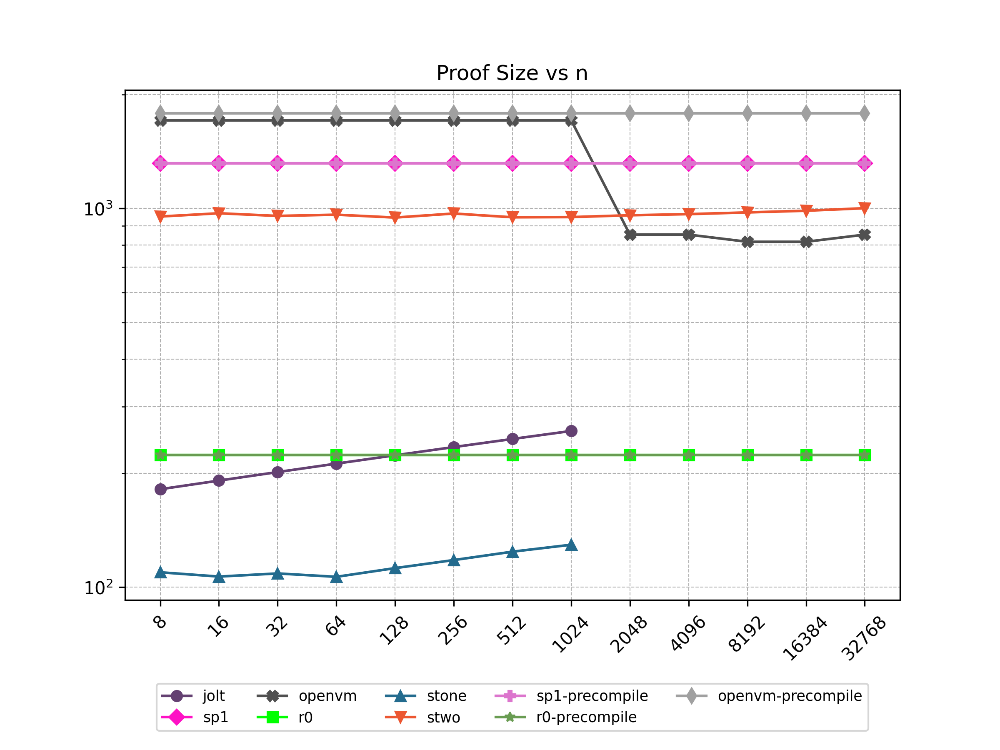

### Cycle Count
|     n |    jolt |       sp1 |        r0 |   stone |     stwo |   sp1-precompile |   r0-precompile |
|----:|----:|----:|----:|----:|----:|----:|----:|
|     8 | 69290.0 |     48118 |     45952 |  3008.0 |    65535 |            13495 |           14624 |
|    16 |  136282 |     85686 |     83432 |  5872.0 |    65535 |            20287 |           20776 |
|    32 |  270266 |    160822 |    158392 | 11600.0 |    65535 |            33871 |           33080 |
|    64 |  538234 |    311094 |    308312 | 23056.0 |    65535 |            61039 |           57688 |
|   128 | 1074187 |    611638 |    608152 | 45968.0 |    65535 |           115375 |          106904 |
|   256 | 2146059 |   1212726 |   1207832 | 91792.0 |   131071 |           224047 |          205336 |
|   512 | 4289803 |   2414902 |   2407192 |  183440 |   262143 |           441391 |          402200 |
|  1024 | 8577291 |   4819254 |   4805912 |  366736 |   524287 |           876079 |          795928 |
|  2048 |      ❌ |   9627958 |   9603352 |      💾 |  1048575 |          1745455 |         1583384 |
|  4096 |      ❌ |  19245366 |  19198232 |      💾 |  2097151 |          3484207 |         3158296 |
|  8192 |      ❌ |  38480182 |  38387992 |      💾 |  4194303 |          6961711 |         6308120 |
| 16384 |      ❌ |  76949814 |  76767512 |      💾 |  8388607 |         13916719 |        12607768 |
| 32768 |      ❌ | 153889078 | 153526552 |      💾 | 16777215 |         27826735 |        25207064 |

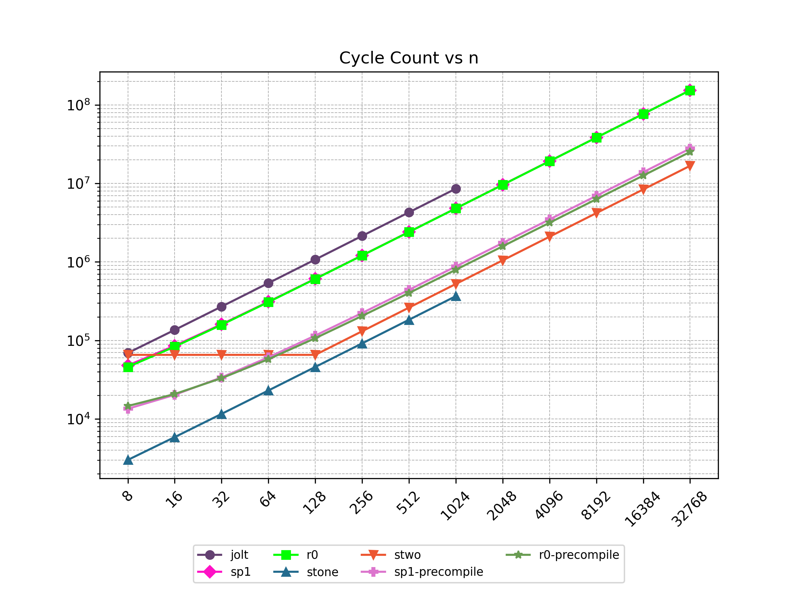

### Peak Memory (GB)
|     n |   jolt |   sp1 |   openvm |   r0 |   stone |   stwo |   sp1-precompile |   r0-precompile |   openvm-precompile |
|----:|----:|----:|----:|----:|----:|----:|----:|----:|----:|
|     8 |    5.1 |  4.31 |     5.44 | 1.42 |     9.1 |  10.74 |             7.81 |            1.44 |                5.44 |
|    16 |   4.91 |  4.54 |     5.44 | 1.42 |    9.04 |  10.74 |             8.04 |            1.43 |                5.44 |
|    32 |   5.92 |  4.98 |     5.44 |  2.3 |    9.04 |  10.75 |              8.5 |            1.43 |                5.44 |
|    64 |   8.69 |  6.19 |     5.44 | 4.58 |    9.05 |  10.77 |             8.05 |            1.42 |                5.44 |
|   128 |  14.39 |  8.81 |     5.44 | 9.14 |   17.87 |  10.78 |             8.29 |            1.42 |                5.44 |
|   256 |  26.36 | 13.27 |     5.44 | 9.17 |   29.66 |  10.83 |             8.52 |             2.3 |                5.44 |
|   512 |  48.32 |  14.7 |     8.57 | 9.17 |   59.33 |  10.95 |             8.63 |            4.59 |                5.44 |
|  1024 |  93.03 |  27.2 |    16.24 | 9.17 |  118.62 |  11.18 |            11.08 |            9.15 |                5.44 |
|  2048 |     ❌ |  40.4 |    20.59 | 9.18 |      💾 |  11.64 |            18.61 |            9.17 |                5.44 |
|  4096 |     ❌ | 44.04 |     20.6 | 9.19 |      💾 |  12.88 |            35.18 |            9.17 |                5.44 |
|  8192 |     ❌ | 55.14 |    20.62 |  9.2 |      💾 |  15.31 |             53.3 |            9.17 |                6.64 |
| 16384 |     ❌ | 58.47 |    20.66 |  9.2 |      💾 |  20.08 |            52.23 |            9.18 |               12.34 |
| 32768 |     ❌ | 60.22 |     20.8 | 9.27 |      💾 |  29.71 |            63.03 |            9.18 |               23.74 |

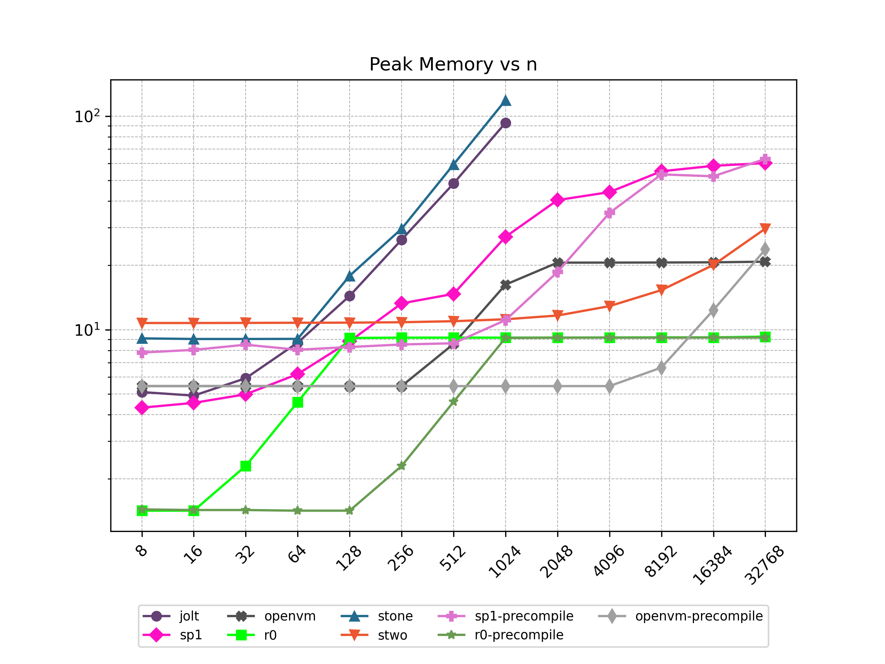

## Sha3
Benchmark Keccak256 hash of `n` bytes. For Stone, the implementation of Keccak256 from stdlib as well as builtin was benchmarked.

### Prover Time (s)
|      n |   jolt |     sp1 |   openvm |      r0 |   stone |    stwo |   sp1-precompile |   r0-precompile |   openvm-precompile |   stone-precompile |
|----:|----:|----:|----:|----:|----:|----:|----:|----:|----:|----:|
|    256 |  1.719 |  13.328 |   31.471 |  11.348 |  20.266 |  19.743 |           60.343 |            33.9 |              57.925 |             18.361 |
|    512 |  2.109 |  13.627 |   32.773 |  17.205 |  30.972 |  10.897 |           60.387 |          36.853 |              59.354 |              17.21 |
|   1024 |   3.15 |  15.275 |   34.777 |  17.179 |  65.925 |  23.258 |           60.193 |          42.789 |              58.748 |             18.037 |
|   2048 |  4.924 |  17.564 |   39.929 |  29.094 | 115.746 |  16.661 |           60.696 |          43.047 |              59.419 |              16.58 |
|   4096 |     ❌ |  24.096 |   45.142 |   52.54 |      💾 |  11.693 |           60.073 |          54.792 |              61.503 |             27.567 |
|   8192 |     ❌ |  37.851 |   60.927 |  110.08 |      💾 |  16.392 |           61.477 |          78.203 |              63.798 |             43.043 |
|  16384 |     ❌ |  50.158 |    94.74 | 225.876 |      💾 |  15.422 |           63.416 |         136.103 |              70.003 |             86.217 |
|  32768 |     ❌ |  66.943 |  165.212 | 422.471 |      💾 |  16.528 |           70.234 |         251.263 |               79.62 |            151.873 |
|  65536 |     ❌ | 109.098 |  308.693 | 841.045 |      💾 |  21.269 |           84.047 |         437.697 |             102.599 |                 💾 |
| 131072 |     ❌ | 207.231 |  753.494 | 1671.26 |      💾 |  32.631 |           96.357 |         856.136 |             151.591 |                 💾 |
| 262144 |     ❌ | 367.867 |  1526.34 |  3310.6 |      💾 |  59.078 |           133.31 |         1691.49 |             252.934 |                 💾 |
| 524288 |     ❌ |  701.99 |  3048.73 | 6615.82 |      💾 | 106.153 |          191.352 |         3376.32 |             454.067 |                 💾 |

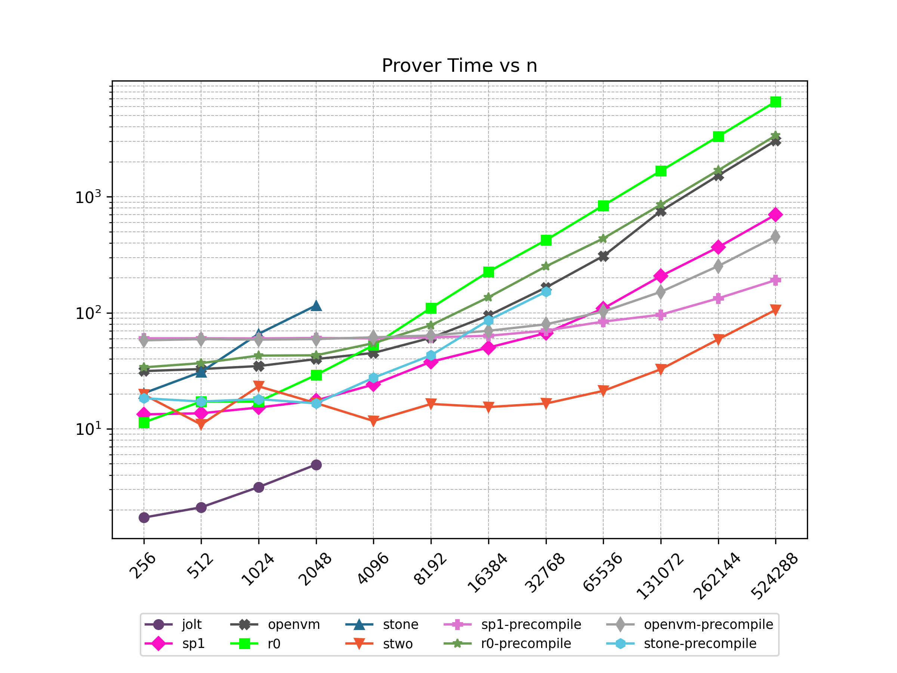

### Verifier Time (ms)
|      n |   jolt |   sp1 |   openvm |   r0 |   stone |   stwo |   sp1-precompile |   r0-precompile |   openvm-precompile |   stone-precompile |
|----:|----:|----:|----:|----:|----:|----:|----:|----:|----:|----:|
|    256 |   77.0 |   107 |      139 |   23 |   505.0 |     11 |              116 |              24 |                 141 |              269.0 |
|    512 |   66.0 |   107 |      139 |   23 |   494.0 |     11 |              108 |              23 |                 141 |              213.0 |
|   1024 |   58.0 |    84 |      139 |   22 |   495.0 |     11 |               88 |              23 |                 141 |              244.0 |
|   2048 |   61.0 |   109 |      140 |   24 |   544.0 |     11 |              104 |              22 |                 141 |              217.0 |
|   4096 |     ❌ |   110 |      140 |   22 |      💾 |     11 |              114 |              22 |                 142 |              229.0 |
|   8192 |     ❌ |   108 |      139 |   23 |      💾 |     11 |               89 |              22 |                 142 |              254.0 |
|  16384 |     ❌ |    83 |      140 |   24 |      💾 |     38 |               91 |              23 |                 142 |              262.0 |
|  32768 |     ❌ |    83 |      140 |   24 |      💾 |    139 |               88 |              22 |                 141 |              273.0 |
|  65536 |     ❌ |    82 |      140 |   24 |      💾 |    198 |              111 |              23 |                 141 |                 💾 |
| 131072 |     ❌ |    83 |       57 |   24 |      💾 |    201 |               88 |              22 |                 141 |                 💾 |
| 262144 |     ❌ |    83 |       56 |   23 |      💾 |    631 |               88 |              23 |                 141 |                 💾 |
| 524288 |     ❌ |    83 |       56 |   22 |      💾 |    191 |               88 |              23 |                 141 |                 💾 |

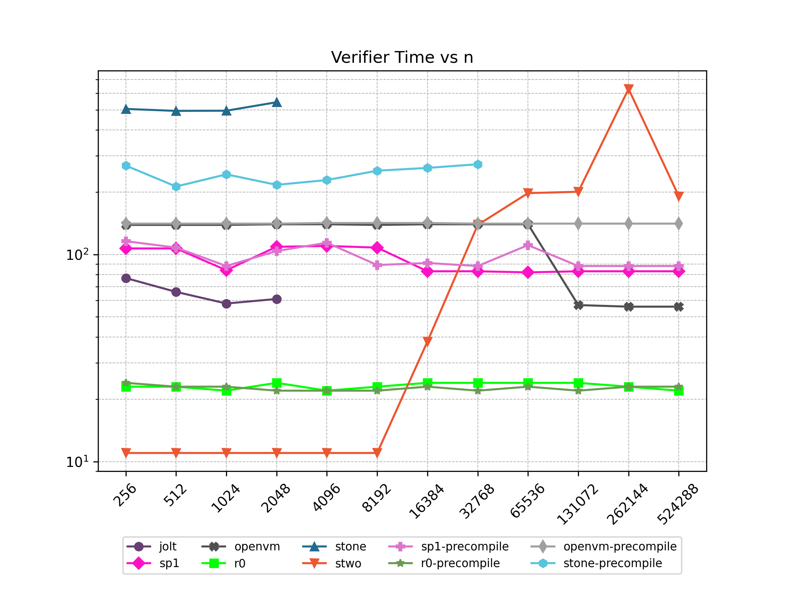

### Proof Size (KB)
|      n |    jolt |     sp1 |   openvm |      r0 |   stone |    stwo |   sp1-precompile |   r0-precompile |   openvm-precompile |   stone-precompile |
|----:|----:|----:|----:|----:|----:|----:|----:|----:|----:|----:|
|    256 | 170.823 | 1315.56 |  1708.31 | 223.482 |  113.64 | 1002.79 |          1477.23 |         223.482 |             1787.55 |            108.008 |
|    512 | 180.175 | 1315.56 |  1708.31 | 223.482 | 119.272 | 991.494 |          1477.23 |         223.482 |             1787.55 |            107.752 |
|   1024 | 189.943 | 1315.56 |  1708.31 | 223.482 |  126.92 | 1001.15 |          1477.23 |         223.482 |             1787.55 |            110.312 |
|   2048 | 200.127 | 1315.56 |  1708.31 | 223.482 | 130.536 |  1001.4 |          1477.23 |         223.482 |             1787.55 |            110.056 |
|   4096 |      ❌ | 1315.56 |  1708.31 | 223.482 |      💾 | 1016.95 |          1477.23 |         223.482 |             1787.55 |             114.92 |
|   8192 |      ❌ | 1315.56 |  1708.31 | 223.482 |      💾 | 1012.45 |          1477.23 |         223.482 |             1787.55 |            119.848 |
|  16384 |      ❌ | 1315.56 |  1708.31 | 223.482 |      💾 |  1027.4 |          1477.23 |         223.482 |             1787.55 |            126.088 |
|  32768 |      ❌ | 1315.56 |  1708.31 | 223.482 |      💾 | 1014.61 |          1477.23 |         223.482 |             1787.55 |            132.872 |
|  65536 |      ❌ | 1315.56 |  1708.31 | 223.482 |      💾 | 1037.78 |          1477.23 |         223.482 |             1787.55 |                 💾 |
| 131072 |      ❌ | 1315.56 |  852.937 | 223.482 |      💾 | 1073.61 |          1477.23 |         223.482 |             1787.55 |                 💾 |
| 262144 |      ❌ | 1315.56 |  816.649 | 223.482 |      💾 | 1154.34 |          1477.23 |         223.482 |             1787.55 |                 💾 |
| 524288 |      ❌ | 1315.56 |  852.937 | 223.482 |      💾 | 1179.28 |          1477.23 |         223.482 |             1787.55 |                 💾 |

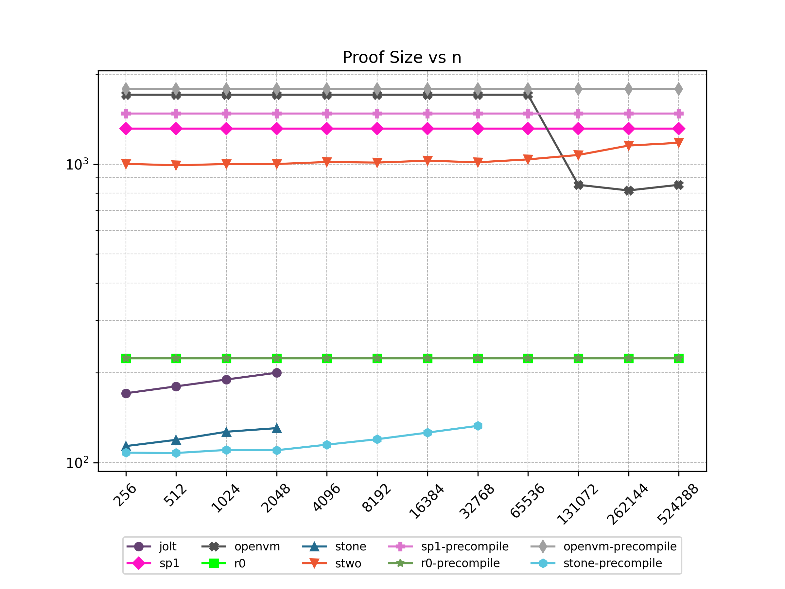

### Cycle Count
|      n |    jolt |      sp1 |        r0 |   stone |     stwo |   sp1-precompile |   r0-precompile |   stone-precompile |
|----:|----:|----:|----:|----:|----:|----:|----:|----:|
|    256 | 46732.0 |    47653 |     63651 | 19431.0 |   131071 |            15337 |           36390 |              998.0 |
|    512 | 90274.0 |    84714 |    121925 | 38611.0 |   131071 |            20082 |           63910 |             1762.0 |
|   1024 |  177358 |   158823 |    238473 | 59058.0 |   262143 |            29559 |          118950 |             3286.0 |
|   2048 |  351574 |   307036 |    471569 |  117859 |   524287 |            48508 |          229030 |             6334.0 |
|   4096 |      ❌ |   586913 |    921296 |      💾 |  1048575 |            86015 |          448102 |            12241.0 |
|   8192 |      ❌ |  1146654 |   1820750 |      💾 |  2097151 |           161016 |          886246 |            24055.0 |
|  16384 |      ❌ |  2266147 |   3619658 |      💾 |  2097151 |           311029 |         1762534 |            47683.0 |
|  32768 |      ❌ |  4505110 |   7217474 |      💾 |  4194303 |           611032 |         3515110 |            94930.0 |
|  65536 |      ❌ |  8999653 |  14429571 |      💾 |  8388607 |          1211497 |         7021350 |                 💾 |
| 131072 |      ❌ | 17988714 |  28853765 |      💾 | 16777215 |          2412402 |        14038604 |                 💾 |
| 262144 |      ❌ | 35966823 |  57702153 |      💾 | 33554431 |          4814199 |        28068169 |                 💾 |
| 524288 |      ❌ | 71923036 | 115398929 |      💾 | 67108863 |          9617788 |        56132428 |                 💾 |

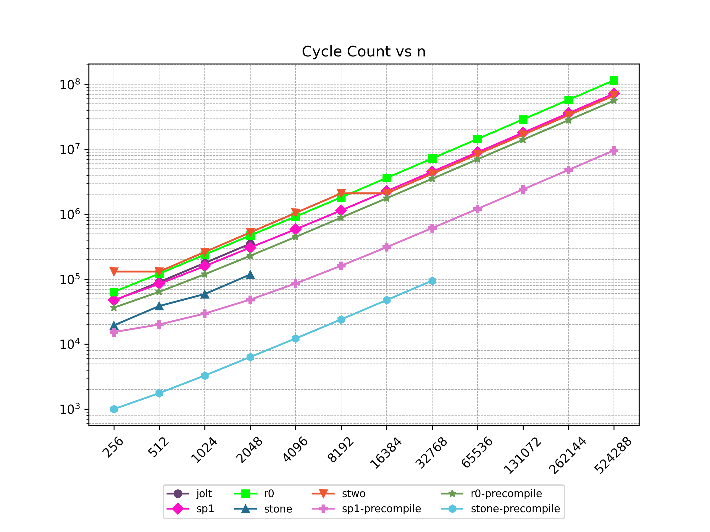

### Peak Memory (GB)
|      n |   jolt |   sp1 |   openvm |   r0 |   stone |   stwo |   sp1-precompile |   r0-precompile |   openvm-precompile |   stone-precompile |
|----:|----:|----:|----:|----:|----:|----:|----:|----:|----:|----:|
|    256 |   5.43 |   4.5 |     5.44 | 1.42 |   19.02 |  10.82 |            11.56 |            3.46 |                5.49 |              11.13 |
|    512 |    4.9 |  4.54 |     5.44 |  2.3 |   35.74 |  10.85 |            11.59 |            3.45 |                5.49 |              11.07 |
|   1024 |    4.9 |  5.01 |     5.44 |  2.3 |   71.41 |  10.97 |            11.55 |            3.45 |                5.49 |              11.07 |
|   2048 |    5.8 |  6.16 |     5.44 | 4.59 |  142.54 |  11.21 |            11.62 |            3.45 |                5.49 |              11.07 |
|   4096 |     ❌ |   8.7 |     5.44 | 9.17 |      💾 |   11.9 |            11.79 |            4.59 |                5.49 |              21.97 |
|   8192 |     ❌ | 13.65 |     5.44 | 9.17 |      💾 |  13.19 |            11.96 |            9.16 |                5.49 |              43.91 |
|  16384 |     ❌ | 12.24 |     5.85 | 9.18 |      💾 |  13.73 |            11.87 |            9.17 |                5.49 |              87.17 |
|  32768 |     ❌ | 24.03 |    10.77 | 9.18 |      💾 |     17 |            12.23 |            9.17 |                5.48 |             174.24 |
|  65536 |     ❌ |    39 |    20.53 | 9.19 |      💾 |  23.54 |            12.22 |            9.18 |                5.49 |                 💾 |
| 131072 |     ❌ | 52.23 |    21.23 |  9.2 |      💾 |  42.08 |            17.09 |            9.18 |                8.19 |                 💾 |
| 262144 |     ❌ | 52.28 |    22.77 |  9.2 |      💾 |  78.97 |            27.25 |            9.21 |               15.42 |                 💾 |
| 524288 |     ❌ | 57.67 |    22.93 | 9.27 |      💾 | 151.16 |            55.68 |            9.22 |               29.87 |                 💾 |

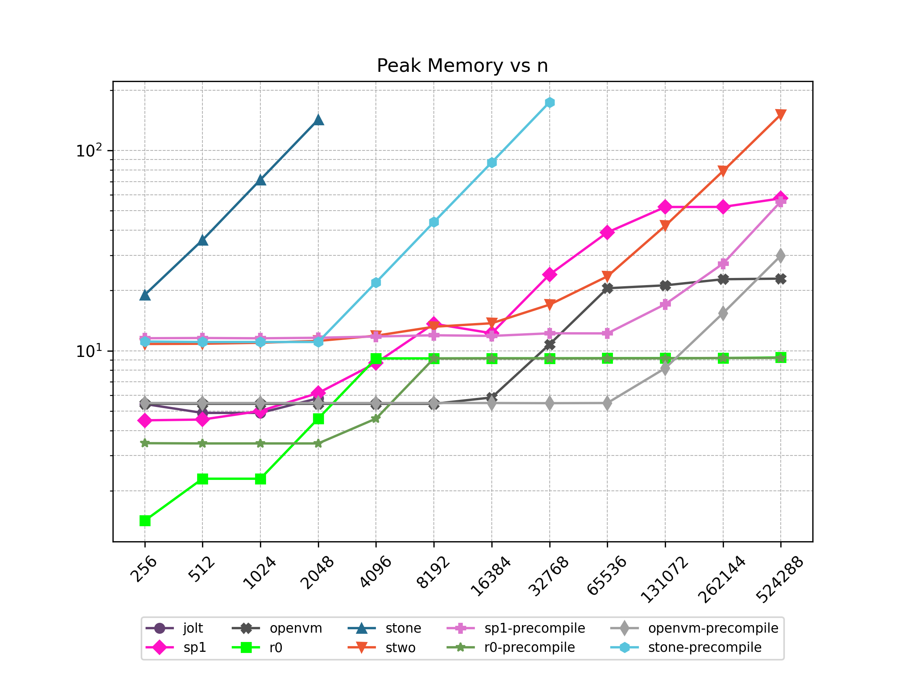

## Sha3-Chain
Benchmark Keccak256 hash of 32 bytes for `n` iteration.

### Prover Time (s)
|     n |    jolt |     sp1 |   openvm |      r0 |   stone |   stwo |   sp1-precompile |   r0-precompile |   openvm-precompile |   stone-precompile |
|----:|----:|----:|----:|----:|----:|----:|----:|----:|----:|----:|
|     8 |   3.151 |  14.691 |   31.427 |    17.2 |  66.291 | 13.552 |           59.266 |          34.114 |              58.806 |             16.827 |
|    16 |   5.142 |  17.431 |   34.818 |  28.941 |  115.28 |  18.47 |           60.353 |          37.322 |              59.329 |             18.279 |
|    32 |    8.57 |  23.603 |   43.135 |  52.437 |      💾 | 13.475 |           60.409 |          36.973 |              58.913 |             27.208 |
|    64 |  15.082 |  37.422 |   57.017 |  74.883 |      💾 |  14.55 |           60.377 |          42.978 |              59.971 |             43.739 |
|   128 |   29.25 |  50.151 |   90.378 | 132.931 |      💾 | 18.699 |           59.433 |          54.814 |              61.487 |             85.956 |
|   256 |  55.496 |  66.364 |  156.377 | 261.039 |      💾 | 22.329 |           61.843 |          78.503 |              65.217 |            151.067 |
|   512 | 105.689 | 104.036 |  297.659 | 515.447 |      💾 | 29.078 |           65.634 |          92.151 |              72.255 |                 💾 |
|  1024 |      ❌ | 192.377 |  715.326 | 1037.74 |      💾 |  52.14 |             73.4 |         176.441 |              88.201 |                 💾 |
|  2048 |      ❌ | 357.885 |  1474.13 | 2034.16 |      💾 | 94.358 |           91.595 |         348.058 |             115.792 |                 💾 |
|  4096 |      ❌ | 681.138 |  2909.76 | 4083.82 |      💾 |     ❌ |          109.247 |         665.897 |             171.808 |                 💾 |
|  8192 |      ❌ | 1316.41 |  5795.09 | 8122.75 |      💾 |     ❌ |           183.78 |          1286.1 |             510.264 |                 💾 |
| 16384 |      ❌ | 2597.86 |  11684.6 | 16241.2 |      💾 |     ❌ |          353.935 |         2565.25 |             870.635 |                 💾 |
| 32768 |      ❌ | 5192.04 |  23068.5 | 32449.9 |      💾 |     ❌ |          657.383 |         5090.45 |             1712.06 |                 💾 |

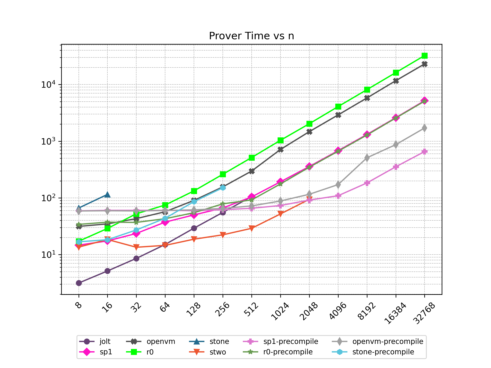

### Verifier Time (ms)
|     n |   jolt |   sp1 |   openvm |   r0 |   stone |   stwo |   sp1-precompile |   r0-precompile |   openvm-precompile |   stone-precompile |
|----:|----:|----:|----:|----:|----:|----:|----:|----:|----:|----:|
|     8 |   83.0 |   107 |      139 |   23 |   526.0 |   11.0 |              122 |              20 |                 142 |              252.0 |
|    16 |  114.0 |    86 |      139 |   23 |   555.0 |   11.0 |              116 |              23 |                 142 |              254.0 |
|    32 |   75.0 |   111 |      139 |   23 |      💾 |   11.0 |               88 |              23 |                 142 |              256.0 |
|    64 |   79.0 |   102 |      139 |   23 |      💾 |   11.0 |              116 |              23 |                 142 |              265.0 |
|   128 |   57.0 |    99 |      139 |   23 |      💾 |   11.0 |               99 |              22 |                 141 |              270.0 |
|   256 |   64.0 |    83 |      139 |   22 |      💾 |   42.0 |               90 |              20 |                 141 |              288.0 |
|   512 |  118.0 |    83 |      139 |   23 |      💾 |   44.0 |              103 |              23 |                 141 |                 💾 |
|  1024 |     ❌ |    83 |       56 |   23 |      💾 |   49.0 |              106 |              23 |                 144 |                 💾 |
|  2048 |     ❌ |    84 |       56 |   23 |      💾 |  572.0 |               88 |              24 |                 142 |                 💾 |
|  4096 |     ❌ |    83 |       56 |   23 |      💾 |     ❌ |               88 |              23 |                 141 |                 💾 |
|  8192 |     ❌ |    84 |       56 |   23 |      💾 |     ❌ |               87 |              22 |                  56 |                 💾 |
| 16384 |     ❌ |    83 |       55 |   20 |      💾 |     ❌ |               88 |              24 |                  57 |                 💾 |
| 32768 |     ❌ |    84 |       57 |   23 |      💾 |     ❌ |               88 |              22 |                  55 |                 💾 |

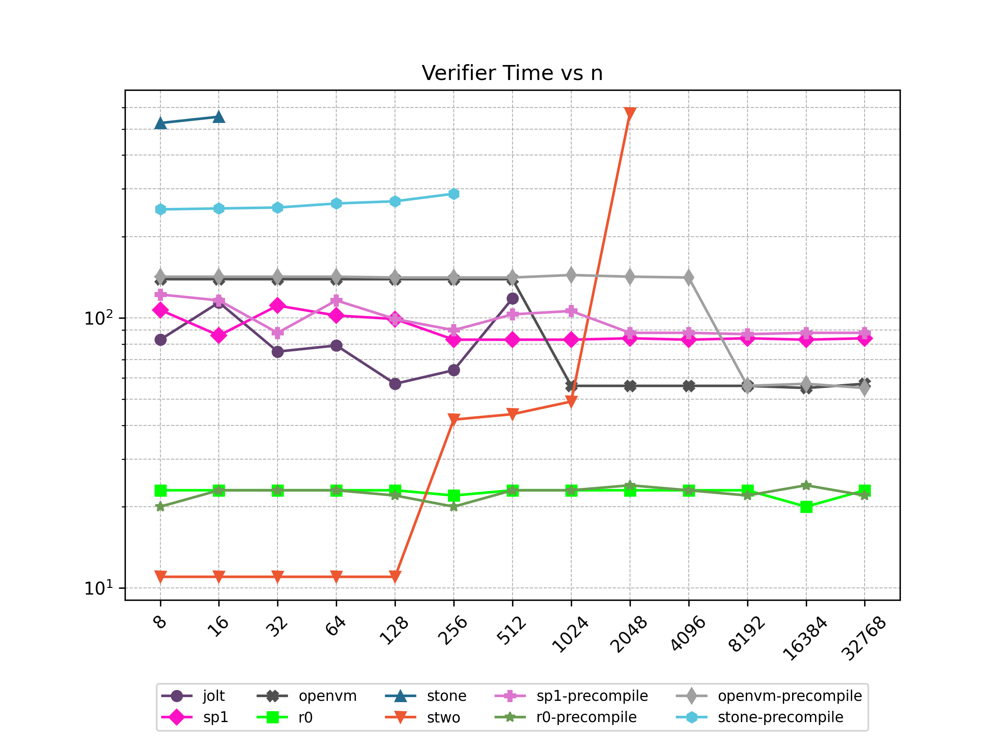

### Proof Size (KB)
|     n |    jolt |     sp1 |   openvm |      r0 |   stone |     stwo |   sp1-precompile |   r0-precompile |   openvm-precompile |   stone-precompile |
|----:|----:|----:|----:|----:|----:|----:|----:|----:|----:|----:|
|     8 | 191.263 | 1315.56 |  1708.31 | 223.482 | 124.616 |  995.554 |          1477.23 |         223.482 |             1787.55 |              109.8 |
|    16 | 201.447 | 1315.56 |  1708.31 | 223.482 |  129.96 | 1006.302 |          1477.23 |         223.482 |             1787.55 |            108.264 |
|    32 | 212.047 | 1315.56 |  1708.31 | 223.482 |      💾 | 1028.558 |          1477.23 |         223.482 |             1787.55 |            115.944 |
|    64 | 223.063 | 1315.56 |  1708.31 | 223.482 |      💾 | 1023.458 |          1477.23 |         223.482 |             1787.55 |            122.856 |
|   128 | 234.495 | 1315.56 |  1708.31 | 223.482 |      💾 | 1032.058 |          1477.23 |         223.482 |             1787.55 |            123.304 |
|   256 | 246.343 | 1315.56 |  1708.31 | 223.482 |      💾 |  1031.81 |          1477.23 |         223.482 |             1787.55 |            131.944 |
|   512 | 258.607 | 1315.56 |  1708.31 | 223.482 |      💾 | 1084.746 |          1477.23 |         223.482 |             1787.55 |                 💾 |
|  1024 |      ❌ | 1315.56 |  852.937 | 223.482 |      💾 | 1155.054 |          1477.23 |         223.482 |             1787.55 |                 💾 |
|  2048 |      ❌ | 1315.56 |  816.649 | 223.482 |      💾 | 1182.062 |          1477.23 |         223.482 |             1787.55 |                 💾 |
|  4096 |      ❌ | 1315.56 |  852.937 | 223.482 |      💾 |       ❌ |          1477.23 |         223.482 |             1787.55 |                 💾 |
|  8192 |      ❌ | 1315.56 |  816.649 | 223.482 |      💾 |       ❌ |          1477.23 |         223.482 |             852.937 |                 💾 |
| 16384 |      ❌ | 1315.56 |  816.649 | 223.482 |      💾 |       ❌ |          1477.23 |         223.482 |             852.937 |                 💾 |
| 32768 |      ❌ | 1315.56 |  852.937 | 223.482 |      💾 |       ❌ |          1477.23 |         223.482 |             816.649 |                 💾 |

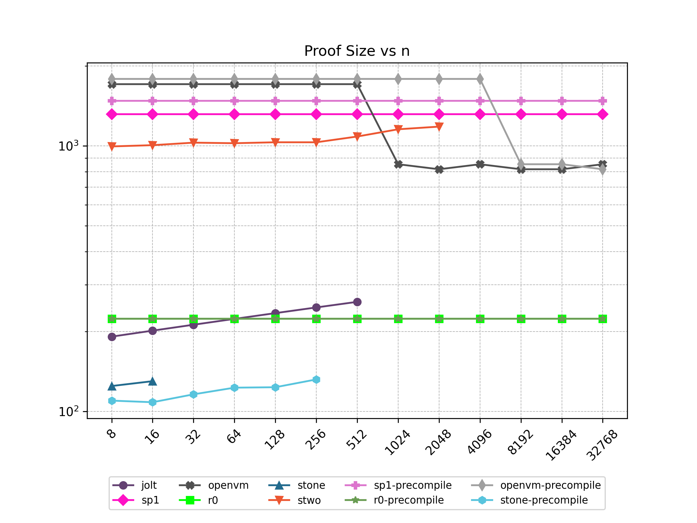

### Cycle Count
|     n |     jolt |       sp1 |        r0 |   stone |     stwo |   sp1-precompile |   r0-precompile |   stone-precompile |
|----:|----:|----:|----:|----:|----:|----:|----:|----:|
|     8 |   203331 |    147841 |    147328 | 57648.0 |   262143 |            18577 |           27805 |             3480.0 |
|    16 |   404363 |    284353 |    286232 |  115185 |   524287 |            25825 |           43693 |             6904.0 |
|    32 |   806427 |    557377 |    564040 |      💾 |  1048575 |            40321 |           75469 |            13752.0 |
|    64 |  1610555 |   1103425 |   1119656 |      💾 |  2097151 |            69313 |          139021 |            27448.0 |
|   128 |  3218828 |   2195521 |   2230888 |      💾 |  4194303 |           127297 |          266125 |            54840.0 |
|   256 |  6435340 |   4379713 |   4453352 |      💾 |  8388607 |           243265 |          520333 |             109624 |
|   512 | 12868364 |   8748097 |   8898280 |      💾 | 16777215 |           475201 |         1028749 |                 💾 |
|  1024 |       ❌ |  17484865 |  17788136 |      💾 | 33554431 |           939073 |         2050355 |                 💾 |
|  2048 |       ❌ |  34958401 |  35567848 |      💾 | 67108863 |          1866817 |         4093575 |                 💾 |
|  4096 |       ❌ |  69905473 |  71127272 |      💾 |       ❌ |          3722305 |         8174812 |                 💾 |
|  8192 |       ❌ | 139799617 | 142246120 |      💾 |       ❌ |          7433281 |        16338156 |                 💾 |
| 16384 |       ❌ | 279587905 | 284483816 |      💾 |       ❌ |         14855233 |        32669621 |                 💾 |
| 32768 |       ❌ | 559164481 | 568959208 |      💾 |       ❌ |         29699137 |        65327886 |                 💾 |

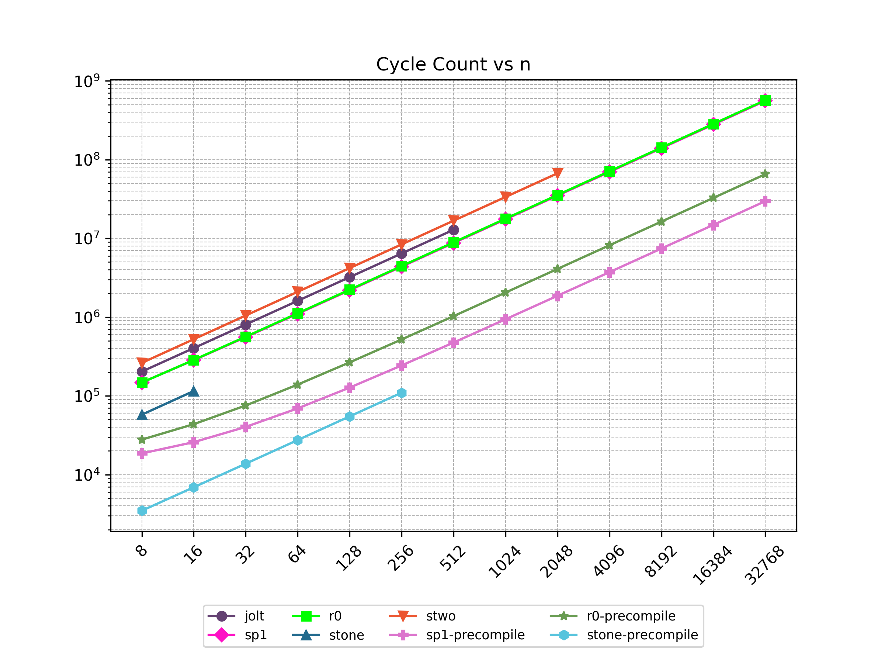

### Peak Memory (GB)
|     n |   jolt |   sp1 |   openvm |   r0 |   stone |   stwo |   sp1-precompile |   r0-precompile |   openvm-precompile |   stone-precompile |
|----:|----:|----:|----:|----:|----:|----:|----:|----:|----:|----:|
|     8 |   5.09 |  5.14 |     5.44 |  2.3 |   71.49 |  10.95 |            11.61 |            3.45 |                5.49 |              11.07 |
|    16 |   5.85 |  6.23 |     5.44 | 4.58 |  142.53 |  11.14 |            11.43 |            3.45 |                5.49 |              11.07 |
|    32 |   8.88 |  9.03 |     5.44 | 9.14 |      💾 |  11.83 |            11.95 |            3.45 |                5.49 |              21.98 |
|    64 |  14.89 | 13.13 |     5.44 | 9.17 |      💾 |   13.2 |             11.6 |            3.45 |                5.49 |              43.91 |
|   128 |  27.13 | 12.02 |      5.7 | 9.18 |      💾 |   15.6 |            11.49 |            4.57 |                5.49 |              87.26 |
|   256 |  51.24 | 21.98 |    10.48 | 9.18 |      💾 |  20.66 |            11.14 |            9.13 |                5.49 |             174.37 |
|   512 |  100.0 | 39.84 |    19.95 | 9.18 |      💾 |  36.36 |            11.92 |            9.16 |                5.49 |                 💾 |
|  1024 |     ❌ | 41.18 |    19.95 | 9.19 |      💾 |  67.57 |            11.24 |            9.16 |                5.49 |                 💾 |
|  2048 |     ❌ |  47.4 |    19.96 |  9.2 |      💾 | 128.39 |            14.17 |            9.16 |                6.28 |                 💾 |
|  4096 |     ❌ | 59.51 |    20.31 | 9.22 |      💾 |     ❌ |             30.3 |            9.17 |               11.39 |                 💾 |
|  8192 |     ❌ | 61.16 |     20.5 | 9.26 |      💾 |     ❌ |            53.85 |            9.18 |               20.72 |                 💾 |
| 16384 |     ❌ | 61.43 |    20.75 | 9.34 |      💾 |     ❌ |            57.23 |             9.2 |                20.8 |                 💾 |
| 32768 |     ❌ | 63.58 |    20.93 | 9.49 |      💾 |     ❌ |            63.67 |            9.22 |               20.87 |                 💾 |

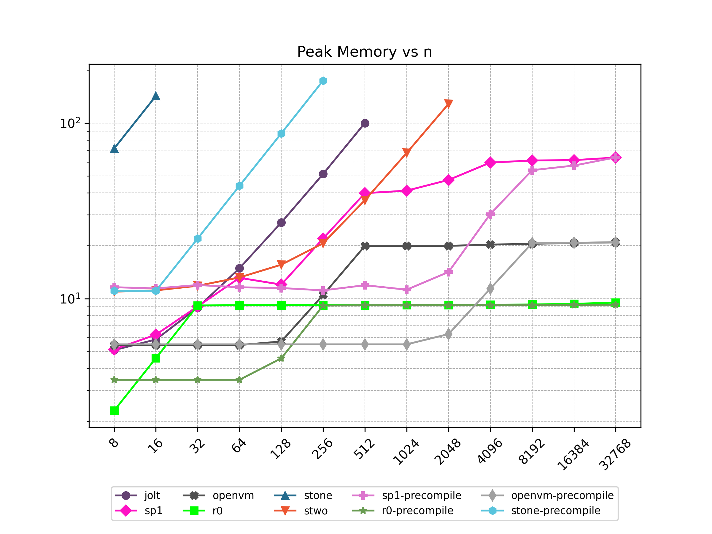

## BLAKE
Benchmark Blake2s256 hash of `n` bytes. For the **S-two** benchmarks, a dedicated opcode for BLAKE was used, as illustrated in [this Cairo source file](https://github.com/starkware-libs/cairo-lang/blob/ab8be40403a7634ba296c467b26b8bd945ba5cfa/src/starkware/cairo/common/cairo_blake2s/blake2s.cairo#L671). **SP1** and **R0** do not support precompiles for BLAKE.

### Prover Time (s)
|      n |     sp1 |      r0 |   stwo-precompile |
|----:|----:|----:|----:|
|   2048 |  14.272 |  28.817 |            35.206 |
|   4096 |  14.773 |   52.33 |            34.752 |
|   8192 |  17.678 |   65.67 |            30.911 |
|  16384 |  24.308 | 126.219 |            32.214 |
|  32768 |  37.485 | 240.843 |            30.324 |
|  65536 |  55.119 | 476.273 |            38.614 |
| 131072 | 101.786 | 947.306 |            35.269 |
| 262144 | 162.863 | 1888.15 |            33.434 |

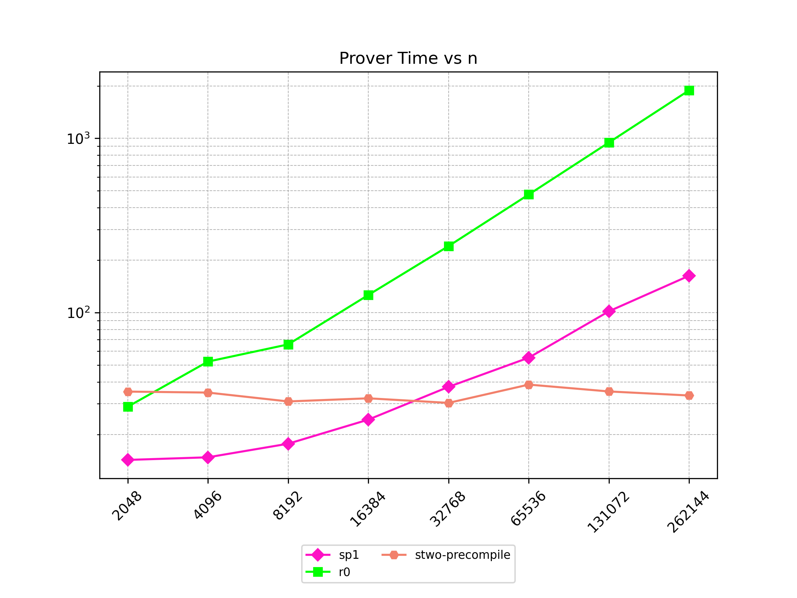

### Verifier Time (ms)
|      n |   sp1 |   r0 |   stwo-precompile |
|----:|----:|----:|----:|
|   2048 |   102 |   10 |                11 |
|   4096 |   105 |   23 |                11 |
|   8192 |   111 |   22 |                11 |
|  16384 |    99 |   24 |                11 |
|  32768 |   104 |   23 |                12 |
|  65536 |    81 |   22 |                12 |
| 131072 |    81 |   23 |                37 |
| 262144 |    81 |   22 |                48 |

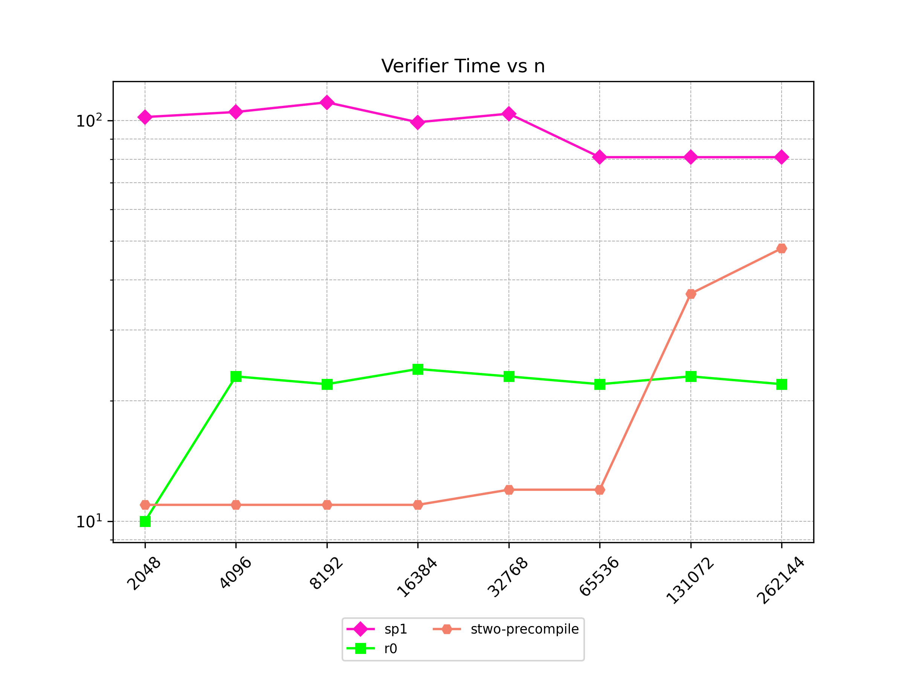

### Proof Size (KB)
|      n |     sp1 |      r0 |   stwo-precompile |
|----:|----:|----:|----:|
|   2048 | 1315.56 | 223.482 |           1117.14 |
|   4096 | 1315.56 | 223.482 |           1138.83 |
|   8192 | 1315.56 | 223.482 |           1134.37 |
|  16384 | 1315.56 | 223.482 |           1121.81 |
|  32768 | 1315.56 | 223.482 |           1144.87 |
|  65536 | 1315.56 | 223.482 |           1158.19 |
| 131072 | 1315.56 | 223.482 |           1141.67 |
| 262144 | 1315.56 | 223.482 |           1148.66 |

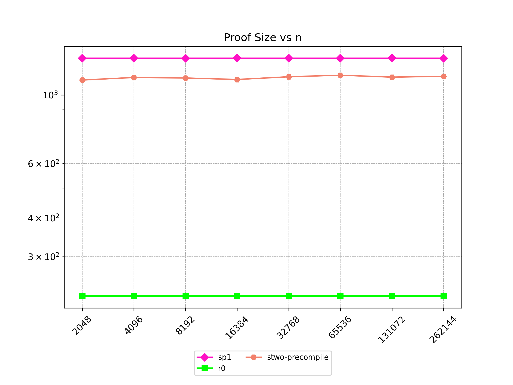

### Cycle Count
|      n |      sp1 |       r0 |   stwo-precompile |
|----:|----:|----:|----:|
|   2048 |   100997 |   264515 |             65535 |
|   4096 |   193061 |   521763 |             65535 |
|   8192 |   377189 |  1036259 |             65535 |
|  16384 |   745445 |  2065251 |             65535 |
|  32768 |  1481957 |  4123235 |            131071 |
|  65536 |  2954981 |  8239203 |            262143 |
| 131072 |  5901029 | 16471139 |            524287 |
| 262144 | 11793125 | 32935011 |           1048575 |

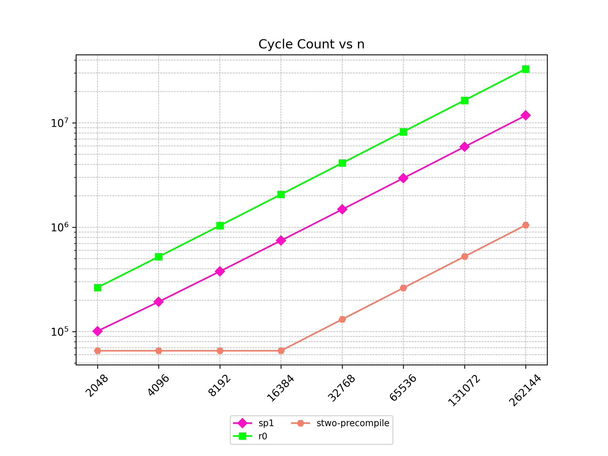

### Peak Memory (GB)
|      n |   sp1 |   r0 |   stwo-precompile |
|----:|----:|----:|----:|
|   2048 |  4.55 | 4.58 |             19.98 |
|   4096 |     5 | 9.14 |             19.94 |
|   8192 |  6.09 | 9.17 |             19.98 |
|  16384 |  8.83 | 9.18 |             20.02 |
|  32768 | 13.83 | 9.18 |             20.17 |
|  65536 | 16.59 | 9.18 |              20.5 |
| 131072 |    38 | 9.19 |             20.88 |
| 262144 | 45.31 | 9.19 |             21.97 |

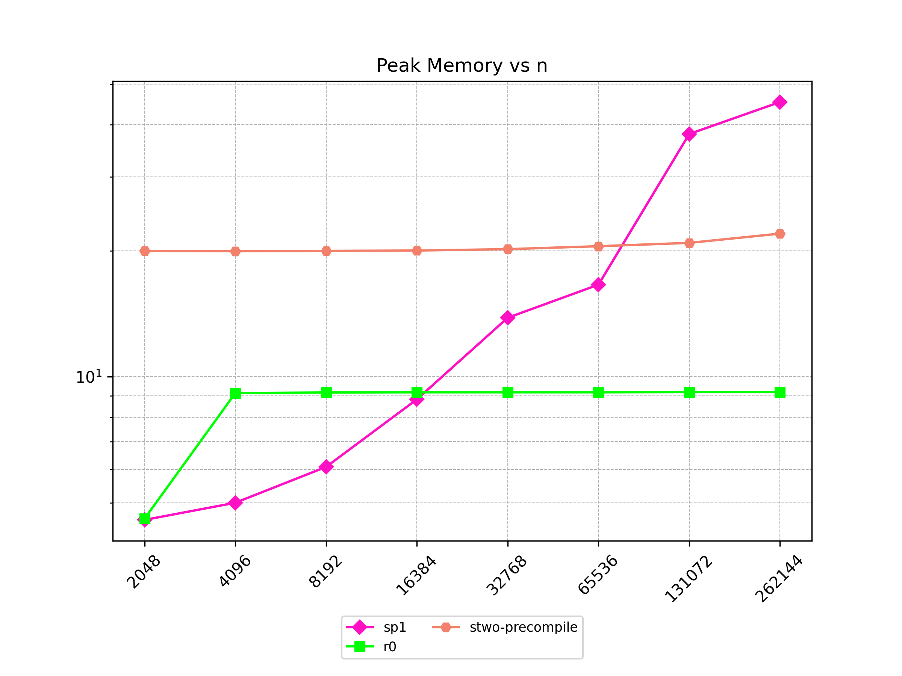

## BLAKE-Chain
Benchmark Blake2s256 hash of 32 bytes for `n` iteration. For the **S-two** benchmarks, a dedicated opcode for BLAKE was used, as illustrated in [this Cairo source file](https://github.com/starkware-libs/cairo-lang/blob/ab8be40403a7634ba296c467b26b8bd945ba5cfa/src/starkware/cairo/common/cairo_blake2s/blake2s.cairo#L671). **SP1** and **R0** do not support precompiles for BLAKE.

### Prover Time (s)
|     n |     sp1 |      r0 |   stwo-precompile |
|----:|----:|----:|----:|
|   128 |  17.319 |   28.76 |            30.885 |
|   256 |  24.279 |  52.074 |            32.974 |
|   512 |    38.5 |  86.181 |             33.26 |
|  1024 |  53.129 | 166.706 |            30.723 |
|  2048 |  89.423 | 316.029 |            38.153 |
|  4096 | 145.299 | 628.118 |            31.717 |
|  8192 |  259.23 | 1260.14 |            37.422 |
| 16384 | 495.878 | 2521.17 |             35.82 |

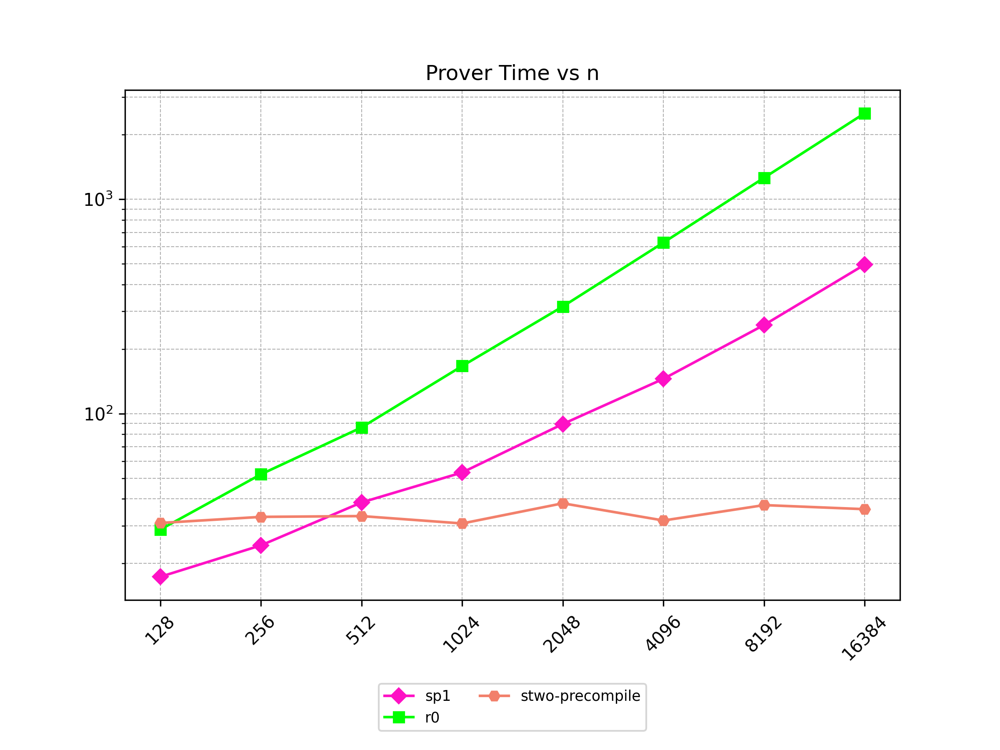

### Verifier Time (ms)
|     n |   sp1 |   r0 |   stwo-precompile |
|----:|----:|----:|----:|
|   128 |   105 |   22 |                11 |
|   256 |   104 |   22 |                11 |
|   512 |   108 |   23 |                11 |
|  1024 |    84 |   23 |                11 |
|  2048 |    81 |   23 |                41 |
|  4096 |    85 |   23 |                40 |
|  8192 |    81 |   23 |                49 |
| 16384 |    81 |   22 |                39 |

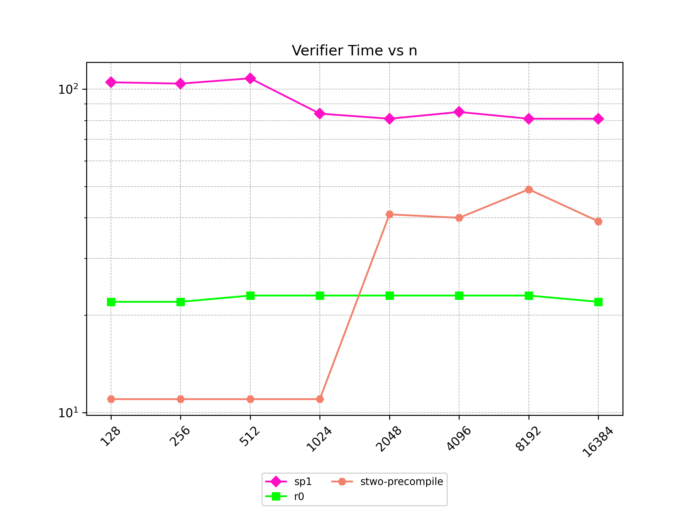

### Proof Size (KB)
|     n |     sp1 |      r0 |   stwo-precompile |
|----:|----:|----:|----:|
|   128 | 1315.56 | 223.482 |           1119.07 |
|   256 | 1315.56 | 223.482 |           1121.09 |
|   512 | 1315.56 | 223.482 |           1128.54 |
|  1024 | 1315.56 | 223.482 |           1119.77 |
|  2048 | 1315.56 | 223.482 |           1127.81 |
|  4096 | 1315.56 | 223.482 |           1127.26 |
|  8192 | 1315.56 | 223.482 |              1134 |
| 16384 | 1315.56 | 223.482 |           1143.83 |

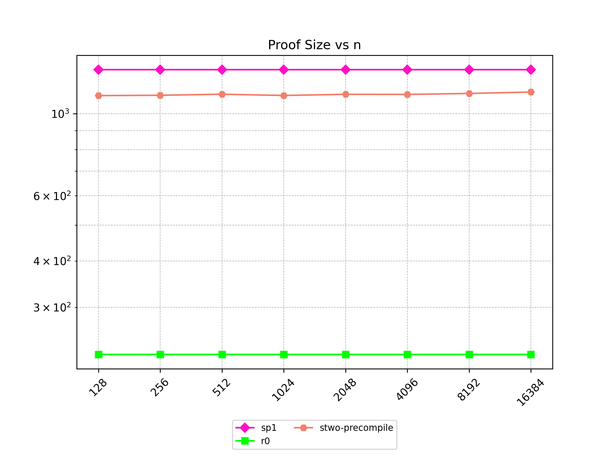

### Cycle Count
|     n |      sp1 |       r0 |   stwo-precompile |
|----:|----:|----:|----:|
|   128 |   376249 |   356507 |             65535 |
|   256 |   742841 |   702491 |             65535 |
|   512 |  1476025 |  1394459 |            131071 |
|  1024 |  2942393 |  2778395 |            262143 |
|  2048 |  5875129 |  5546267 |            524287 |
|  4096 | 11740601 | 11082011 |           1048575 |
|  8192 | 23471545 | 22153499 |           2097151 |
| 16384 | 46933433 | 44296475 |           4194303 |

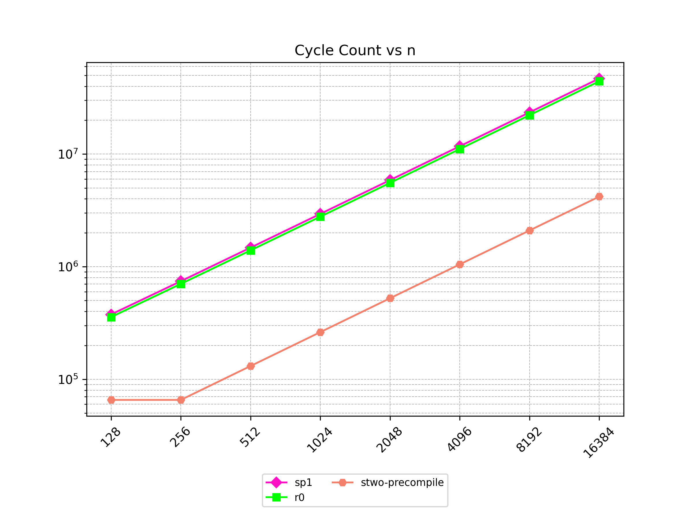

### Peak Memory (GB)
|     n |   sp1 |   r0 |   stwo-precompile |
|----:|----:|----:|----:|
|   128 |  6.16 | 4.58 |             19.99 |
|   256 |  9.12 | 9.15 |             20.01 |
|   512 | 13.17 | 9.17 |             20.13 |
|  1024 | 15.96 | 9.17 |             20.39 |
|  2048 | 32.88 | 9.17 |             20.72 |
|  4096 |  44.6 | 9.19 |             21.54 |
|  8192 | 50.57 | 9.19 |             23.31 |
| 16384 | 53.25 | 9.21 |             27.19 |

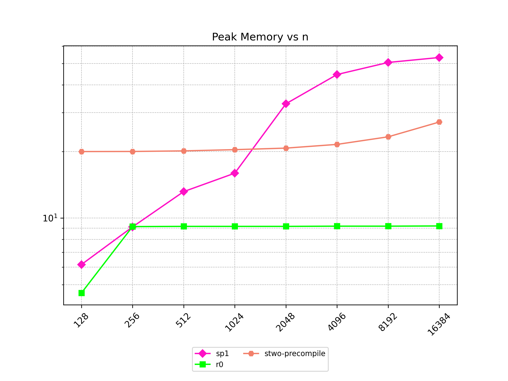

## Matrix Multiplication
Benchmark multiplication of two matrices of size n x n.

### Prover Time (s)
|   n |   jolt |     sp1 |   openvm |      r0 |   stone |   stwo |
|----:|----:|----:|----:|----:|----:|----:|
|   4 |  1.196 |  13.179 |   29.508 |   6.763 |  10.922 |  12.72 |
|   8 |  1.648 |  12.862 |   30.119 |    8.21 |   9.879 | 19.566 |
|  16 |  4.979 |  15.252 |   33.467 |  17.135 |  26.384 | 16.531 |
|  32 | 27.702 |  26.491 |   58.102 |  65.806 |      💾 | 14.655 |
|  64 |     ❌ | 135.352 |  292.125 | 480.724 |      💾 | 21.199 |
| 128 |     ❌ |  881.29 |  2671.68 | 3809.76 |      💾 | 76.061 |

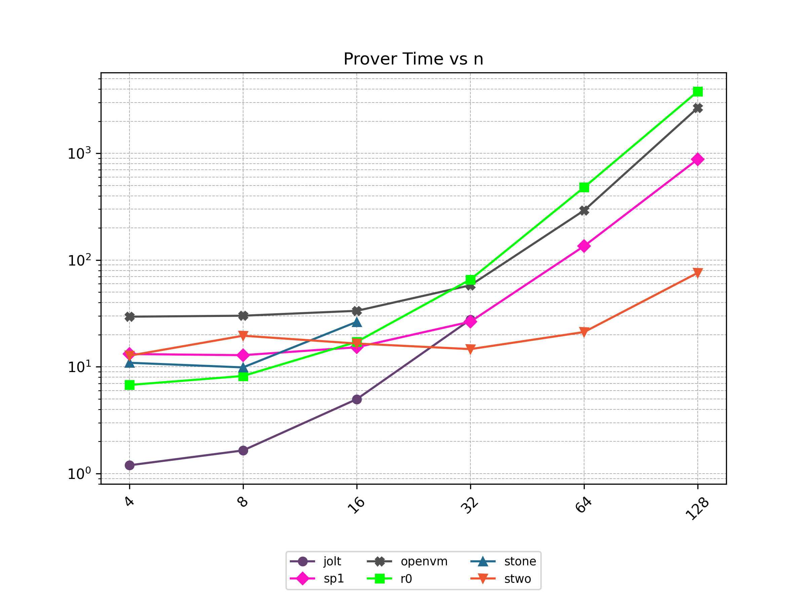

### Verifier Time (ms)
|   n |   jolt |   sp1 |   openvm |   r0 |   stone |   stwo |
|----:|----:|----:|----:|----:|----:|----:|
|   4 |   44.0 |   110 |      140 |   23 |   111.0 |     10 |
|   8 |   51.0 |   110 |      140 |   22 |   120.0 |     10 |
|  16 |   86.0 |   102 |      139 |   23 |   139.0 |     10 |
|  32 |   84.0 |   109 |      140 |   25 |      💾 |     18 |
|  64 |     ❌ |    85 |      140 |   22 |      💾 |     41 |
| 128 |     ❌ |    84 |       56 |   23 |      💾 |     45 |

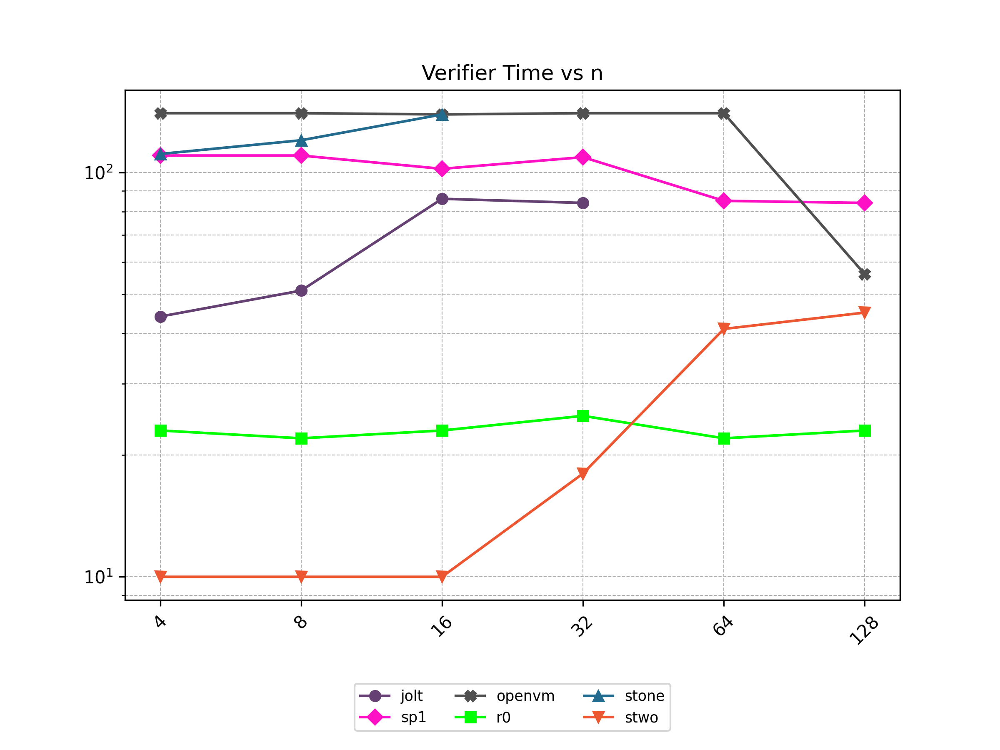

### Proof Size (KB)
|   n |    jolt |     sp1 |   openvm |      r0 |   stone |    stwo |
|----:|----:|----:|----:|----:|----:|----:|
|   4 | 144.647 | 1315.53 |  1708.31 | 223.234 | 109.032 | 815.674 |
|   8 | 169.607 | 1315.53 |  1708.31 | 223.234 |  108.52 | 833.086 |
|  16 | 198.911 | 1315.53 |  1708.31 | 223.234 | 116.456 | 844.238 |
|  32 | 233.591 | 1315.53 |  1708.31 | 223.234 |      💾 | 844.914 |
|  64 |      ❌ | 1315.53 |  1708.31 | 223.234 |      💾 | 876.354 |
| 128 |      ❌ | 1315.53 |  852.937 | 223.234 |      💾 | 981.178 |

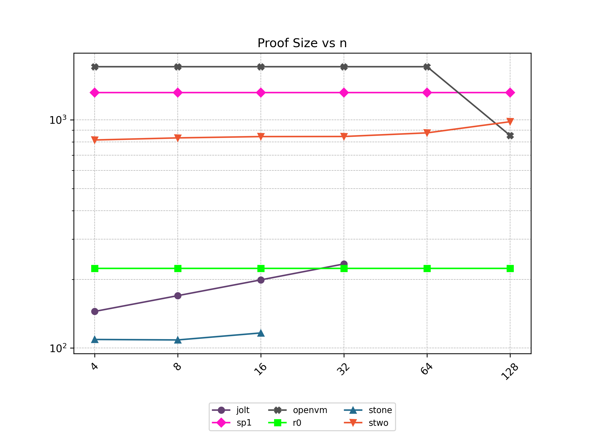

### Cycle Count
|   n |    jolt |      sp1 |       r0 |   stone |     stwo |
|----:|----:|----:|----:|----:|----:|
|   4 |  7181.0 |     8430 |     5820 |  2181.0 |    32767 |
|   8 | 42753.0 |    23951 |    21352 | 13521.0 |    32767 |
|  16 |  314782 |   139844 |   137280 | 94569.0 |   131071 |
|  32 | 2457710 |  1044394 |  1041904 |      💾 |  1048575 |
|  64 |      ❌ |  8211062 |  8208720 |      💾 |  8388607 |
| 128 |      ❌ | 65306638 | 65304592 |      💾 | 67108863 |

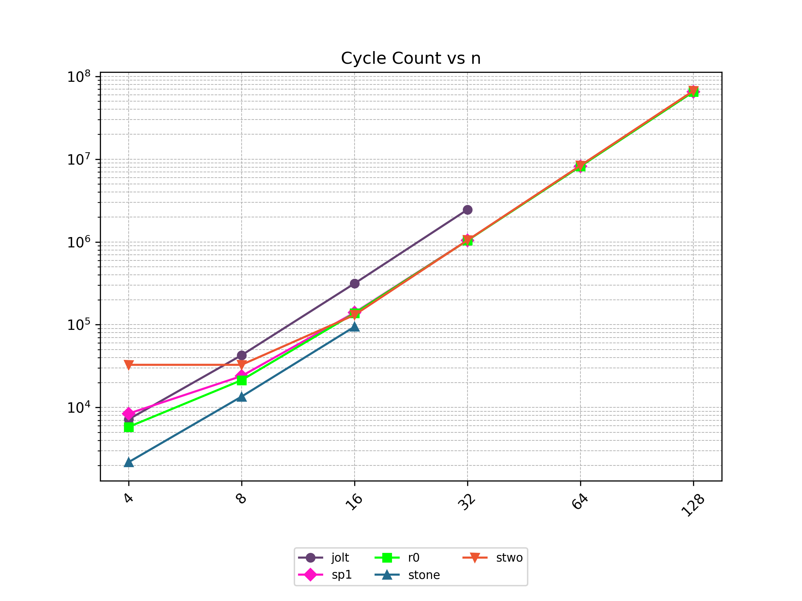

### Peak Memory (GB)
|   n |   jolt |   sp1 |   openvm |   r0 |   stone |   stwo |
|----:|----:|----:|----:|----:|----:|----:|
|   4 |   5.43 |  4.45 |     5.43 | 1.42 |    9.09 |  10.73 |
|   8 |   4.91 |  4.29 |     5.43 | 1.43 |    9.03 |  10.73 |
|  16 |    5.8 |  5.12 |     5.43 | 2.29 |   29.68 |  10.82 |
|  32 |  26.45 | 10.34 |     5.43 | 9.17 |      💾 |  11.61 |
|  64 |     ❌ | 39.28 |    19.69 | 9.17 |      💾 |  19.92 |
| 128 |     ❌ | 60.01 |    20.09 | 9.19 |      💾 |  101.6 |

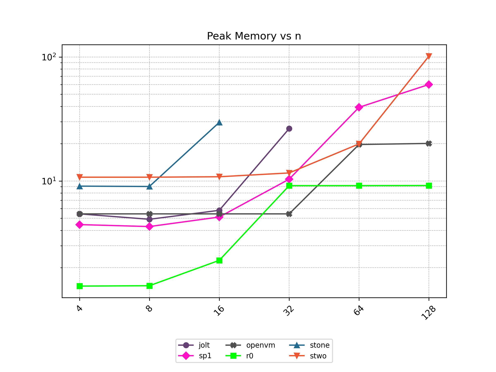

## Elliptic Curve Addition
Benchmark n point doubling for secp256k1.

### Prover Time (s)
|     n |   jolt |     sp1 |   openvm |       r0 |   stone |   stwo |
|----:|----:|----:|----:|----:|----:|----:|
|   256 |  50.41 |  70.731 |  158.631 |  283.941 |  18.869 | 11.993 |
|   512 | 96.814 |  116.11 |  292.691 |  531.309 |  30.529 | 19.268 |
|  1024 |     ❌ | 211.962 |  582.356 |  1037.16 |  65.693 | 15.356 |
|  2048 |     ❌ | 394.022 |  1048.01 | 2072.757 | 114.312 | 14.318 |
|  4096 |     ❌ | 741.169 |  2029.72 | 4079.796 |      💾 | 14.407 |
|  8192 |     ❌ | 1426.64 |  4046.32 | 8181.789 |      💾 | 16.635 |
| 16384 |     ❌ | 2844.32 |  7953.88 |       ❌ |      💾 | 24.382 |
| 32768 |     ❌ | 5628.39 |  15793.7 |       ❌ |      💾 | 28.304 |

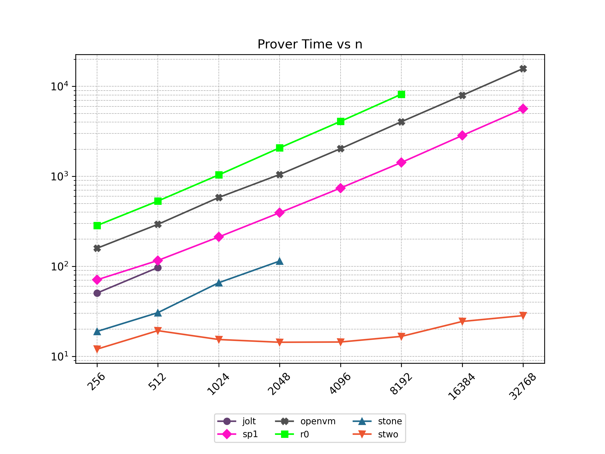

### Verifier Time (ms)
|     n |   jolt |   sp1 |   openvm |   r0 |   stone |   stwo |
|----:|----:|----:|----:|----:|----:|----:|
|   256 |   67.0 |    83 |      140 | 22.0 |   188.0 |     10 |
|   512 |   60.0 |    83 |      140 | 23.0 |   181.0 |     10 |
|  1024 |     ❌ |    83 |       56 | 23.0 |   187.0 |     34 |
|  2048 |     ❌ |    83 |       56 | 25.0 |   238.0 |     39 |
|  4096 |     ❌ |    83 |       57 | 23.0 |      💾 |     41 |
|  8192 |     ❌ |    83 |       56 | 11.0 |      💾 |     36 |
| 16384 |     ❌ |    83 |       56 |   ❌ |      💾 |    130 |
| 32768 |     ❌ |    83 |       55 |   ❌ |      💾 |     15 |

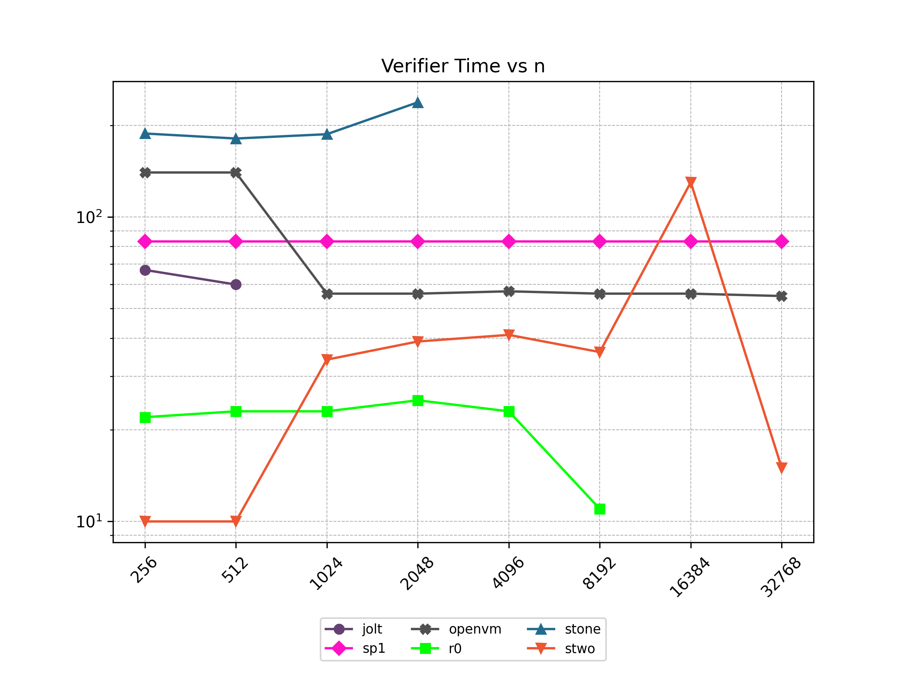

### Proof Size (KB)
|     n |    jolt |     sp1 |   openvm |      r0 |   stone |    stwo |
|----:|----:|----:|----:|----:|----:|----:|
|   256 | 249.399 | 1315.56 |  1708.31 | 223.482 | 111.592 |  918.41 |
|   512 | 261.663 | 1315.56 |  1708.31 | 223.482 |  120.04 | 897.182 |
|  1024 |      ❌ | 1315.56 |  852.937 | 223.482 | 127.784 |  889.49 |
|  2048 |      ❌ | 1315.56 |  852.937 | 223.482 | 131.976 |  896.15 |
|  4096 |      ❌ | 1315.56 |  816.649 | 223.482 |      💾 | 901.758 |
|  8192 |      ❌ | 1315.56 |  816.649 | 223.482 |      💾 | 910.154 |
| 16384 |      ❌ | 1315.56 |  852.937 |      ❌ |      💾 | 929.282 |
| 32768 |      ❌ | 1315.56 |  816.649 |      ❌ |      💾 | 931.042 |

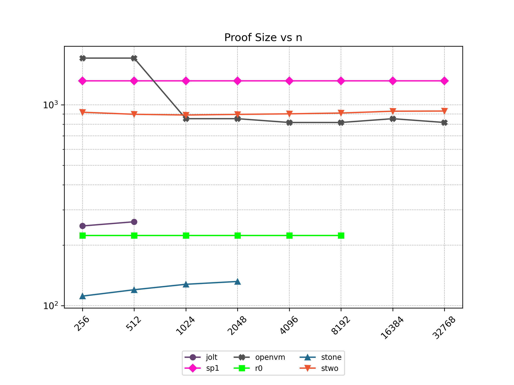

### Cycle Count
|     n |    jolt |       sp1 |        r0 |   stone |    stwo |
|----:|----:|----:|----:|----:|----:|
|   256 | 4760760 |   4715656 |   4711913 | 59936.0 |  131071 |
|   512 | 9290168 |   9169544 |   9165801 |  119840 |  262143 |
|  1024 |      ❌ |  18077320 |  18073577 |  239648 |  262143 |
|  2048 |      ❌ |  35892872 |  35889129 |  479264 |  524287 |
|  4096 |      ❌ |  71523976 |  71520233 |      💾 | 1048575 |
|  8192 |      ❌ | 142786184 | 142782441 |      💾 | 2097151 |
| 16384 |      ❌ | 285310600 |        ❌ |      💾 | 4194303 |
| 32768 |      ❌ | 570359432 |        ❌ |      💾 | 8388607 |

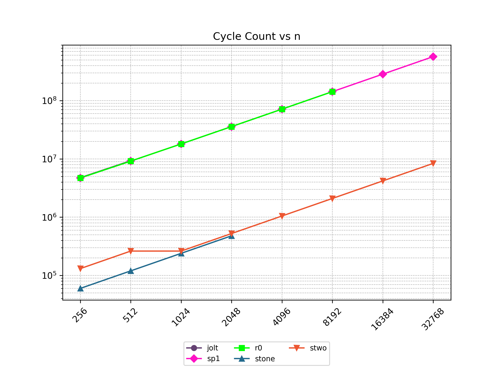

### Peak Memory (GB)
|     n |   jolt |   sp1 |   openvm |   r0 |   stone |   stwo |
|----:|----:|----:|----:|----:|----:|----:|
|   256 |  48.62 |  23.6 |    10.37 | 9.18 |   17.93 |   10.9 |
|   512 |   93.9 | 47.38 |     19.8 | 9.19 |    35.7 |  11.08 |
|  1024 |     ❌ | 44.31 |    19.83 | 9.19 |   71.47 |  11.27 |
|  2048 |     ❌ | 55.82 |    19.84 | 9.19 |  142.68 |  11.81 |
|  4096 |     ❌ | 62.49 |    19.86 | 9.22 |      💾 |  13.22 |
|  8192 |     ❌ | 63.14 |    19.94 | 9.26 |      💾 |  16.01 |
| 16384 |     ❌ | 66.48 |    19.95 |   ❌ |      💾 |  21.62 |
| 32768 |     ❌ | 66.97 |    19.96 |   ❌ |      💾 |  32.64 |

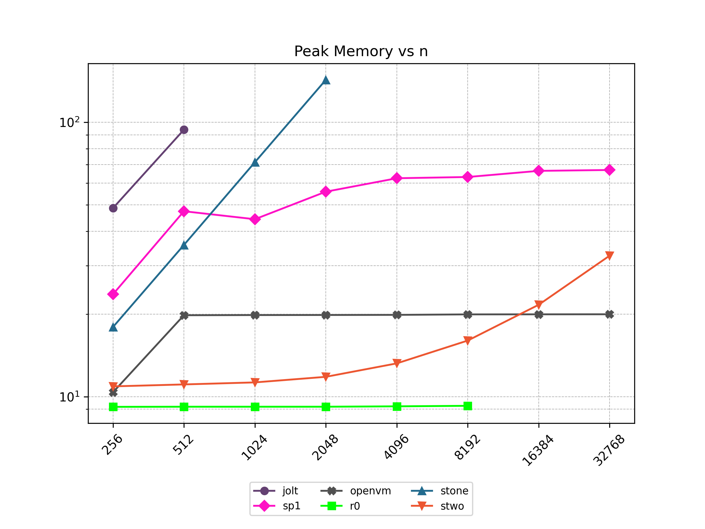