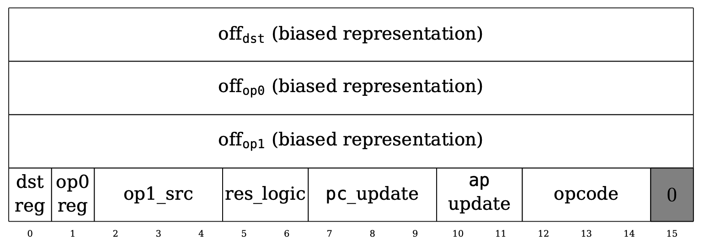
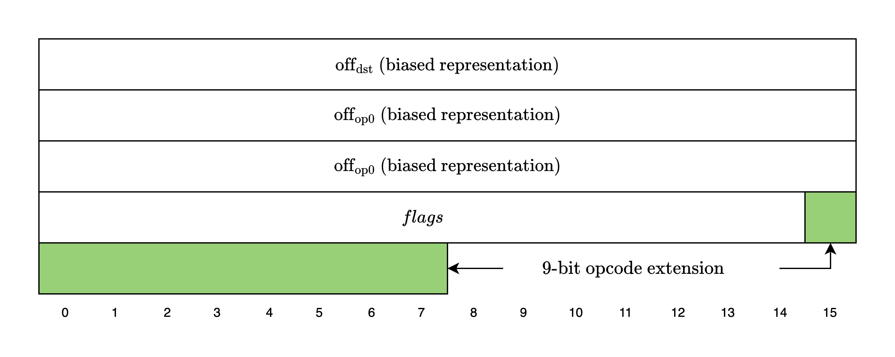

<Callout type="info">
This is an informal overview of Cairo. For a more formal explanation, please refer to the original [Cairo paper](https://eprint.iacr.org/2021/1063.pdf).
</Callout>

Let's start by understanding how Cairo works. Essentially, Cairo is a Turing-complete CPU architecture specifically designed to enable efficient proofs of execution using STARKs. In particular, Cairo uses a read-only memory model instead of the more common read-write memory model and does not use any general-purpose registers.

## Non-Deterministic Read-Only Memory

A read-only memory model is one where each address in memory can have only a single value throughout the program's execution. This contrasts with the more common read-write memory model, where an address can have multiple values at different points during execution.

The memory is also non-deterministic: the prover provides the values of the memory cells as witness values, and they do not need further constraints beyond ensuring that each address has a single value throughout the program's execution.

## Registers

In physical CPUs, accessing memory is expensive compared to accessing registers due to physical proximity. This is why instructions typically operate over registers rather than directly over memory cells. In Cairo, accessing memory and registers incur the same cost, so Cairo instructions operate directly over memory cells. Thus, the three registers used by Cairo do not store instructions or operand values like in physical CPUs, but rather pointers to the memory cells where the instructions and operands are stored:

- `pc` is the **program counter**, which points to the current Cairo instruction
- `ap` is the **allocation pointer**, which points to the current available memory address
- `fp` is the **frame pointer**, which points to the current frame in the "call stack"

## Cairo Instructions

Let's now see what a Cairo instruction looks like.

*Figure 1: Cairo instruction (little-endian)*

As the figure above from the [Cairo paper](https://eprint.iacr.org/2021/1063.pdf) shows, an instruction is 64 bits, where the first three 16-bit integers are signed offsets to the operands `dst`, `op0`, and `op1`.

The next 15 bits are flags. The `dst_reg` and `op0_reg` 1-bit flags indicate whether to use the `ap` or the `fp` register as the base for the `dst` and `op0` operands. The `op1_src` flag supports a wider range of base values for the `op1` operand: `op0`, `pc`, `fp`, and `ap`. The `res_logic` flag indicates how to compute the `res` operand: `op1`, `op0 + op1`, or `op0 * op1`. The `pc_update` and `ap_update` flags show how to update the `pc` and `ap` registers after computing the operands. The `opcode` flag indicates whether this instruction belongs to a predefined opcode (e.g., `CALL`, `RET`, `ASSERT_EQ`) and also defines how the `ap` and `fp` registers should be updated.

<Callout type="info">
For a more detailed explanation of the flags, please refer to Section 4.5 of the [Cairo paper](https://eprint.iacr.org/2021/1063.pdf).
</Callout>

Finally, the last bit is fixed to 0, but as we will see in the next section, this design has been modified in the current version of Cairo to support opcode extensions.

### Opcodes and Opcode Extensions

In Cairo, an **opcode** refers to what the instruction should do. Cairo defines a set of common CPU operations as specific opcodes (e.g., `ADD`, `MUL`, `JUMP`, `CALL`), and the current version of Cairo also defines a new set of opcodes used to improve the performance of heavy computations such as Blake2s hashing and QM31 addition and multiplication.

Since the 64-bit instruction structure is not flexible enough to support this extended set of opcodes, Cairo extends the instruction size to 72 bits and uses the last 9 bits as the **opcode extension** value.

*Figure 2: New instruction format with opcode extension*

As of [this commit](https://github.com/starkware-libs/stwo-cairo/blob/b712c77887f8f8ce0d39a8a9741221c89846836e/stwo_cairo_prover/crates/adapter/src/decode.rs#L4), the following opcode extension values are supported:

- `0`: Stone (original opcodes)
- `1`: Blake
- `2`: BlakeFinalize
- `3`: QM31Operation

<Callout type="info">
Even if an instruction does not belong to any predefined set of opcodes, it is considered a valid opcode as long as it adheres to the state-transition function defined in Section 4.5 of the [Cairo paper](https://eprint.iacr.org/2021/1063.pdf). In S-two Cairo, this is referred to as a _generic opcode_.
</Callout>
