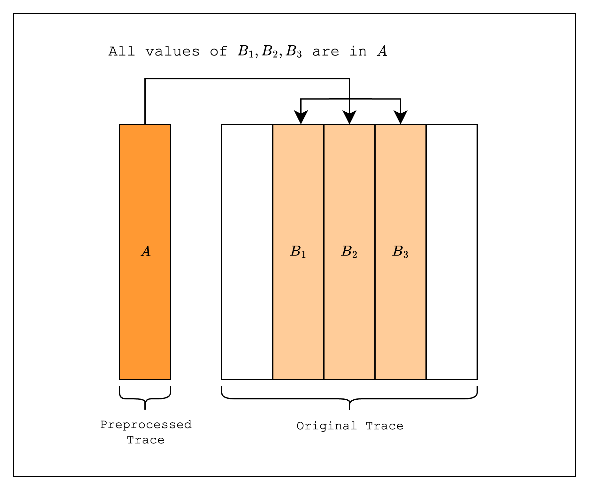
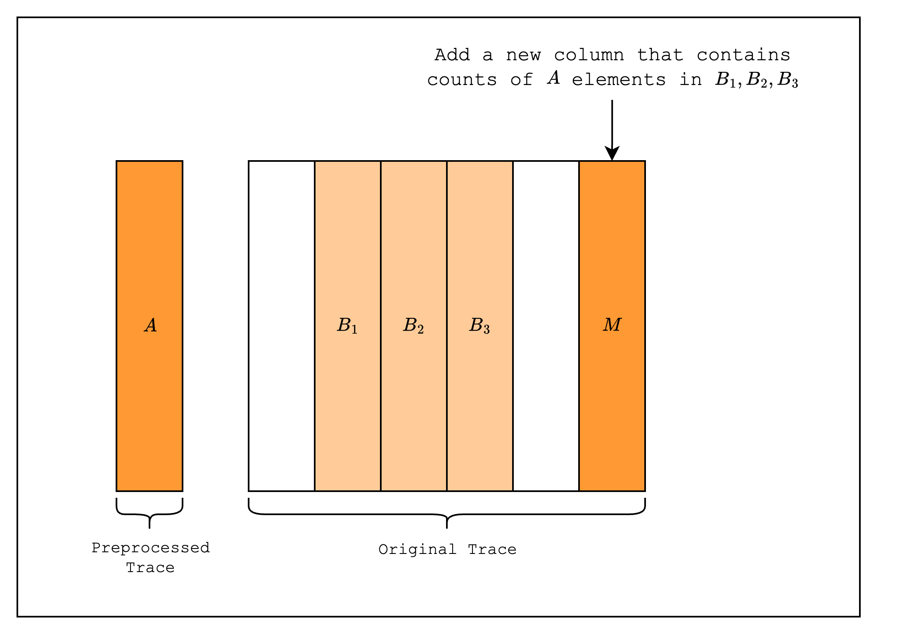
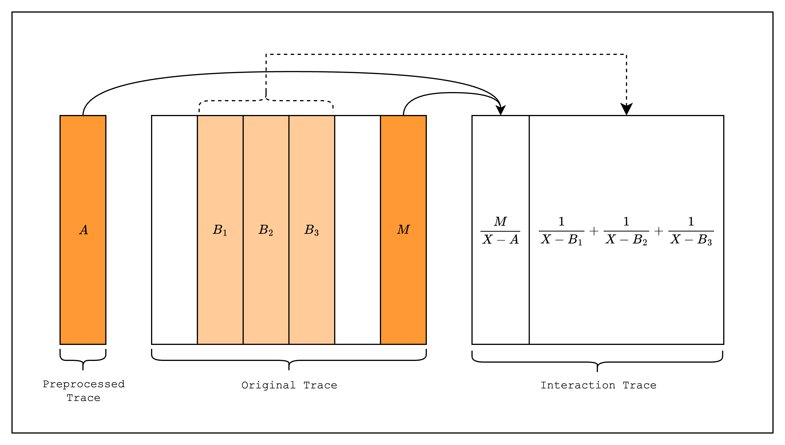
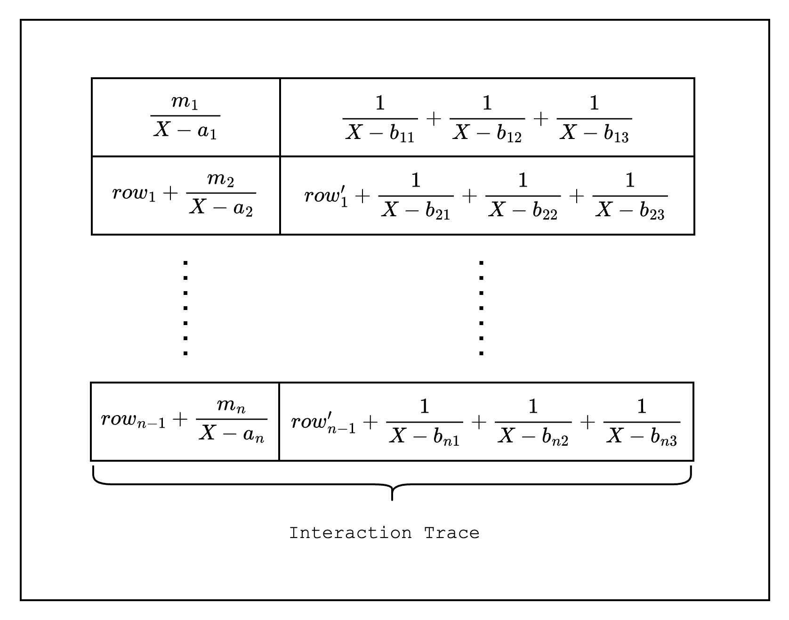
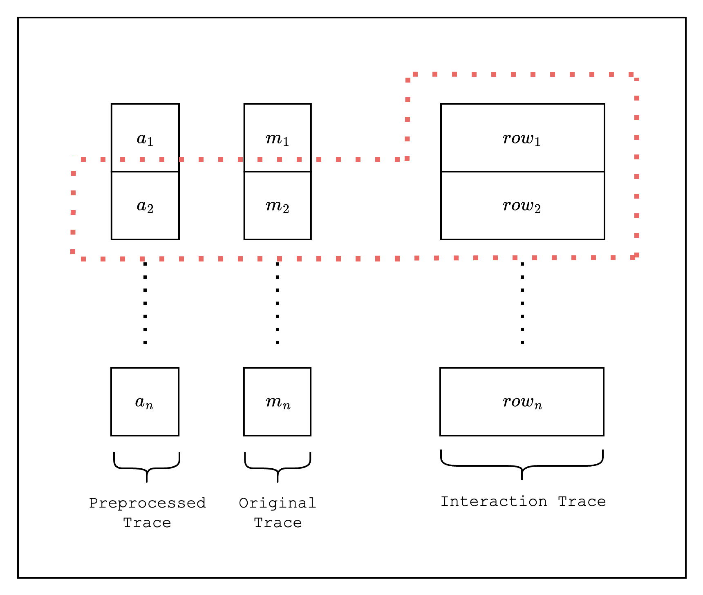
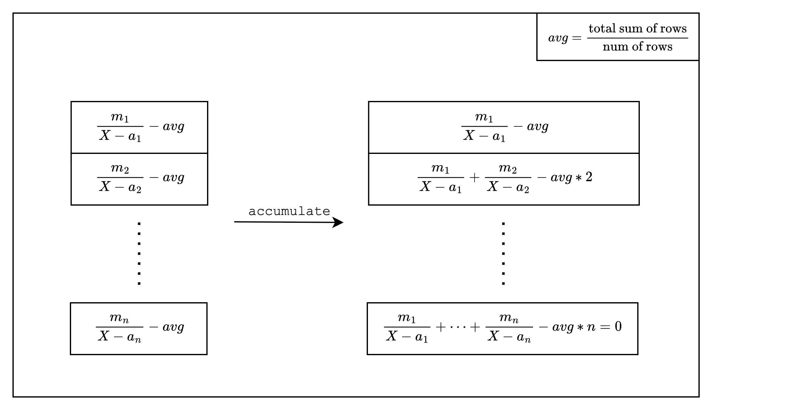

Lookups are simply a way to connect one part of the table to another. When we "look up" a value, we are doing nothing more than creating a constraint that allows us to use that value in another part of the table without breaking soundness.

## Design

We will walk through four steps to incrementally build up the design of lookups.

### Step 1: Suppose we want to have two columns with the same values.

We can do this by creating two columns with the exact same values and adding a constraint over them: `col_1 - col_2 = 0`.

### Step 2: We want to check that the two columns have the same values but in a different order.

We can use the idea that two sets of values will have the same cumulative product if they are indeed permutations of each other. So we add new columns, `col_1_cumprod` for `col_1` and `col_2_cumprod` for `col_2`, which contain the running cumulative product of `col_1` and `col_2`, respectively. The new constraints will check that each of these new columns do indeed contain the cumulative product values and that their last values are the same. We can optimize this by creating just one new column that keeps a running cumulative product of the fraction `col_1 / col_2`.

### Step 3: We want to check that all values in `col_2` are in `col_1`, but each value appears an arbitrary number of times.

_(Note that this is a generalization of the second step in that for the second step, all values in `col_2` appear exactly once in `col_1`)_

Supporting this third step is actually pretty simple: when creating the running cumulative product, we need to raise each value in `col_1` to its multiplicity, or the number of times it appears in `col_2`. The rest of the constraints do not need to be changed.

### Step 4: We want to check that all values in `[col_2, col_3, ...]` are in `col_1` with arbitrary multiplicities

Finally, we want to create many more columns that contain values from `col_1`. Fortunately,

To support this, we can use the same idea as the third step: when creating the running cumulative product, we need to raise each value in `col_1` to the power of the number of times it appears in `[col_2, col_3, ...]`.

<Info>
**In summary, lookups support the following use-cases:**

1. Prove equality: we want to prove that the values of the first column are equal to the values of the second column.
2. Prove permutation: we want to prove that the values of the first column are a permutation of the values of the second column.
3. Prove permutation with multiplicities: we want to prove that each value of the first column appears a certain number of times over multiple columns.
</Info>

## Technique: LogUp

LogUp is a technique used to constrain lookups. It's a successor to [Plookup](https://eprint.iacr.org/2020/315), and is especially useful for proving permutation with multiplicities. Here, we'll briefly explain why this is the case.

Plookup and its variants use a technique called the Grand Product Check to prove permutation.

$$\prod_{i=0}^{n-1} (X - a_i) = \prod_{i=0}^{n-1} (X - b_i)$$

In the equation above, we can check that the set $\{a_0,...,a_{n-1}\}$ is a permutation of the set $\{b_0,...,b_{n-1}\}$ by setting $X$ to a random value provided by the verifier.

However, this becomes inefficient when we have multiplicities since we need to encode the multiplicities as powers of each lookup polynomial, and thus the degree of the polynomial increases linearly with the number of multiplicities.

$$\prod_{i=0}^{n-1} (X - a_i) = \prod_{i=0}^{n-1} (X - b_i)^{m_i}$$

On the other hand, LogUp uses the derivative of the Grand Product Check:

$$\sum_{i=0}^{n-1} \frac{1}{X - a_i} = \sum_{i=0}^{n-1} \frac{m_i}{X - b_i}$$

In this approach, each lookup polynomial is represented as a rational function with the multiplicity as the numerator. This transformation is significant because the degree of the polynomial remains constant regardless of the number of multiplicities, making LogUp more efficient for handling multiple lookups of the same value.

## Implementation

Let's walk through how LogUp is implemented in S-two using a simple example where we look up values from a preprocessed trace.

First, we create columns in the original trace, where all values are from the preprocessed trace $A$.

*Figure 1: Create original trace columns that look up values from a preprocessed trace*

Then, we add a multiplicity column to the original trace indicating the number of times each value in $A$ appears in the original trace.

*Figure 2: Add a multiplicity column*

Next, we create LogUp columns as part of the interaction trace, one for the preprocessed trace and the multiplicity column, and another for the batch of all lookups.

*Figure 3: Create LogUp columns*

To create a constraint over the LogUp columns, S-two modifies the LogUp columns to contain the cumulative sum of the fractions in each row. This results in columns that look like the following:

*Figure 4: Cumulative sum columns*

A constraint is created using the values of two rows of the cumulative sum LogUp column. For example, as in **Figure 5**, we can create a constraint by subtracting $row_1$ from $row_2$ and checking that it equals the LogUp fraction created using values $a_2$ and $m_2$:

$$
\frac{m_2}{X - a_2} = row\_2 - row\_1
$$

*Figure 5: Constraint over two rows*

However, this constraint actually does not hold for the first row since $\frac{m_1}{X - a_1} \neq row_1 - row_n$. A typical solution to this problem would be to disable this constraint for the first row and create a separate constraint that is enabled only on the first row.

But S-two solves this problem differently. First, before we accumulate the original LogUp column rows, we subtract each row by the average of the total sum of the rows. Only then do we accumulate each row. This way, the last row of the column will always equal zero, so we do not need to make an exception for the first row. The final constraint for the second row looks as follows:

$$
\frac{m_2}{X - a_2} = row\_2 - row\_1 + \text{avg}
$$

Where $\text{avg}$ is a witness value provided by the prover.

*Figure 6: Trick to not create a separate constraint for the first row*

The right column in **Figure 6** is the final form of the LogUp column that S-two commits to as part of the interaction trace.

## Batching

In general, batching multiple lookups together helps reduce the size of the proof as it reduces the number of LogUp columns, which means we can commit to fewer columns. However, we cannot batch an arbitrary number of fractions together because it increases the degree of the constraint polynomial.

More specifically, the degree of the constraint polynomial increases linearly with the number of fractions in the batch. Let's say we want to batch $k$ fractions together. This will create a constraint $\frac{1}{X - a_1} + \frac{1}{X - a_2} + ... + \frac{1}{X - a_k} = \text{sum} - \text{prev\_sum}$. Once we multiply both sides by the common denominator, we get a constraint of degree $k+1$ from the product $(X - a_1)\cdot \dots \cdot (X - a_k) \cdot \text{sum}$.

To illustrate the accounting for how many fractions we can batch together, we first need to understand how the degree of the composition polynomial is calculated in S-two. Here, the composition polynomial is the constraint polynomial divided by the quotient polynomial, where the quotient polynomial is the vanishing polynomial of the trace domain (i.e. evaluates to 0 over the trace domain). So let's say we have a degree-$m$ constraint on two columns: $a^m + b^m = 0$. We can define the composition polynomial as $\frac{a^m + b^m}{x^N - 1}$ where $N$ is the trace height. The degree of $a$ and $b$ is $N-1$ so, if the constraint holds, the degree of the composition polynomial is $m \cdot (N-1) - N = (m-1) \cdot N - m$. Thus, given that we already has $N$ evaluations, we can expand it by $m-1$ to convince the verifier that the constraint holds since $(m-1) \cdot N > (m-1) \cdot N - m$.

Now, coming back to the question of how many fractions we can batch together, we can see that we can batch up to exactly $k$ fractions if the rate of expansion is $k$.
