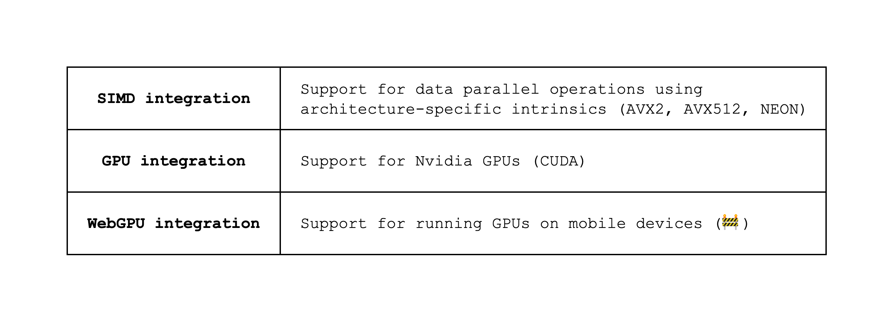

Before we dive into why we should choose S-two, let's define some terminology. When we talked about proof systems in the previous section, we mentioned that we can create a proof of a statement using a proof system. In reality, however, we first need to structure the function involved in the statement in a way that it can be proven. This structuring part is often referred to as the **frontend**, while the rest of the process of creating a proof is commonly referred to as the **backend**.

With that out of the way, let's dive into some of the advantages of using S-two.

First, S-two is a standalone framework that provides both the frontend and backend and therefore handles the entire proving process. There are other frameworks that only provide the frontend or the backend, which has its advantages as its modular structure makes it possible to pick and choose a backend or frontend of one's liking. However, having a single integrated frontend and backend reduces the complexity of the system and is also easier to maintain.

In addition, S-two's frontend structures statements as an **Algebraic Intermediate Representation (AIR)**, which is a representation that is especially useful for proving statements that are repetitive (e.g. the CPU in a VM, which essentially repeats the same fetch-decode-execute over and over again).

S-two's backend is also optimized for prover performance. This is due to largely three factors.

1. It implements **STARKs**, or hash-based SNARKs, which boasts a faster prover compared to elliptic curve-based SNARKs like Groth16 or PLONK. This improvement comes mainly from running the majority of the computation in a small prime field (32 bits); Elliptic curve-based SNARKs, on the other hand, need to use big prime fields (e.g. 254-bit prime fields), which incur a lot of overhead as most computation does not require that many bits.

2. Even amongst multiple STARK backends, however, S-two provides state-of-the-art prover performance by running the **Mersenne-31 prime field** (modulo $2^{31} - 1$), which is faster than another popular 32-bit prime field like BabyBear (modulo $2^{31} - 2^{27} + 1$). We suggest going through [this post](https://blog.zksecurity.xyz/posts/circle-starks-1/) for a breakdown of why this is the case.

3. Finally, S-two offers **various CPU and GPU optimizations** that improves prover performance as shown in [Figure 1](#figure-1) below. It can also be compiled to WASM, allowing for fast proving in web environments.

*Figure 1: Prover performance optimizations in S-two*

One of the drawbacks of STARKs is that they have a larger proof size compared to elliptic curve-based SNARKs. One way to mitigate this drawback is by batching multiple proofs together to form a single proof.

<Note>
**On zero-knowledge:**

As of the time of this writing, S-two does not provide the "zero-knowledge" feature. "Zero-knowledge" here refers to the fact that the proof should not reveal any additional information other than the validity of the statement, which is not true for S-two as it reveals to the verifier commitments to its witness values without hiding them by e.g. adding randomness. This reveals **some information** about the witness values, which may be used in conjunction with other information to infer the witness values.
</Note>
