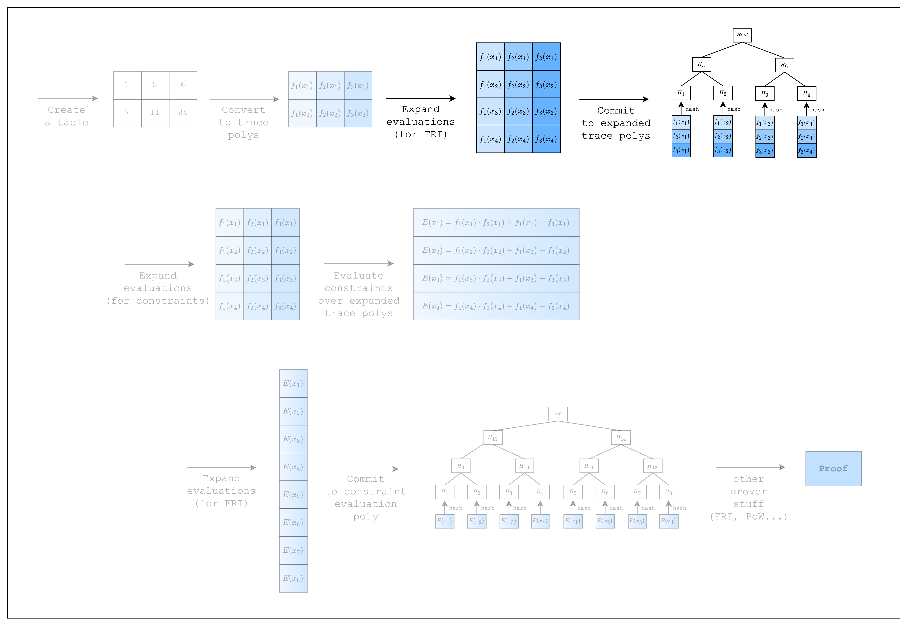

<Frame caption="Figure 1: Prover workflow: Commitment">
  
</Frame>

Now that we have created the trace polynomials, we need to commit to them.

S-two commits to the trace polynomials by first expanding the trace polynomials (i.e. adding more evaluations) and then committing to the expanded evaluations using a merkle tree.
The rate of expansion (commonly referred to as the _blowup factor_) is a parameter of FRI and readers who are interested in learning more about how to set this parameter can refer to the [Circle-STARKs paper](https://eprint.iacr.org/2024/278).
(We are also working on adding an explanation in the book).

For the puposes of this tutorial, we will use the default values for the blowup factor.

```rust
use stwo_prover::core::{
    backend::{
        simd::{
            column::BaseColumn,
            m31::{LOG_N_LANES, N_LANES},
            SimdBackend,
        },
        Column,
    },
    channel::{Blake2sChannel, Channel},
    fields::m31::M31,
    pcs::{CommitmentSchemeProver, PcsConfig},
    poly::{
        circle::{CanonicCoset, CircleEvaluation, PolyOps},
        BitReversedOrder,
    },
    vcs::blake2_merkle::Blake2sMerkleChannel,
    ColumnVec,
};

const CONSTRAINT_EVAL_BLOWUP_FACTOR: u32 = 1;

fn main() {
    let num_rows = N_LANES;
    let log_num_rows = LOG_N_LANES;

    // Create the table
    let mut col_1 = BaseColumn::zeros(num_rows);
    col_1.set(0, M31::from(1));
    col_1.set(1, M31::from(7));

    let mut col_2 = BaseColumn::zeros(num_rows);
    col_2.set(0, M31::from(5));
    col_2.set(1, M31::from(11));

    // Convert table to trace polynomials
    let domain = CanonicCoset::new(log_num_rows).circle_domain();
    let trace: ColumnVec<CircleEvaluation<SimdBackend, M31, BitReversedOrder>> = vec![col_1, col_2]
        .into_iter()
        .map(|col| CircleEvaluation::new(domain, col))
        .collect();

    // Config for FRI and PoW
    let config = PcsConfig::default();

    // Precompute twiddles for evaluating and interpolating the trace
    let twiddles = SimdBackend::precompute_twiddles(
        CanonicCoset::new(
            log_num_rows + CONSTRAINT_EVAL_BLOWUP_FACTOR + config.fri_config.log_blowup_factor,
        )
        .circle_domain()
        .half_coset,
    );

    // Create the channel and commitment scheme
    let channel = &mut Blake2sChannel::default();
    let mut commitment_scheme =
        CommitmentSchemeProver::<SimdBackend, Blake2sMerkleChannel>::new(config, &twiddles);

    // Commit to the preprocessed trace
    let mut tree_builder = commitment_scheme.tree_builder();
    tree_builder.extend_evals(vec![]);
    tree_builder.commit(channel);

    // Commit to the size of the trace
    channel.mix_u64(log_num_rows as u64);

    // Commit to the original trace
    let mut tree_builder = commitment_scheme.tree_builder();
    tree_builder.extend_evals(trace);
    tree_builder.commit(channel);
}
```
We begin with some setup.
First, we create a default `PcsConfig` instance, which sets the values for the FRI and PoW operations.
Setting non-default values is related to the security of the proof, which is out of the scope for this tutorial.

Next, we precompute twiddles, also known as the _domain_ over which the rows in the table are evaluated on.
The log size of this domain is set to `log_num_rows + CONSTRAINT_EVAL_BLOWUP_FACTOR + config.fri_config.log_blowup_factor`, which is the max log size of the domain that is needed throughout the proving process.
Why we need to add `CONSTRAINT_EVAL_BLOWUP_FACTOR` will be explained in the next section.

The final setup is creating a commitment scheme and a channel.
The commitment scheme will be used to commit to the trace polynomials as merkle trees, while the channel will be used to keep a running hash of all data in the proving process (i.e. transcript of the proof).
This is part of the Fiat-Shamir transformation where randomness can be generated safely even in a non-interactive setting.
Here, we use the `Blake2sChannel` and `Blake2sMerkleChannel` for the channel and commitment scheme, respectively, but we can also use the `Poseidon252Channel` and `Poseidon252MerkleChannel` pair.
Now that we have our setup, we can commit to the trace polynomials.
But before we do so, we need to first commit to an empty vector called a _preprocessed trace_, which doesn't do anything but is required by S-two.
Then, we need to commit to the size of the trace, which is a vital part of the proof system that the prover should not be able to cheat on.
Once we have done these, we can finally commit to the original trace polynomials.
