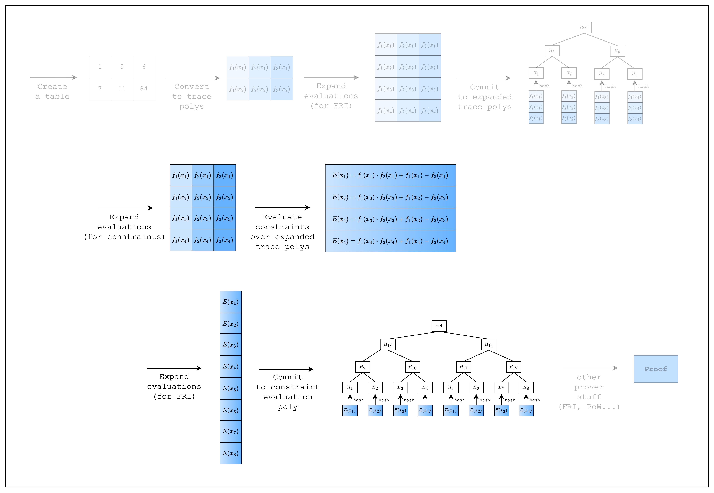
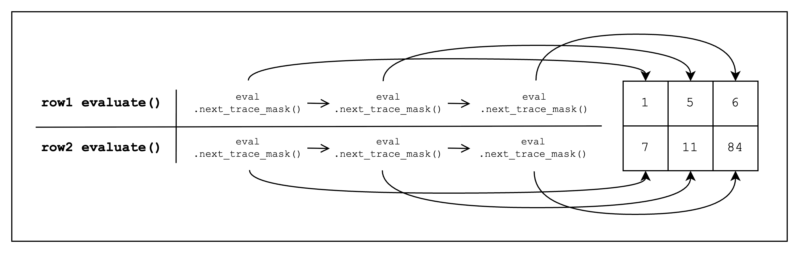

<Frame caption="Figure 1: Prover workflow: Constraints">
  
</Frame>

## Proving Spreadsheet Functions

When we want to perform computations over the cells in a spreadsheet, we don't want to manually fill in the computed values.
Instead, we leverage spreadsheet functions to autofill cells based on a given computation.
We can do the same thing with our table, except in addition to autofilling cells, we can also create a constraint that the result was computed correctly.
Remember that the purpose of using a proof system is that the verifier can verify a computation was executed correctly without having to execute it themselves?
Well, that's exactly why we need to create a constraint.

Now let's say we want to add a new column `C` to our spreadsheet that computes the product of the previous columns plus the first column.
We can set `C1` as `A1 * B1 + A1`.

In the same vein, we can create a new column in our table that computes the sum of the two previous columns.
And we can constrain the value of the third column by creating an equation that must equal 0: `col1_row1 * col2_row1 + col1_row1 - col3_row1 = 0`.
<Frame caption="Figure 2: Proving spreadsheet functions as constraints">
  
</Frame>

## Identical Constraints Every Row

Obviously, our new constraint is satisfied for every row in the table.
This means that we can substitute creating a constraint for each row with a single constraint over the columns, i.e. the trace polynomials.
Thus, `col1_row1 * col2_row1 + col1_row1 - col3_row1 = 0` becomes $f_1(x) \cdot f_2(x) + f_1(x) - f_3(x) = 0$.

<Note>
The idea that all rows must have the same constraint may seem restrictive, compared to say a spreadsheet where we can define different functions for different rows.
However, we will show in later sections how to handle such use-cases.

(Spoiler alert: it involves selectors and components)
</Note>

## Composition Polynomial

We will now give a name to the polynomial that expresses the constraint: a **composition polynomial**.
$C(x) = f_1(x) \cdot f_2(x) + f_1(x) - f_3(x)$

Basically, in order to prove that the constraints are satisfied, we need to show that the composition polynomial evaluates to 0 over the original domain (i.e. the domain of size the number of rows in the table).

But first, we need to expand the evaluations of the trace polynomials by a factor of 2.
This is because the composition polynomial has degree 2, while the trace polynomials have degree 1, and thus we need more evaluations to uniquely determine the Lagrange polynomial.
Once we have the expanded evaluations, we can evaluate the composition polynomial.
Checking that the composition polynomial evaluates to 0 over the original domain is done in FRI, so once again we need to expand the composition polynomial evaluations by a factor of 2 and commit to them.

We'll see in the code below how this is implemented.

## Code
```rust
use num_traits::identities::Zero;
use stwo_prover::{
    constraint_framework::{EvalAtRow, FrameworkComponent, FrameworkEval, TraceLocationAllocator},
    core::{
        backend::{
            simd::{
                column::BaseColumn,
                m31::{LOG_N_LANES, N_LANES},
                SimdBackend,
            },
            Column,
        },
        channel::{Blake2sChannel, Channel},
        fields::{m31::M31, qm31::QM31},
        pcs::{CommitmentSchemeProver, PcsConfig},
        poly::{
            circle::{CanonicCoset, CircleEvaluation, PolyOps},
            BitReversedOrder,
        },
        vcs::blake2_merkle::Blake2sMerkleChannel,
        ColumnVec,
    },
};

struct TestEval {
    log_size: u32,
}

impl FrameworkEval for TestEval {
    fn log_size(&self) -> u32 {
        self.log_size
    }

    fn max_constraint_log_degree_bound(&self) -> u32 {
        self.log_size + CONSTRAINT_EVAL_BLOWUP_FACTOR
    }

    fn evaluate<E: EvalAtRow>(&self, mut eval: E) -> E {
        let col_1 = eval.next_trace_mask();
        let col_2 = eval.next_trace_mask();
        let col_3 = eval.next_trace_mask();
        eval.add_constraint(col_1.clone() * col_2.clone() + col_1.clone() - col_3.clone());
        eval
    }
}

const CONSTRAINT_EVAL_BLOWUP_FACTOR: u32 = 1;

fn main() {
    let num_rows = N_LANES;
    let log_num_rows = LOG_N_LANES;

    // Create the table
    let mut col_1 = BaseColumn::zeros(num_rows);
    col_1.set(0, M31::from(1));
    col_1.set(1, M31::from(7));

    let mut col_2 = BaseColumn::zeros(num_rows);
    col_2.set(0, M31::from(5));
    col_2.set(1, M31::from(11));

    let mut col_3 = BaseColumn::zeros(num_rows);
    col_3.set(0, col_1.at(0) * col_2.at(0) + col_1.at(0));
    col_3.set(1, col_1.at(1) * col_2.at(1) + col_1.at(1));

    // Convert table to trace polynomials
    let domain = CanonicCoset::new(log_num_rows).circle_domain();
    let trace: ColumnVec<CircleEvaluation<SimdBackend, M31, BitReversedOrder>> =
        vec![col_1, col_2, col_3]
            .into_iter()
            .map(|col| CircleEvaluation::new(domain, col))
            .collect();

    // Config for FRI and PoW
    let config = PcsConfig::default();

    // Precompute twiddles for evaluating and interpolating the trace
    let twiddles = SimdBackend::precompute_twiddles(
        CanonicCoset::new(
            log_num_rows + CONSTRAINT_EVAL_BLOWUP_FACTOR + config.fri_config.log_blowup_factor,
        )
        .circle_domain()
        .half_coset,
    );

    // Create the channel and commitment scheme
    let channel = &mut Blake2sChannel::default();
    let mut commitment_scheme =
        CommitmentSchemeProver::<SimdBackend, Blake2sMerkleChannel>::new(config, &twiddles);

    // Commit to the preprocessed trace
    let mut tree_builder = commitment_scheme.tree_builder();
    tree_builder.extend_evals(vec![]);
    tree_builder.commit(channel);

    // Commit to the size of the trace
    channel.mix_u64(log_num_rows as u64);

    // Commit to the original trace
    let mut tree_builder = commitment_scheme.tree_builder();
    tree_builder.extend_evals(trace);
    tree_builder.commit(channel);

    // Create a component
    let _component = FrameworkComponent::<TestEval>::new(
        &mut TraceLocationAllocator::default(),
        TestEval {
            log_size: log_num_rows,
        },
        QM31::zero(),
    );
}
```
First, we add a new column `col_3` that contains the result of the computation: `col_1 * col_2 + col_1`.

Then, to create a constraint over the trace polynomials, we first create a `TestEval` struct that implements the `FrameworkEval` trait.
Then, we add our constraint logic in the `FrameworkEval::evaluate` function.
Note that this function is called for every row in the table, so we only need to define the constraint once.

Inside `FrameworkEval::evaluate`, we call `eval.next_trace_mask()` consecutively three times, retrieving the cell values of all three columns.
Once we retrieve all three column values, we add a constraint of the form `col_1 * col_2 + col_1 - col_3`, which should equal 0.
<Frame caption="Figure 3: Evaluate function">
  
</Frame>

We also need to implement `FrameworkEval::max_constraint_log_degree_bound(&self)` for `FrameworkEval`.
As mentioned in the [Composition Polynomial section](#composition-polynomial), we need to expand the trace polynomial evaluations because the degree of our composition polynomial is higher than the trace polynomial.
Expanding it by the lowest value `CONSTRAINT_EVAL_BLOWUP_FACTOR=1` is sufficient for our example as the degree of our composition polynomial is not very high, so we can return `self.log_size + CONSTRAINT_EVAL_BLOWUP_FACTOR`.
For those who are interested in how to set this value in general, we leave a detailed note below.

<Note>
**What value to set for `max_constraint_log_degree_bound(&self)`?**

`self.log_size + max(1, ceil(log2(max_degree - 1)))`, where `max_degree` is the maximum degree of all defined constraint polynomials.

e.g.
- degree 1 - 3: `self.log_size + 1`
- degree 4 - 5: `self.log_size + 2`
- degree 6 - 9: `self.log_size + 3`
- degree 10 - 17: `self.log_size + 4`
- ...
</Note>

<Note>
Now that we know the degree of the composition polynomial, we can also explain the following code:

```rust
// Precompute twiddles for evaluating and interpolating the trace
let twiddles = SimdBackend::precompute_twiddles(
    CanonicCoset::new(
        log_num_rows + CONSTRAINT_EVAL_BLOWUP_FACTOR + config.fri_config.log_blowup_factor,
    )
    .circle_domain()
    .half_coset,
);
```

Why is the `log_size` of the domain set to `log_num_rows + CONSTRAINT_EVAL_BLOWUP_FACTOR + config.fri_config.log_blowup_factor` here?
Once we have the composition polynomial, we need to expand it again for before committing to it for the FRI step.
Thus, the maximum size of the domain that we need in the entire proving process is the FRI blow-up factor times the degree of the composition polynomial.
</Note>

Using the new `TestEval` struct, we can create a new `FrameworkComponent::<TestEval>` component, which the prover will use to evaluate the constraint.
For now, we can ignore the other parameters of the `FrameworkComponent::<TestEval>` constructor.
We now move on to the final section where we finally create and verify a proof.

<Info>
Finally, we can break down what an Algebraic Intermediate Representation (AIR) means.

*Algebraic* means that we are using polynomials to represent the constraints.

*Intermediate Representation* means that this is a modified representation of our statement so that it can be proven by a proof system.
So AIR is just another way of saying that we are representing statements to be proven as constraints over polynomials.
</Info>
