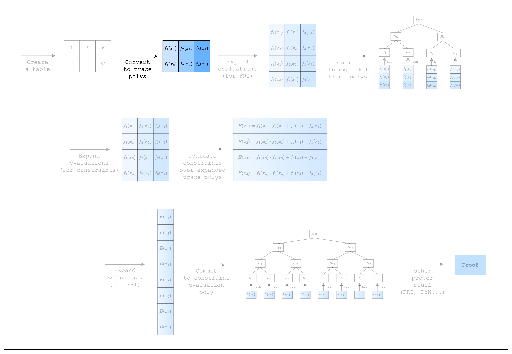
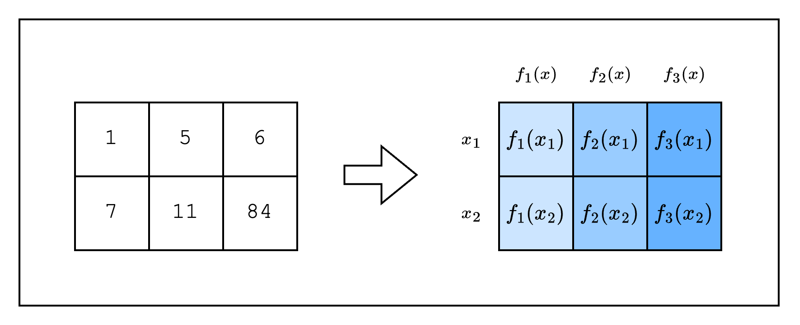

<Frame caption="Figure 1: Prover workflow: Trace polynomials">
  
</Frame>

In the previous section, we created a table (aka spreadsheet).
In this section, we will convert the table into something called trace polynomials.

<Frame caption="Figure 2: From spreadsheet to trace polynomials">
  
</Frame>
As we can see in Figure 2, the cells in each column of the table can be seen as evaluations of a [Lagrange polynomial](https://en.wikipedia.org/wiki/Lagrange_polynomial).
A characteristic of a Lagrange polynomial is that interpolating $n$ distinct points will result in a unique polynomial of at most $n-1$ degrees.
So if we consider each row value $f(x_i)$ as the evaluation of a distinct point $x_i$, we can get a unique polynomial of degree $num\_rows-1$ for each column, which is also known as a **trace polynomial**.

We will explain why using a polynomial representation is useful in the next section, but for now, let's see how we can create trace polynomials for our code.
Note that we are building upon the code from the previous section, so there's not much new code here.

```rust
use stwo_prover::core::{
    backend::{
        simd::{
            column::BaseColumn,
            m31::{LOG_N_LANES, N_LANES},
            SimdBackend,
        },
        Column,
    },
    fields::m31::M31,
    poly::{
        circle::{CanonicCoset, CircleEvaluation},
        BitReversedOrder,
    },
    ColumnVec,
};

fn main() {
    let num_rows = N_LANES;
    let log_num_rows = LOG_N_LANES;

    // Create the table
    let mut col_1 = BaseColumn::zeros(num_rows);
    col_1.set(0, M31::from(1));
    col_1.set(1, M31::from(7));

    let mut col_2 = BaseColumn::zeros(num_rows);
    col_2.set(0, M31::from(5));
    col_2.set(1, M31::from(11));

    // Convert table to trace polynomials
    let domain = CanonicCoset::new(log_num_rows).circle_domain();
    let _trace: ColumnVec<CircleEvaluation<SimdBackend, M31, BitReversedOrder>> =
        vec![col_1, col_2]
            .into_iter()
            .map(|col| CircleEvaluation::new(domain, col))
            .collect();
}
```
Here, `domain` refers to the $x_i$ values used to interpolate the trace polynomials.
For example, $x_1, x_2$ values are the domain values for our example (in reality, we need the size of the domain needs to be 16 as we have 16 rows).
We can ignore terms like `CanonicCoset` and `.circle_domain()` for now, but should note that the `log_num_rows` in `CanonicCoset::new(log_num_rows).circle_domain()` needs to be equal to the log of the actual number of rows that are used in the table.
