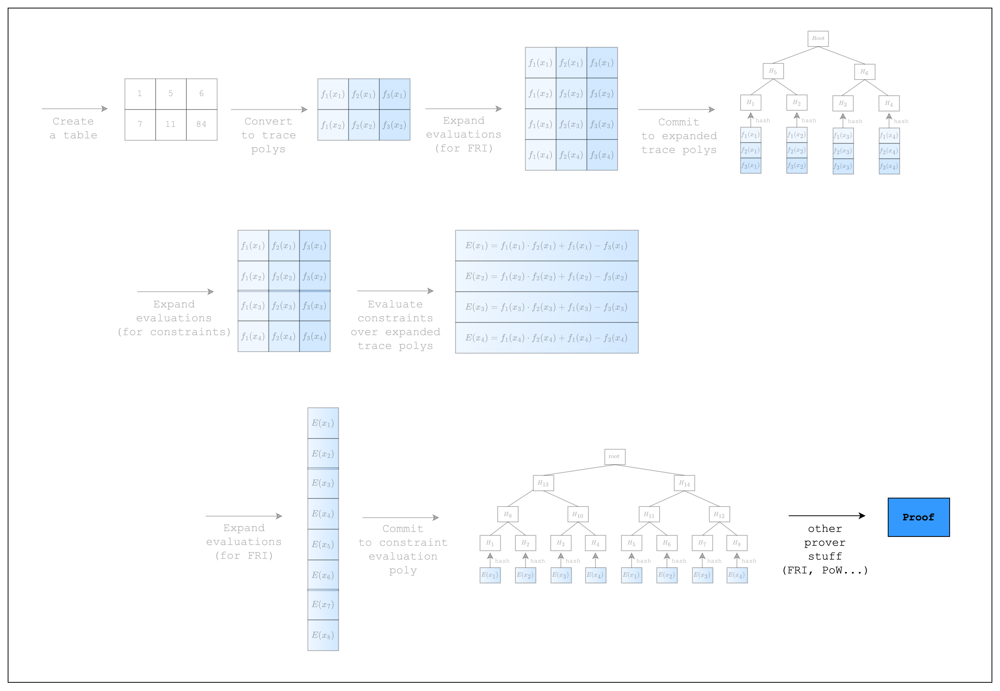

<Frame caption="Figure 1: Prover workflow: perform FRI and PoW">
  
</Frame>

We're finally ready to take the final step--prove and verify an AIR!

Since the new code is relatively short, let us present it first and then go over the details.
```rust
use num_traits::identities::Zero;
use stwo_prover::{
    constraint_framework::{EvalAtRow, FrameworkComponent, FrameworkEval, TraceLocationAllocator},
    core::{
        air::Component,
        backend::{
            simd::{
                column::BaseColumn,
                m31::{LOG_N_LANES, N_LANES},
                SimdBackend,
            },
            Column,
        },
        channel::{Blake2sChannel, Channel},
        fields::{m31::M31, qm31::QM31},
        pcs::{CommitmentSchemeProver, CommitmentSchemeVerifier, PcsConfig},
        poly::{
            circle::{CanonicCoset, CircleEvaluation, PolyOps},
            BitReversedOrder,
        },
        prover::{prove, verify},
        vcs::blake2_merkle::Blake2sMerkleChannel,
        ColumnVec,
    },
};

struct TestEval {
    log_size: u32,
}

impl FrameworkEval for TestEval {
    fn log_size(&self) -> u32 {
        self.log_size
    }

    fn max_constraint_log_degree_bound(&self) -> u32 {
        self.log_size + CONSTRAINT_EVAL_BLOWUP_FACTOR
    }

    fn evaluate<E: EvalAtRow>(&self, mut eval: E) -> E {
        let col_1 = eval.next_trace_mask();
        let col_2 = eval.next_trace_mask();
        let col_3 = eval.next_trace_mask();
        eval.add_constraint(col_1.clone() * col_2.clone() + col_1.clone() - col_3.clone());
        eval
    }
}

const CONSTRAINT_EVAL_BLOWUP_FACTOR: u32 = 1;

fn main() {
    let num_rows = N_LANES;
    let log_num_rows = LOG_N_LANES;

    // Create the table
    let mut col_1 = BaseColumn::zeros(num_rows);
    col_1.set(0, M31::from(1));
    col_1.set(1, M31::from(7));

    let mut col_2 = BaseColumn::zeros(num_rows);
    col_2.set(0, M31::from(5));
    col_2.set(1, M31::from(11));

    let mut col_3 = BaseColumn::zeros(num_rows);
    col_3.set(0, col_1.at(0) * col_2.at(0) + col_1.at(0));
    col_3.set(1, col_1.at(1) * col_2.at(1) + col_1.at(1));

    // Convert table to trace polynomials
    let domain = CanonicCoset::new(log_num_rows).circle_domain();
    let trace: ColumnVec<CircleEvaluation<SimdBackend, M31, BitReversedOrder>> =
        vec![col_1, col_2, col_3]
            .into_iter()
            .map(|col| CircleEvaluation::new(domain, col))
            .collect();

    // Config for FRI and PoW
    let config = PcsConfig::default();

    // Precompute twiddles for evaluating and interpolating the trace
    let twiddles = SimdBackend::precompute_twiddles(
        CanonicCoset::new(
            log_num_rows + CONSTRAINT_EVAL_BLOWUP_FACTOR + config.fri_config.log_blowup_factor,
        )
        .circle_domain()
        .half_coset,
    );

    // Create the channel and commitment scheme
    let channel = &mut Blake2sChannel::default();
    let mut commitment_scheme =
        CommitmentSchemeProver::<SimdBackend, Blake2sMerkleChannel>::new(config, &twiddles);

    // Commit to the preprocessed trace
    let mut tree_builder = commitment_scheme.tree_builder();
    tree_builder.extend_evals(vec![]);
    tree_builder.commit(channel);

    // Commit to the size of the trace
    channel.mix_u64(log_num_rows as u64);

    // Commit to the original trace
    let mut tree_builder = commitment_scheme.tree_builder();
    tree_builder.extend_evals(trace);
    tree_builder.commit(channel);

    // Create a component
    let component = FrameworkComponent::<TestEval>::new(
        &mut TraceLocationAllocator::default(),
        TestEval {
            log_size: log_num_rows,
        },
        QM31::zero(),
    );

    // Prove
    let proof = prove(&[&component], channel, commitment_scheme).unwrap();

    // Verify
    let channel = &mut Blake2sChannel::default();
    let commitment_scheme = &mut CommitmentSchemeVerifier::<Blake2sMerkleChannel>::new(config);
    let sizes = component.trace_log_degree_bounds();

    commitment_scheme.commit(proof.commitments[0], &sizes[0], channel);
    channel.mix_u64(log_num_rows as u64);
    commitment_scheme.commit(proof.commitments[1], &sizes[1], channel);

    verify(&[&component], channel, commitment_scheme, proof).unwrap();
}
```

## Prove

As you can see, there is only a single line of code added to create the proof.
The `prove` function performs the FRI and PoW operations under the hood, although technically, the constraint related steps were not performed in the previous section and are only performed once `prove` is called.
## Verify

In order to verify our proof, we need to check that the constraints are satisfied using the commitments from the proof.
In order to do that, we need to set up a `Blake2sChannel` and `CommitmentSchemeVerifier<Blake2sMerkleChannel>`, along with the same `PcsConfig` that we used when creating the proof.
Then, we need to recreate the running hash channel by passing the merkle tree commitments and the `log_num_rows` to the `CommitmentSchemeVerifier` instance by calling `commit` (remember, the order is important!).
Then, we can verify the proof using the `verify` function.

<Tip>
Try setting the dummy values in the table to 1 instead of 0. Does it fail? If so, can you see why?
</Tip>
